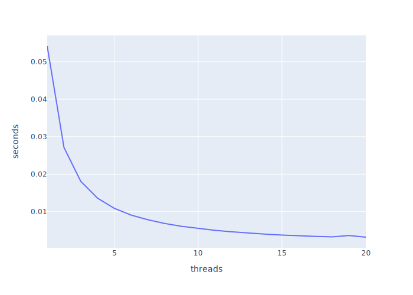

# Distributed systems

This is my documentation from the course 

# Week 1
# Week 2
# Week 3
- Conceptually write a parallel version of pi running on an arbitrary number of processors.
I made a version with mutex and waitgroups
```go
package main

import (
	"fmt"
	"runtime"
	"sync"
	"time"
)

const PI25DT float64 = 3.141592653589793238462643
const INTERVALS int = 10000000

func main() {
	cpus := runtime.NumCPU()
	for i := 1; i <= cpus; i++ {
		for j := 0; j <= 20; j++ {
			fmt.Println(run(i))
		}
	}
}

func run(cpus int) string {
	var (
		sum, pi, time2 float64
		wg             sync.WaitGroup
		mu             sync.Mutex
		intervals      = INTERVALS / cpus
		dx             = 1.0 / float64(INTERVALS)
		time1          = time.Now()
	)

	for i := cpus; i > 0; i-- {
		var (
			innerSum float64
			x        float64
			start    = intervals * i
			end      = start - intervals
		)
		wg.Add(1)
		go func(w *sync.WaitGroup) {
			defer w.Done()
			for j := start; j > end; j-- {
				x = dx * (float64(j) - 0.5)
				innerSum += 4.0 / (1.0 + x*x)
			}
			mu.Lock()
			sum += innerSum
			mu.Unlock()
		}(&wg)
	}

	wg.Wait()

	pi = dx * sum

	time2 = time.Since(time1).Seconds()

	return fmt.Sprintf("%d, %.24f, %.24f, %.24f", cpus, PI25DT, PI25DT-pi, time2)
}
```
which gave the following output with 20 threads
```csv
1.0, 3.141592653589793, 3.57047724719e-13, 0.05423645338095238
2.0, 3.141592653589793, 5.3290705182e-14, 0.03858928442857143
3.0, 3.141592653589793, 1.9999996858643954e-07, 0.03377063738095238
4.0, 3.141592653589793, 8.881784197e-15, 0.03148214357142857
5.0, 3.141592653589793, 7.211162883619048e-15, 0.027955456476190476
6.0, 3.141592653589793, 8.000001265672822e-07, 0.028463973142857143
7.0, 3.141592653589793, 6.000000984940357e-07, 0.03183754328571429
8.0, 3.141592653589793, 1.0298640247761905e-14, 0.028439853714285715
9.0, 3.141592653589793, 2.000000396407131e-07, 0.027101552476190477
10.0, 3.141592653589793, 2.3494433911523812e-14, 0.02337746119047619
11.0, 3.141592653589793, 2.0000009698320366e-06, 0.025170761
12.0, 3.141592653589793, 8.000001244314246e-07, 0.025845478285714287
13.0, 3.141592653589793, 2.000001016905493e-06, 0.024133992523809523
14.0, 3.141592653589793, 2.0000009813149145e-06, 0.02736389476190476
15.0, 3.141592653589793, 2.0000009909579946e-06, 0.023870838142857145
16.0, 3.141592653589793, 8.331959460809524e-15, 0.028217270238095237
17.0, 3.141592653589793, 1.0000002471591142e-06, 0.022219067619047617
18.0, 3.141592653589793, 2.0000009887586956e-06, 0.02301042480952381
19.0, 3.141592653589793, 3.000002241906753e-06, 0.02155738580952381
20.0, 3.141592653589793, 3.573860784238095e-15, 0.029006359952380954
```
with some statistics I got this graph


I made another version with channels
```go
package main

import (
	"fmt"
	"runtime"
	"time"
)

const PI25DT float64 = 3.141592653589793238462643
const INTERVALS int = 10000000

func main() {
	cpus := runtime.NumCPU()
	for i := 1; i <= cpus; i++ {
		for j := 0; j <= 20; j++ {
			fmt.Println(run(i))
		}
	}
}

func run(cpus int) string {
	var (
		sum, pi, time2 float64
		ch             = make(chan float64)
		intervals      = INTERVALS / cpus
		dx             = 1.0 / float64(INTERVALS)
		time1          = time.Now()
	)

	go func() {
		for i := cpus; i > 0; i-- {
			go func() {
				var (
					innerSum float64
					x        float64
					start    = intervals * i
					end      = start - intervals
				)
				for j := start; j > end; j-- {
					x = dx * (float64(j) - 0.5)
					innerSum += 4.0 / (1.0 + x*x)
				}
				ch <- innerSum
			}()
		}
	}()

	for i := cpus; i > 0; i-- {
		sum += <-ch
	}

	pi = dx * sum

	time2 = time.Since(time1).Seconds()

	return fmt.Sprintf("%d, %.24f, %.24f, %.24f", cpus, PI25DT, PI25DT-pi, time2)
}
```
which gave this output

```csv
1, 3.141592653589793115997963, 0.000000000000062172489379, 0.054363202999999998832337
1, 3.141592653589793115997963, 0.000000000000062172489379, 0.054281352999999997466229
1, 3.141592653589793115997963, 0.000000000000062172489379, 0.054200022000000000477193
1, 3.141592653589793115997963, 0.000000000000062172489379, 0.054196270999999997253216
1, 3.141592653589793115997963, 0.000000000000062172489379, 0.054183583000000000440277
1, 3.141592653589793115997963, 0.000000000000062172489379, 0.054186752999999997226777
1, 3.141592653589793115997963, 0.000000000000062172489379, 0.054194022000000001415554
1, 3.141592653589793115997963, 0.000000000000062172489379, 0.054188819999999998655582
1, 3.141592653589793115997963, 0.000000000000062172489379, 0.054180709000000000508113
1, 3.141592653589793115997963, 0.000000000000062172489379, 0.054195678999999996605652
1, 3.141592653589793115997963, 0.000000000000062172489379, 0.054185958999999998819685
1, 3.141592653589793115997963, 0.000000000000062172489379, 0.054192590999999998291337
1, 3.141592653589793115997963, 0.000000000000062172489379, 0.054194710000000000105214
1, 3.141592653589793115997963, 0.000000000000062172489379, 0.054206281000000001990546
1, 3.141592653589793115997963, 0.000000000000062172489379, 0.054211628999999997291503
1, 3.141592653589793115997963, 0.000000000000062172489379, 0.054196523000000003389420
1, 3.141592653589793115997963, 0.000000000000062172489379, 0.054183765000000001788028
1, 3.141592653589793115997963, 0.000000000000062172489379, 0.054188042999999998239335
1, 3.141592653589793115997963, 0.000000000000062172489379, 0.054191834000000001225761
1, 3.141592653589793115997963, 0.000000000000062172489379, 0.054185490000000002819291
1, 3.141592653589793115997963, 0.000000000000062172489379, 0.054187600000000002431477
2, 3.141592653589793115997963, -0.567588218416814616062993, 0.027102213999999999471946
2, 3.141592653589793115997963, -0.567588218416814616062993, 0.027136481999999999964457
2, 3.141592653589793115997963, -0.567588218416814616062993, 0.027121388999999999219748
2, 3.141592653589793115997963, -0.567588218416814616062993, 0.027204848999999999697996
2, 3.141592653589793115997963, -0.567588218416814616062993, 0.027119918999999999276174
2, 3.141592653589793115997963, -0.567588218416814616062993, 0.027111455999999999055827
2, 3.141592653589793115997963, -0.567588218416814616062993, 0.027115712999999999621714
2, 3.141592653589793115997963, -0.567588218416814616062993, 0.027116904000000000701798
2, 3.141592653589793115997963, -0.567588218416814616062993, 0.027114688000000001372181
2, 3.141592653589793115997963, -0.567588218416814616062993, 0.027242909999999998654774
2, 3.141592653589793115997963, -0.567588218416814616062993, 0.027121039999999999037250
2, 3.141592653589793115997963, -0.567588218416814616062993, 0.027108788000000001716661
2, 3.141592653589793115997963, -0.567588218416814616062993, 0.027112516999999999173232
2, 3.141592653589793115997963, -0.567588218416814616062993, 0.027111651000000000499845
2, 3.141592653589793115997963, -0.567588218416814616062993, 0.027115118000000000553218
2, 3.141592653589793115997963, -0.567588218416814616062993, 0.027148607000000001682194
2, 3.141592653589793115997963, -0.567588218416814616062993, 0.027107670000000000376517
2, 3.141592653589793115997963, -0.567588218416814616062993, 0.027121736999999999928601
2, 3.141592653589793115997963, -0.567588218416814616062993, 0.027150091000000001195680
2, 3.141592653589793115997963, -0.567588218416814616062993, 0.027287233000000001015284
2, 3.141592653589793115997963, -0.567588218416814616062993, 0.027128762000000000709221
3, 3.141592653589793115997963, -0.719413639169772078929554, 0.018085857000000000321949
3, 3.141592653589793115997963, -0.719413639169772078929554, 0.018142899999999999999245
3, 3.141592653589793115997963, -0.719413639169885765767276, 0.018079073000000001059107
3, 3.141592653589793115997963, -0.719413639169772078929554, 0.018081968999999999819783
3, 3.141592653589793115997963, -0.719413639169772078929554, 0.018091396999999998645992
3, 3.141592653589793115997963, -0.719413639169772078929554, 0.018083221999999999490827
3, 3.141592653589793115997963, -0.719413639169772078929554, 0.018094018999999999380845
3, 3.141592653589793115997963, -0.719413639169772078929554, 0.018089007000000000696671
3, 3.141592653589793115997963, -0.719413639169772078929554, 0.018136383999999998450914
3, 3.141592653589793115997963, -0.719413639169772078929554, 0.018080912000000001066402
3, 3.141592653589793115997963, -0.719413639169772078929554, 0.018109835000000001209441
3, 3.141592653589793115997963, -0.719413639169772078929554, 0.018094558000000000169694
3, 3.141592653589793115997963, -0.719413639169772078929554, 0.018067529999999998313598
3, 3.141592653589793115997963, -0.719413639169772078929554, 0.018142183999999998700314
3, 3.141592653589793115997963, -0.719413639169772078929554, 0.018077836999999999378907
3, 3.141592653589793115997963, -0.719413639169772078929554, 0.018082013000000000946255
3, 3.141592653589793115997963, -0.719413639169772078929554, 0.018126884999999998832054
3, 3.141592653589793115997963, -0.719413639169772078929554, 0.018081619999999999637286
3, 3.141592653589793115997963, -0.719413639169772078929554, 0.018173655999999999838268
3, 3.141592653589793115997963, -0.719413639169772078929554, 0.018087775000000000380496
3, 3.141592653589793115997963, -0.719413639169772078929554, 0.018110079000000001148152
4, 3.141592653589793115997963, -0.778065956439997208349268, 0.013565643999999999966266
4, 3.141592653589793115997963, -0.778065956439997208349268, 0.013575726999999999239366
4, 3.141592653589793115997963, -0.778065956439997208349268, 0.013579779000000000155346
4, 3.141592653589793115997963, -0.778065956439997208349268, 0.013603507000000000792816
4, 3.141592653589793115997963, -0.778065956439997208349268, 0.013572911999999999477229
4, 3.141592653589793115997963, -0.778065956439997208349268, 0.013570052000000000849700
4, 3.141592653589793115997963, -0.778065956439997208349268, 0.013682708999999999496811
4, 3.141592653589793115997963, -0.778065956439997208349268, 0.013571869000000000293760
4, 3.141592653589793115997963, -0.778065956439997208349268, 0.013603771000000000612751
4, 3.141592653589793115997963, -0.778065956439997208349268, 0.013577712000000000461264
4, 3.141592653589793115997963, -0.778065956439997208349268, 0.013661569000000000143058
4, 3.141592653589793115997963, -0.778065956439997208349268, 0.013587026999999999785085
4, 3.141592653589793115997963, -0.778065956439997208349268, 0.013620863000000000414547
4, 3.141592653589793115997963, -0.778065956439997208349268, 0.013603940999999999603154
4, 3.141592653589793115997963, -0.778065956439997208349268, 0.013591216999999999187621
4, 3.141592653589793115997963, -0.778065956439997208349268, 0.013647348000000000117771
4, 3.141592653589793115997963, -0.778065956439997208349268, 0.013578066999999999220350
4, 3.141592653589793115997963, -0.778065956439997208349268, 0.013582502999999999243608
4, 3.141592653589793115997963, -0.778065956439997208349268, 0.013594758000000000189300
4, 3.141592653589793115997963, -0.778065956439997208349268, 0.013605528000000000413139
4, 3.141592653589793115997963, -0.778065956439997208349268, 0.013600492000000000483717
5, 3.141592653589793115997963, -0.806318543408036880748568, 0.010912929999999999505778
5, 3.141592653589793115997963, -0.806318543408036880748568, 0.011001267999999999810945
5, 3.141592653589793115997963, -0.806318543408036880748568, 0.010873898999999999370747
5, 3.141592653589793115997963, -0.806318543408036880748568, 0.010877441999999999319715
5, 3.141592653589793115997963, -0.806318543408036880748568, 0.010891405999999999310024
5, 3.141592653589793115997963, -0.806318543408036880748568, 0.010868878000000000219605
5, 3.141592653589793115997963, -0.806318543408036880748568, 0.010899504000000000830672
5, 3.141592653589793115997963, -0.806318543408036880748568, 0.010861778000000000751757
5, 3.141592653589793115997963, -0.806318543408036880748568, 0.010869244999999999601314
5, 3.141592653589793115997963, -0.806318543408036880748568, 0.010879520000000000162776
5, 3.141592653589793115997963, -0.806318543408036880748568, 0.010895882000000000830453
5, 3.141592653589793115997963, -0.806318543408036880748568, 0.010891625999999999738210
5, 3.141592653589793115997963, -0.806318543408036880748568, 0.010897913000000000391387
5, 3.141592653589793115997963, -0.806318543408036880748568, 0.010913726999999999803248
5, 3.141592653589793115997963, -0.806318543408036880748568, 0.010892014999999999683156
5, 3.141592653589793115997963, -0.806318543408036880748568, 0.010898961000000000412524
5, 3.141592653589793115997963, -0.806318543408036880748568, 0.010901676000000000768542
5, 3.141592653589793115997963, -0.806318543408036880748568, 0.010866802000000000058555
5, 3.141592653589793115997963, -0.806318543408036880748568, 0.010891764999999999433133
5, 3.141592653589793115997963, -0.806318543408036880748568, 0.010863384999999999708242
5, 3.141592653589793115997963, -0.806318543408036880748568, 0.010889364999999999808478
6, 3.141592653589793115997963, -0.821974047604597579663732, 0.009129059999999999605591
6, 3.141592653589793115997963, -0.821974047604597579663732, 0.009069060000000000315579
6, 3.141592653589793115997963, -0.821974047604597579663732, 0.009059446000000000512320
6, 3.141592653589793115997963, -0.821974047604597579663732, 0.009188728999999999647041
6, 3.141592653589793115997963, -0.821974047604597579663732, 0.009100936000000000442034
6, 3.141592653589793115997963, -0.821974047604597579663732, 0.009098973999999999257016
6, 3.141592653589793115997963, -0.821974047604597579663732, 0.009083664999999999448144
6, 3.141592653589793115997963, -0.821974047604597579663732, 0.009072966999999999490600
6, 3.141592653589793115997963, -0.821974047604597579663732, 0.009101883999999999322328
6, 3.141592653589793115997963, -0.821974047604597579663732, 0.009086666000000000187331
6, 3.141592653589793115997963, -0.821974047604597579663732, 0.009063174999999999703615
6, 3.141592653589793115997963, -0.821974047604597579663732, 0.009081937999999999469591
6, 3.141592653589793115997963, -0.821974047604597579663732, 0.009089629999999999585003
6, 3.141592653589793115997963, -0.821974047604597579663732, 0.009114673999999999692845
6, 3.141592653589793115997963, -0.821974047604597579663732, 0.009068067000000000835169
6, 3.141592653589793115997963, -0.821974047604597579663732, 0.009064080000000000400528
6, 3.141592653589793115997963, -0.821974047604597579663732, 0.009064489999999999700342
6, 3.141592653589793115997963, -0.821974047604597579663732, 0.009070229000000000832427
6, 3.141592653589793115997963, -0.821974047604597579663732, 0.009068724999999999702993
6, 3.141592653589793115997963, -0.821974047604597579663732, 0.009076943000000000510985
6, 3.141592653589793115997963, -0.821974047604597579663732, 0.009100505999999999526273
7, 3.141592653589793115997963, -0.831523699327005427761605, 0.007841969000000000716843
7, 3.141592653589793115997963, -0.831523699327005427761605, 0.008465969999999999745510
7, 3.141592653589793115997963, -0.831523699327005427761605, 0.007790949000000000138066
7, 3.141592653589793115997963, -0.809545917532976666564082, 0.007789762000000000422006
7, 3.141592653589793115997963, -0.831523699327005427761605, 0.007864328999999999764148
7, 3.141592653589793115997963, -0.831523699327005427761605, 0.007796220999999999880237
7, 3.141592653589793115997963, -0.809545917532976666564082, 0.007820765000000000355396
7, 3.141592653589793115997963, -0.831523699327005427761605, 0.007811534999999999659415
7, 3.141592653589793115997963, -0.831523699327005427761605, 0.007786359999999999982612
7, 3.141592653589793115997963, -0.831523699327005427761605, 0.007797883999999999718455
7, 3.141592653589793115997963, -0.831523699327005427761605, 0.007801315999999999979686
7, 3.141592653589793115997963, -0.831523699327005427761605, 0.007822479999999999711324
7, 3.141592653589793115997963, -0.831523699327005427761605, 0.007830014999999999197877
7, 3.141592653589793115997963, -0.831523699327005427761605, 0.007787928000000000385017
7, 3.141592653589793115997963, -0.831523699327005427761605, 0.007816629999999999758864
7, 3.141592653589793115997963, -0.831523699327005427761605, 0.007782886000000000144283
7, 3.141592653589793115997963, -0.831523699327005427761605, 0.007818307999999999508001
7, 3.141592653589793115997963, -0.831523699327005427761605, 0.007816220999999999932695
7, 3.141592653589793115997963, -0.831523699327005427761605, 0.007796815999999999816095
7, 3.141592653589793115997963, -0.831523699327005427761605, 0.007808271000000000308661
7, 3.141592653589793115997963, -0.831523699327005427761605, 0.007804664999999999693003
8, 3.141592653589793115997963, -0.837767171906763863376000, 0.006819834000000000312491
8, 3.141592653589793115997963, -0.837767171906763863376000, 0.006829151999999999791968
8, 3.141592653589793115997963, -0.837767171906763863376000, 0.006826701999999999596891
8, 3.141592653589793115997963, -0.837767171906763863376000, 0.006833615999999999822412
8, 3.141592653589793115997963, -0.795515222294511659129057, 0.006821213999999999923196
8, 3.141592653589793115997963, -0.837767171906763863376000, 0.006851720999999999853203
8, 3.141592653589793115997963, -0.837767171906763863376000, 0.006853437000000000417499
8, 3.141592653589793115997963, -0.837767171906763863376000, 0.006864560999999999926779
8, 3.141592653589793115997963, -0.837767171906763863376000, 0.006883595999999999638652
8, 3.141592653589793115997963, -0.837767171906763863376000, 0.006869214999999999696212
8, 3.141592653589793115997963, -0.837767171906763863376000, 0.006856237000000000268718
8, 3.141592653589793115997963, -0.837767171906763863376000, 0.006896021999999999915754
8, 3.141592653589793115997963, -0.837767171906763863376000, 0.006823207999999999877339
8, 3.141592653589793115997963, -0.837767171906741658915507, 0.006861677000000000054003
8, 3.141592653589793115997963, -0.837767171906763863376000, 0.006835400999999999629986
8, 3.141592653589793115997963, -0.837767171906763863376000, 0.006895123999999999871158
8, 3.141592653589793115997963, -0.837767171906763863376000, 0.006830082999999999814056
8, 3.141592653589793115997963, -0.837767171906763863376000, 0.006828139999999999903979
8, 3.141592653589793115997963, -0.837767171906763863376000, 0.006861981999999999977391
8, 3.141592653589793115997963, -0.837767171906763863376000, 0.006817428000000000376524
8, 3.141592653589793115997963, -0.837767171906763863376000, 0.006850201000000000206569
9, 3.141592653589793115997963, -0.842066913548609630169040, 0.006075757999999999679763
9, 3.141592653589793115997963, -0.842066913548609630169040, 0.006083289999999999878022
9, 3.141592653589793115997963, -0.842066913548609630169040, 0.006111196000000000162766
9, 3.141592653589793115997963, -0.785333145032177881716962, 0.006076868000000000026584
9, 3.141592653589793115997963, -0.842066913548609630169040, 0.006106509999999999889486
9, 3.141592653589793115997963, -0.842066913548609630169040, 0.006084805999999999895356
9, 3.141592653589793115997963, -0.842066913548609630169040, 0.006084738000000000125722
9, 3.141592653589793115997963, -0.842066913548609630169040, 0.006077001000000000277557
9, 3.141592653589793115997963, -0.842066913548609630169040, 0.006146147999999999715637
9, 3.141592653589793115997963, -0.842066913548609630169040, 0.006072201999999999634527
9, 3.141592653589793115997963, -0.842066913548609630169040, 0.006077487000000000340327
9, 3.141592653589793115997963, -0.842066913548609630169040, 0.006093567999999999727778
9, 3.141592653589793115997963, -0.842066913548609630169040, 0.006137756000000000287942
9, 3.141592653589793115997963, -0.842066913548609630169040, 0.006103225000000000316502
9, 3.141592653589793115997963, -0.842066913548609630169040, 0.006076752000000000368540
9, 3.141592653589793115997963, -0.842066913548609630169040, 0.006076348999999999986321
9, 3.141592653589793115997963, -0.842066913548609630169040, 0.006071929999999999688631
9, 3.141592653589793115997963, -0.842066913548609630169040, 0.006096154999999999803129
9, 3.141592653589793115997963, -0.842066913548609630169040, 0.006094042000000000035287
9, 3.141592653589793115997963, -0.842066913548609630169040, 0.006078369000000000132999
9, 3.141592653589793115997963, -0.842066913548609630169040, 0.006136108000000000360641
10, 3.141592653589793115997963, -0.845153446056814416920133, 0.005494439000000000267177
10, 3.141592653589793115997963, -0.636117647681092357458965, 0.005493485999999999681853
10, 3.141592653589793115997963, -0.837386465527031553790493, 0.005486969000000000394601
10, 3.141592653589793115997963, -0.845153446056814416920133, 0.005518681000000000107242
10, 3.141592653589793115997963, -0.845153446056814416920133, 0.005506890000000000395808
10, 3.141592653589793115997963, -0.845153446056814416920133, 0.005488602000000000410984
10, 3.141592653589793115997963, -0.845153446056814416920133, 0.005488146000000000170049
10, 3.141592653589793115997963, -0.837386465527031553790493, 0.005478888999999999807888
10, 3.141592653589793115997963, -0.845153446056814416920133, 0.005506111999999999638555
10, 3.141592653589793115997963, -0.845153446056814416920133, 0.005486244000000000363426
10, 3.141592653589793115997963, -0.845153446056814416920133, 0.005525803000000000138325
10, 3.141592653589793115997963, -0.845153446056814416920133, 0.005512280999999999951677
10, 3.141592653589793115997963, -0.845153446056814416920133, 0.005519287999999999798362
10, 3.141592653589793115997963, -0.845153446056814416920133, 0.005474887999999999803336
10, 3.141592653589793115997963, -0.845153446056814416920133, 0.005493838000000000020007
10, 3.141592653589793115997963, -0.845153446056814416920133, 0.005523527999999999771319
10, 3.141592653589793115997963, -0.845153446056814416920133, 0.005505496999999999821473
10, 3.141592653589793115997963, -0.822723774604118496256433, 0.005481014000000000198354
10, 3.141592653589793115997963, -0.779043763645929754346753, 0.005503489000000000297419
10, 3.141592653589793115997963, -0.845153446056801982422257, 0.005480475000000000276867
10, 3.141592653589793115997963, -0.845153446056814416920133, 0.005482319999999999728113
11, 3.141592653589793115997963, -0.754329081020070013607892, 0.005008501000000000272228
11, 3.141592653589793115997963, -0.847438416029983709876205, 0.005041214999999999932245
11, 3.141592653589793115997963, -0.847438416029990371214353, 0.005012685999999999704457
11, 3.141592653589793115997963, -0.847438416029990371214353, 0.004993916999999999627169
11, 3.141592653589793115997963, -0.841573334905396208682760, 0.005017810000000000152098
11, 3.141592653589793115997963, -0.847438416029983709876205, 0.004993291000000000395831
11, 3.141592653589793115997963, -0.841573334905396208682760, 0.005001465000000000077351
11, 3.141592653589793115997963, -0.847438416029990371214353, 0.005021369000000000352990
11, 3.141592653589793115997963, -0.847438416029990371214353, 0.005079751000000000404899
11, 3.141592653589793115997963, -0.847438416029990371214353, 0.004998563000000000138001
11, 3.141592653589793115997963, -0.847438416029990371214353, 0.005033542000000000224413
11, 3.141592653589793115997963, -0.847438416029990371214353, 0.004997342000000000103443
11, 3.141592653589793115997963, -0.847438416029990371214353, 0.004991762999999999755874
11, 3.141592653589793115997963, -0.847438416029990371214353, 0.004986924999999999691402
11, 3.141592653589793115997963, -0.847438416029990371214353, 0.005031064000000000022150
11, 3.141592653589793115997963, -0.847438416029983709876205, 0.004992645999999999889551
11, 3.141592653589793115997963, -0.847438416029990371214353, 0.005045469999999999816120
11, 3.141592653589793115997963, -0.847438416029990371214353, 0.005001488999999999587875
11, 3.141592653589793115997963, -0.847438416029990371214353, 0.005042714000000000224011
11, 3.141592653589793115997963, -0.847438416029990371214353, 0.004990193000000000406180
11, 3.141592653589793115997963, -0.847438416029990371214353, 0.005015371000000000238639
12, 3.141592653589793115997963, -0.849184888089964395874176, 0.004647712000000000023836
12, 3.141592653589793115997963, -0.849184888089964395874176, 0.004674478999999999613568
12, 3.141592653589793115997963, -0.849184888089964395874176, 0.004646390999999999715797
12, 3.141592653589793115997963, -0.849184888089964395874176, 0.004625960999999999614940
12, 3.141592653589793115997963, -0.849184888089963951784966, 0.004596733999999999889519
12, 3.141592653589793115997963, -0.849184888089964395874176, 0.004588013999999999634194
12, 3.141592653589793115997963, -0.849184888089964395874176, 0.004628820999999999977192
12, 3.141592653589793115997963, -0.849184888089964395874176, 0.004659950000000000376599
12, 3.141592653589793115997963, -0.849184888089964395874176, 0.004624379999999999983629
12, 3.141592653589793115997963, -0.849184888089964395874176, 0.004625060000000000282050
12, 3.141592653589793115997963, -0.844649748009072443011291, 0.004600179999999999720661
12, 3.141592653589793115997963, -0.849184888089964395874176, 0.004619500999999999815704
12, 3.141592653589793115997963, -0.849184888089964395874176, 0.004603900000000000179712
12, 3.141592653589793115997963, -0.849184888089964395874176, 0.004595896999999999829600
12, 3.141592653589793115997963, -0.849184888089964395874176, 0.004710367000000000026194
12, 3.141592653589793115997963, -0.844649748009072443011291, 0.004591116999999999594151
12, 3.141592653589793115997963, -0.849184888089964395874176, 0.004633240000000000274882
12, 3.141592653589793115997963, -0.835939918787800717581149, 0.004593266000000000362502
12, 3.141592653589793115997963, -0.849184888089964395874176, 0.004589809999999999723386
12, 3.141592653589793115997963, -0.844649748009072443011291, 0.004640459000000000423791
12, 3.141592653589793115997963, -0.849184888089964395874176, 0.004612192999999999674932
13, 3.141592653589793115997963, -0.850541715968200495723295, 0.004275746000000000407448
13, 3.141592653589793115997963, -0.850541715968200495723295, 0.004254917000000000421034
13, 3.141592653589793115997963, -0.850541715968200495723295, 0.004279963000000000343526
13, 3.141592653589793115997963, -0.818153849817650158371407, 0.004286721999999999754838
13, 3.141592653589793115997963, -0.850541715968200495723295, 0.004283956000000000222117
13, 3.141592653589793115997963, -0.804390042035572960799072, 0.004277188000000000343837
13, 3.141592653589793115997963, -0.850541715968200495723295, 0.004361860000000000389675
13, 3.141592653589793115997963, -0.850541715968200495723295, 0.004257193999999999735329
13, 3.141592653589793115997963, -0.770730989555668877244443, 0.004257376000000000215717
13, 3.141592653589793115997963, -0.850541715968200495723295, 0.004276330000000000061688
13, 3.141592653589793115997963, -0.846963909999651320958947, 0.004258831999999999722017
13, 3.141592653589793115997963, -0.850541715968200495723295, 0.004373049999999999853939
13, 3.141592653589793115997963, -0.850541715968200495723295, 0.004312751000000000084489
13, 3.141592653589793115997963, -0.850541715968200495723295, 0.004287800999999999938816
13, 3.141592653589793115997963, -0.850541715968200495723295, 0.004280237000000000104072
13, 3.141592653589793115997963, -0.850541715968200495723295, 0.004267174999999999787659
13, 3.141592653589793115997963, -0.850541715968200495723295, 0.004268113999999999935708
13, 3.141592653589793115997963, -0.850541715968200495723295, 0.004265007999999999820095
13, 3.141592653589793115997963, -0.850541715968200495723295, 0.004337704999999999859461
13, 3.141592653589793115997963, -0.850541715968200495723295, 0.004295295999999999662922
13, 3.141592653589793115997963, -0.850541715968200495723295, 0.004300538999999999924262
14, 3.141592653589793115997963, -0.835216885851780332927774, 0.003996259999999999742992
14, 3.141592653589793115997963, -0.848749903353378964965259, 0.004009758999999999892760
14, 3.141592653589793115997963, -0.851621394691141730959316, 0.003967707000000000004680
14, 3.141592653589793115997963, -0.835216885851780332927774, 0.003981853999999999949022
14, 3.141592653589793115997963, -0.843176674776040968595225, 0.003990646999999999944286
14, 3.141592653589793115997963, -0.851621394691141730959316, 0.003975092999999999855698
14, 3.141592653589793115997963, -0.851621394691141730959316, 0.004009976999999999638935
14, 3.141592653589793115997963, -0.851621394691141730959316, 0.004007265999999999779579
14, 3.141592653589793115997963, -0.851621394691140398691687, 0.004048081999999999722184
14, 3.141592653589793115997963, -0.851621394691141730959316, 0.003959065000000000326963
14, 3.141592653589793115997963, -0.851621394691141730959316, 0.004018896999999999573860
14, 3.141592653589793115997963, -0.851621394691141730959316, 0.004013502000000000388691
14, 3.141592653589793115997963, -0.851621394691141730959316, 0.004038065000000000404068
14, 3.141592653589793115997963, -0.848749903353378964965259, 0.003965854999999999901117
14, 3.141592653589793115997963, -0.851621394691141730959316, 0.003981537999999999744016
14, 3.141592653589793115997963, -0.851621394691141730959316, 0.003989480000000000109450
14, 3.141592653589793115997963, -0.851621394691140398691687, 0.003960968999999999948236
14, 3.141592653589793115997963, -0.851621394691141730959316, 0.003994049000000000383681
14, 3.141592653589793115997963, -0.851621394691141730959316, 0.003972330999999999952277
14, 3.141592653589793115997963, -0.851621394691141730959316, 0.004040649999999999797407
14, 3.141592653589793115997963, -0.851621394691141730959316, 0.004013166999999999776105
15, 3.141592653589793115997963, -0.821243912594828540107983, 0.003767837000000000009098
15, 3.141592653589793115997963, -0.852493190658940580561875, 0.003747794000000000038536
15, 3.141592653589793115997963, -0.852493190658940580561875, 0.003732286999999999931033
15, 3.141592653589793115997963, -0.852493190658940580561875, 0.003786931999999999798323
15, 3.141592653589793115997963, -0.845596666041863009866120, 0.003708775000000000092448
15, 3.141592653589793115997963, -0.852493190658940580561875, 0.003730668999999999825568
15, 3.141592653589793115997963, -0.852493190658940580561875, 0.003745459000000000027858
15, 3.141592653589793115997963, -0.830813247490134187955846, 0.003759974000000000128596
15, 3.141592653589793115997963, -0.852493190658940580561875, 0.003709285000000000099424
15, 3.141592653589793115997963, -0.852493190658940580561875, 0.003771711000000000073989
15, 3.141592653589793115997963, -0.852493190658940580561875, 0.003837376999999999888785
15, 3.141592653589793115997963, -0.852493190658940580561875, 0.003711677000000000031799
15, 3.141592653589793115997963, -0.852493190658940580561875, 0.003772230000000000114252
15, 3.141592653589793115997963, -0.852493190658940580561875, 0.003746871000000000142410
15, 3.141592653589793115997963, -0.810703778310616129942900, 0.003770433000000000117735
15, 3.141592653589793115997963, -0.808364604246681217603054, 0.003714394000000000202466
15, 3.141592653589793115997963, -0.743619798120766173354923, 0.003780557999999999835294
15, 3.141592653589793115997963, -0.852493190658940580561875, 0.003744800999999999858991
15, 3.141592653589793115997963, -0.852493190658940580561875, 0.003745783999999999832470
15, 3.141592653589793115997963, -0.830813247490134187955846, 0.003724870999999999824498
15, 3.141592653589793115997963, -0.850154016595005224132819, 0.003711209000000000035602
16, 3.141592653589793115997963, -0.853211186151736189486883, 0.003504624000000000020455
16, 3.141592653589793115997963, -0.853211186151736189486883, 0.003581931999999999911150
16, 3.141592653589793115997963, -0.818095031475152723032807, 0.003579014000000000153556
16, 3.141592653589793115997963, -0.847507767963629365937095, 0.003506846000000000095065
16, 3.141592653589793115997963, -0.842058798692572718636029, 0.003494440000000000132868
16, 3.141592653589793115997963, -0.853211186151736189486883, 0.003555271000000000038849
16, 3.141592653589793115997963, -0.818095031475152723032807, 0.003507033000000000112079
16, 3.141592653589793115997963, -0.735117653342062915555744, 0.003489401999999999955115
16, 3.141592653589793115997963, -0.818095031475152723032807, 0.003655133000000000079860
16, 3.141592653589793115997963, -0.835160767160311401369199, 0.003544167999999999884436
16, 3.141592653589793115997963, -0.778288069333494370027893, 0.003569224000000000181221
16, 3.141592653589793115997963, -0.853211186151722866810587, 0.003595277999999999928721
16, 3.141592653589793115997963, -0.835160767160324724045495, 0.003500384000000000047498
16, 3.141592653589793115997963, -0.853211186151736189486883, 0.003507662999999999840078
16, 3.141592653589793115997963, -0.851280684371102491780903, 0.003530629999999999879545
16, 3.141592653589793115997963, -0.806554114000931576811126, 0.003501253000000000177583
16, 3.141592653589793115997963, -0.853211186151736189486883, 0.003553606999999999859624
16, 3.141592653589793115997963, -0.827079153750287954238729, 0.003504761999999999808053
16, 3.141592653589793115997963, -0.808484615781564830427897, 0.003510741999999999855830
16, 3.141592653589793115997963, -0.827079153750287954238729, 0.003550591000000000076881
16, 3.141592653589793115997963, -0.853211186151736189486883, 0.003491165000000000066815
17, 3.141592653589793115997963, -0.853801297976160000757773, 0.003371606000000000082084
17, 3.141592653589793115997963, -0.802235197791960619184692, 0.003579053000000000008679
17, 3.141592653589793115997963, -0.852189696918671746317386, 0.003318399000000000088201
17, 3.141592653589793115997963, -0.849031831920164847815613, 0.003359463999999999939822
17, 3.141592653589793115997963, -0.844451893485495652669215, 0.003574013999999999923601
17, 3.141592653589793115997963, -0.844451893485495652669215, 0.003322807000000000104273
17, 3.141592653589793115997963, -0.853801297976160000757773, 0.003412353999999999821374
17, 3.141592653589793115997963, -0.824035764879482268696620, 0.003413166000000000029763
17, 3.141592653589793115997963, -0.815720214430584178444406, 0.003415331000000000182676
17, 3.141592653589793115997963, -0.807004663847956216216062, 0.003432769999999999918638
17, 3.141592653589793115997963, -0.852189696918671746317386, 0.003328358999999999918301
17, 3.141592653589793115997963, -0.853801297976160000757773, 0.003322494000000000054923
17, 3.141592653589793115997963, -0.853801297976160000757773, 0.003390073999999999865285
17, 3.141592653589793115997963, -0.815720214430584178444406, 0.003377710999999999821192
17, 3.141592653589793115997963, -0.852189696918671746317386, 0.003419249999999999980321
17, 3.141592653589793115997963, -0.849031831920164847815613, 0.003384794999999999904478
17, 3.141592653589793115997963, -0.849031831920164847815613, 0.003328320000000000063178
17, 3.141592653589793115997963, -0.853801297976160000757773, 0.003374572000000000161768
17, 3.141592653589793115997963, -0.838621126940676031580324, 0.003402786999999999999200
17, 3.141592653589793115997963, -0.798077419135796439775277, 0.003513954000000000122556
17, 3.141592653589793115997963, -0.853801297976160000757773, 0.003366474999999999849487
18, 3.141592653589793115997963, -0.821633966701858398096192, 0.003296902999999999899633
18, 3.141592653589793115997963, -0.854295736409725225968259, 0.003307810999999999911070
18, 3.141592653589793115997963, -0.854295736409725225968259, 0.003374991999999999835874
18, 3.141592653589793115997963, -0.806105420418139484439735, 0.003189368000000000150790
18, 3.141592653589793115997963, -0.824836539317140182703270, 0.003268286000000000020987
18, 3.141592653589793115997963, -0.835516584716776922192594, 0.003343950999999999954687
18, 3.141592653589793115997963, -0.854295736409707906489075, 0.003149533999999999840658
18, 3.141592653589793115997963, -0.854295736409725225968259, 0.003388044000000000211675
18, 3.141592653589793115997963, -0.828864723422899185578672, 0.003280869999999999966911
18, 3.141592653589793115997963, -0.850267552303966223092857, 0.003183984999999999853521
18, 3.141592653589793115997963, -0.854295736409725225968259, 0.003253723000000000031839
18, 3.141592653589793115997963, -0.828864723422899185578672, 0.003198354999999999948024
18, 3.141592653589793115997963, -0.854295736409725225968259, 0.003229381999999999825618
18, 3.141592653589793115997963, -0.835516584716776922192594, 0.003402055000000000183069
18, 3.141592653589793115997963, -0.846382812392366012943512, 0.003208616999999999979537
18, 3.141592653589793115997963, -0.850267552303966223092857, 0.003380114999999999942509
18, 3.141592653589793115997963, -0.821633966701858398096192, 0.003184114999999999948838
18, 3.141592653589793115997963, -0.806105420418139484439735, 0.003176722999999999786508
18, 3.141592653589793115997963, -0.846382812392366012943512, 0.003336740999999999839065
18, 3.141592653589793115997963, -0.854295736409725225968259, 0.003239496000000000128921
18, 3.141592653589793115997963, -0.854295736409725225968259, 0.003229261000000000197269
19, 3.141592653589793115997963, -0.838602493386867653413219, 0.003120284000000000078356
19, 3.141592653589793115997963, -0.854714045416527845588917, 0.006482001999999999729274
19, 3.141592653589793115997963, -0.854714045416512302466572, 0.003166687000000000060812
19, 3.141592653589793115997963, -0.854714045416527845588917, 0.004817893000000000175431
19, 3.141592653589793115997963, -0.854714045416527845588917, 0.005775497999999999569620
19, 3.141592653589793115997963, -0.854714045416527845588917, 0.003043188000000000056205
19, 3.141592653589793115997963, -0.854714045416527845588917, 0.003360052999999999998049
19, 3.141592653589793115997963, -0.854714045416527845588917, 0.003101500000000000090150
19, 3.141592653589793115997963, -0.831671223368553036436879, 0.003055266000000000058134
19, 3.141592653589793115997963, -0.819789047746411814188150, 0.003145148999999999861465
19, 3.141592653589793115997963, -0.812796786512758551168645, 0.003115386999999999843858
19, 3.141592653589793115997963, -0.847959226477838168278822, 0.003065389999999999868369
19, 3.141592653589793115997963, -0.819789047746411814188150, 0.003094925000000000106515
19, 3.141592653589793115997963, -0.854714045416527845588917, 0.003125024000000000117677
19, 3.141592653589793115997963, -0.847959226477838168278822, 0.003082774999999999838290
19, 3.141592653589793115997963, -0.826510145706894405748244, 0.003194211000000000185567
19, 3.141592653589793115997963, -0.854714045416527845588917, 0.003134970999999999851510
19, 3.141592653589793115997963, -0.847959226477838168278822, 0.003350128999999999867415
19, 3.141592653589793115997963, -0.851281567230195435058704, 0.005735330000000000288951
19, 3.141592653589793115997963, -0.832827956158449289603141, 0.003170897000000000211933
19, 3.141592653589793115997963, -0.826510145706894405748244, 0.003051393999999999807893
20, 3.141592653589793115997963, -0.855079004165814282600877, 0.004823215999999999961667
20, 3.141592653589793115997963, -0.855079004165814282600877, 0.003075524999999999960221
20, 3.141592653589793115997963, -0.852130601751376115515768, 0.002937517000000000166188
20, 3.141592653589793115997963, -0.841157946682046908648545, 0.002930636999999999825484
20, 3.141592653589793115997963, -0.786345998894332876005819, 0.002921781000000000030892
20, 3.141592653589793115997963, -0.855079004165814282600877, 0.003002986000000000023358
20, 3.141592653589793115997963, -0.815134447580493137763824, 0.002922035999999999817539
20, 3.141592653589793115997963, -0.855079004165814282600877, 0.002974604000000000050136
20, 3.141592653589793115997963, -0.830571652180581487812105, 0.003011682999999999808122
20, 3.141592653589793115997963, -0.830571652180581487812105, 0.005176608000000000077423
20, 3.141592653589793115997963, -0.855079004165814282600877, 0.003310296999999999805614
20, 3.141592653589793115997963, -0.805550578648925430513827, 0.003097969999999999803769
20, 3.141592653589793115997963, -0.855079004165814282600877, 0.003046488999999999881113
20, 3.141592653589793115997963, -0.805550578648925430513827, 0.002945231999999999884798
20, 3.141592653589793115997963, -0.805550578648925430513827, 0.002921464999999999825886
20, 3.141592653589793115997963, -0.852130601751376115515768, 0.002925450999999999919521
20, 3.141592653589793115997963, -0.855079004165814282600877, 0.002995554000000000098580
20, 3.141592653589793115997963, -0.852130601751376115515768, 0.003003065000000000074609
20, 3.141592653589793115997963, -0.812027828986235711283825, 0.002987888000000000175704
20, 3.141592653589793115997963, -0.774393621072865467880320, 0.002994505000000000170118
20, 3.141592653589793115997963, -0.854086448354906657698393, 0.002903361000000000136101
```


with some statistics I got this graph



# Week 4
# Week 5
- When is `MPI_REDUCE` useful:
- When is `MPI_Scatter` and `MPI_Gather` useful?
- What happens if all jobs send before receiving?
- Change communication.c to use non blocking operations
```c
#include "mpi.h"
#include <stdio.h>
#include <stdlib.h>
#define  MASTER		0

int main (int argc, char *argv[])
{
  int  numtasks, taskid, len, partner, message;
  char hostname[MPI_MAX_PROCESSOR_NAME];

  MPI_Status status;
  MPI_Request request;

  MPI_Init(&argc, &argv);
  MPI_Comm_rank(MPI_COMM_WORLD, &taskid);
  MPI_Comm_size(MPI_COMM_WORLD, &numtasks);

  /* need an even number of tasks  */
  if (numtasks % 2 != 0) {
   if (taskid == MASTER)
    printf("Quitting. Need an even number of tasks: numtasks=%d\n", numtasks);
  } else {
    if (taskid == MASTER)
      printf("MASTER: Number of MPI tasks is: %d\n",numtasks);

    MPI_Get_processor_name(hostname, &len);
    printf ("Hello from task %d on %s!\n", taskid, hostname);

    /* determine partner and then send/receive with partner */
    if (taskid < numtasks/2) {
      partner = numtasks/2 + taskid;
      MPI_Isend(&taskid, 1, MPI_INT, partner, 1, MPI_COMM_WORLD, &request);
      MPI_Irecv(&message, 1, MPI_INT, partner, 1, MPI_COMM_WORLD, &request);
    } else if (taskid >= numtasks/2) {
      partner = taskid - numtasks/2;
      MPI_Irecv(&message, 1, MPI_INT, partner, 1, MPI_COMM_WORLD, &request);
      MPI_Isend(&taskid, 1, MPI_INT, partner, 1, MPI_COMM_WORLD, &request);
    }

    MPI_Waitall(1, &request, &status);
    /* print partner info and exit*/
    printf("Task %d is partner with %d\n",taskid,message);
  }

  MPI_Finalize();
}
```
- Use MPI to implement a parallel version of PI
```c
#include "mpi.h"
#include "time.h"
#include <stdio.h>
#include <stdlib.h>
#define  MASTER		0
#define PI25DT 3.141592653589793238462643
#define INTERVALS 10000000


int main (int argc, char *argv[])
{
    double x, f, local_sum, pi;

    double dx = 1.0 / (double) INTERVALS;

    int  numtasks, taskid, len, partner, message;


    MPI_Status status;

    MPI_Init(&argc, &argv);
    MPI_Comm_rank(MPI_COMM_WORLD, &taskid);
    MPI_Comm_size(MPI_COMM_WORLD, &numtasks);

    long int intervals = INTERVALS/numtasks;
    long int start = intervals * (int) (taskid+1);
    long int stop = start - intervals;
    time_t time1;
    double time2;


    if (taskid == 0) { 
	time1 = clock();
    }

    local_sum = 0.0;
    for (int i = start; i > stop ; i--) {
	x = dx * ((double) (i - 0.5));
	local_sum = local_sum + 4.0 / (1.0 + x*x);
    }

    double global_sum;

    MPI_Reduce(&local_sum, &global_sum, 1, MPI_DOUBLE, MPI_SUM, 0, MPI_COMM_WORLD);


    if (taskid == 0) {
	time2 = (clock() - time1) / (double) CLOCKS_PER_SEC;
	pi = dx*global_sum;
	printf("%d, %.24f, %.24f, %.24f, %.24f\n", numtasks, pi, PI25DT, PI25DT-pi, time2);
    }

    MPI_Finalize();

    return 0;
}

```
- Make statistics on the output by changing factors
```sh
#!/bin/sh 
### General options 
### -- specify queue -- 
#BSUB -q hpc
### -- set the job Name -- 
#BSUB -J My_Application
### -- ask for number of cores (default: 1) -- 
#BSUB -n {cpucore}
### -- specify that the cores must be on the same host -- 
#BSUB -R "span[hosts=1]"
### -- specify that we need 2GB of memory per core/slot -- 
#BSUB -R "rusage[mem=2GB]"
### -- specify that we want the job to get killed if it exceeds 3 GB per core/slot -- 
#BSUB -M 3GB
### -- set walltime limit: hh:mm -- 
#BSUB -W 24:00 
### -- set the email address -- 
# please uncomment the following line and put in your e-mail address,
# if you want to receive e-mail notifications on a non-default address
##BSUB -u your_email_address
### -- send notification at start -- 
#BSUB -B 
### -- send notification at completion -- 
#BSUB -N 
### -- Specify the output and error file. %J is the job-id -- 
### -- -o and -e mean append, -oo and -eo mean overwrite -- 
#BSUB -o Output_%J.out 
#BSUB -e Error_%J.err 

module load mpi

mpirun ./main > log/main_{n}.log 
```


```python
from os import execvp 
data = open('run.txt').read()

for i in range(1,16):
    for j in range(20):
        open(f'run/run_{str(i).zfill(2)}_{j}.txt', 'w').write(data.format(cpucore=i, n=f'{str(i).zfill(2)}_{j}'))

```

```sh
bsub < run/run_01_0.txt
bsub < run/run_01_10.txt
bsub < run/run_01_11.txt
bsub < run/run_01_12.txt
bsub < run/run_01_13.txt
bsub < run/run_01_14.txt
bsub < run/run_01_15.txt
bsub < run/run_01_16.txt
bsub < run/run_01_17.txt
bsub < run/run_01_18.txt
bsub < run/run_01_19.txt
bsub < run/run_01_1.txt
bsub < run/run_01_2.txt
bsub < run/run_01_3.txt
bsub < run/run_01_4.txt
bsub < run/run_01_5.txt
bsub < run/run_01_6.txt
bsub < run/run_01_7.txt
bsub < run/run_01_8.txt
bsub < run/run_01_9.txt
bsub < run/run_02_0.txt
bsub < run/run_02_10.txt
bsub < run/run_02_11.txt
bsub < run/run_02_12.txt
bsub < run/run_02_13.txt
bsub < run/run_02_14.txt
bsub < run/run_02_15.txt
bsub < run/run_02_16.txt
bsub < run/run_02_17.txt
bsub < run/run_02_18.txt
bsub < run/run_02_19.txt
bsub < run/run_02_1.txt
bsub < run/run_02_2.txt
bsub < run/run_02_3.txt
bsub < run/run_02_4.txt
bsub < run/run_02_5.txt
bsub < run/run_02_6.txt
bsub < run/run_02_7.txt
bsub < run/run_02_8.txt
bsub < run/run_02_9.txt
bsub < run/run_03_0.txt
bsub < run/run_03_10.txt
bsub < run/run_03_11.txt
bsub < run/run_03_12.txt
bsub < run/run_03_13.txt
bsub < run/run_03_14.txt
bsub < run/run_03_15.txt
bsub < run/run_03_16.txt
bsub < run/run_03_17.txt
bsub < run/run_03_18.txt
bsub < run/run_03_19.txt
bsub < run/run_03_1.txt
bsub < run/run_03_2.txt
bsub < run/run_03_3.txt
bsub < run/run_03_4.txt
bsub < run/run_03_5.txt
bsub < run/run_03_6.txt
bsub < run/run_03_7.txt
bsub < run/run_03_8.txt
bsub < run/run_03_9.txt
bsub < run/run_04_0.txt
bsub < run/run_04_10.txt
bsub < run/run_04_11.txt
bsub < run/run_04_12.txt
bsub < run/run_04_13.txt
bsub < run/run_04_14.txt
bsub < run/run_04_15.txt
bsub < run/run_04_16.txt
bsub < run/run_04_17.txt
bsub < run/run_04_18.txt
bsub < run/run_04_19.txt
bsub < run/run_04_1.txt
bsub < run/run_04_2.txt
bsub < run/run_04_3.txt
bsub < run/run_04_4.txt
bsub < run/run_04_5.txt
bsub < run/run_04_6.txt
bsub < run/run_04_7.txt
bsub < run/run_04_8.txt
bsub < run/run_04_9.txt
bsub < run/run_05_0.txt
bsub < run/run_05_10.txt
bsub < run/run_05_11.txt
bsub < run/run_05_12.txt
bsub < run/run_05_13.txt
bsub < run/run_05_14.txt
bsub < run/run_05_15.txt
bsub < run/run_05_16.txt
bsub < run/run_05_17.txt
bsub < run/run_05_18.txt
bsub < run/run_05_19.txt
bsub < run/run_05_1.txt
bsub < run/run_05_2.txt
bsub < run/run_05_3.txt
bsub < run/run_05_4.txt
bsub < run/run_05_5.txt
bsub < run/run_05_6.txt
bsub < run/run_05_7.txt
bsub < run/run_05_8.txt
bsub < run/run_05_9.txt
bsub < run/run_06_0.txt
bsub < run/run_06_10.txt
bsub < run/run_06_11.txt
bsub < run/run_06_12.txt
bsub < run/run_06_13.txt
bsub < run/run_06_14.txt
bsub < run/run_06_15.txt
bsub < run/run_06_16.txt
bsub < run/run_06_17.txt
bsub < run/run_06_18.txt
bsub < run/run_06_19.txt
bsub < run/run_06_1.txt
bsub < run/run_06_2.txt
bsub < run/run_06_3.txt
bsub < run/run_06_4.txt
bsub < run/run_06_5.txt
bsub < run/run_06_6.txt
bsub < run/run_06_7.txt
bsub < run/run_06_8.txt
bsub < run/run_06_9.txt
bsub < run/run_07_0.txt
bsub < run/run_07_10.txt
bsub < run/run_07_11.txt
bsub < run/run_07_12.txt
bsub < run/run_07_13.txt
bsub < run/run_07_14.txt
bsub < run/run_07_15.txt
bsub < run/run_07_16.txt
bsub < run/run_07_17.txt
bsub < run/run_07_18.txt
bsub < run/run_07_19.txt
bsub < run/run_07_1.txt
bsub < run/run_07_2.txt
bsub < run/run_07_3.txt
bsub < run/run_07_4.txt
bsub < run/run_07_5.txt
bsub < run/run_07_6.txt
bsub < run/run_07_7.txt
bsub < run/run_07_8.txt
bsub < run/run_07_9.txt
bsub < run/run_08_0.txt
bsub < run/run_08_10.txt
bsub < run/run_08_11.txt
bsub < run/run_08_12.txt
bsub < run/run_08_13.txt
bsub < run/run_08_14.txt
bsub < run/run_08_15.txt
bsub < run/run_08_16.txt
bsub < run/run_08_17.txt
bsub < run/run_08_18.txt
bsub < run/run_08_19.txt
bsub < run/run_08_1.txt
bsub < run/run_08_2.txt
bsub < run/run_08_3.txt
bsub < run/run_08_4.txt
bsub < run/run_08_5.txt
bsub < run/run_08_6.txt
bsub < run/run_08_7.txt
bsub < run/run_08_8.txt
bsub < run/run_08_9.txt
bsub < run/run_09_0.txt
bsub < run/run_09_10.txt
bsub < run/run_09_11.txt
bsub < run/run_09_12.txt
bsub < run/run_09_13.txt
bsub < run/run_09_14.txt
bsub < run/run_09_15.txt
bsub < run/run_09_16.txt
bsub < run/run_09_17.txt
bsub < run/run_09_18.txt
bsub < run/run_09_19.txt
bsub < run/run_09_1.txt
bsub < run/run_09_2.txt
bsub < run/run_09_3.txt
bsub < run/run_09_4.txt
bsub < run/run_09_5.txt
bsub < run/run_09_6.txt
bsub < run/run_09_7.txt
bsub < run/run_09_8.txt
bsub < run/run_09_9.txt
bsub < run/run_10_0.txt
bsub < run/run_10_10.txt
bsub < run/run_10_11.txt
bsub < run/run_10_12.txt
bsub < run/run_10_13.txt
bsub < run/run_10_14.txt
bsub < run/run_10_15.txt
bsub < run/run_10_16.txt
bsub < run/run_10_17.txt
bsub < run/run_10_18.txt
bsub < run/run_10_19.txt
bsub < run/run_10_1.txt
bsub < run/run_10_2.txt
bsub < run/run_10_3.txt
bsub < run/run_10_4.txt
bsub < run/run_10_5.txt
bsub < run/run_10_6.txt
bsub < run/run_10_7.txt
bsub < run/run_10_8.txt
bsub < run/run_10_9.txt
bsub < run/run_11_0.txt
bsub < run/run_11_10.txt
bsub < run/run_11_11.txt
bsub < run/run_11_12.txt
bsub < run/run_11_13.txt
bsub < run/run_11_14.txt
bsub < run/run_11_15.txt
bsub < run/run_11_16.txt
bsub < run/run_11_17.txt
bsub < run/run_11_18.txt
bsub < run/run_11_19.txt
bsub < run/run_11_1.txt
bsub < run/run_11_2.txt
bsub < run/run_11_3.txt
bsub < run/run_11_4.txt
bsub < run/run_11_5.txt
bsub < run/run_11_6.txt
bsub < run/run_11_7.txt
bsub < run/run_11_8.txt
bsub < run/run_11_9.txt
bsub < run/run_12_0.txt
bsub < run/run_12_10.txt
bsub < run/run_12_11.txt
bsub < run/run_12_12.txt
bsub < run/run_12_13.txt
bsub < run/run_12_14.txt
bsub < run/run_12_15.txt
bsub < run/run_12_16.txt
bsub < run/run_12_17.txt
bsub < run/run_12_18.txt
bsub < run/run_12_19.txt
bsub < run/run_12_1.txt
bsub < run/run_12_2.txt
bsub < run/run_12_3.txt
bsub < run/run_12_4.txt
bsub < run/run_12_5.txt
bsub < run/run_12_6.txt
bsub < run/run_12_7.txt
bsub < run/run_12_8.txt
bsub < run/run_12_9.txt
bsub < run/run_13_0.txt
bsub < run/run_13_10.txt
bsub < run/run_13_11.txt
bsub < run/run_13_12.txt
bsub < run/run_13_13.txt
bsub < run/run_13_14.txt
bsub < run/run_13_15.txt
bsub < run/run_13_16.txt
bsub < run/run_13_17.txt
bsub < run/run_13_18.txt
bsub < run/run_13_19.txt
bsub < run/run_13_1.txt
bsub < run/run_13_2.txt
bsub < run/run_13_3.txt
bsub < run/run_13_4.txt
bsub < run/run_13_5.txt
bsub < run/run_13_6.txt
bsub < run/run_13_7.txt
bsub < run/run_13_8.txt
bsub < run/run_13_9.txt
bsub < run/run_14_0.txt
bsub < run/run_14_10.txt
bsub < run/run_14_11.txt
bsub < run/run_14_12.txt
bsub < run/run_14_13.txt
bsub < run/run_14_14.txt
bsub < run/run_14_15.txt
bsub < run/run_14_16.txt
bsub < run/run_14_17.txt
bsub < run/run_14_18.txt
bsub < run/run_14_19.txt
bsub < run/run_14_1.txt
bsub < run/run_14_2.txt
bsub < run/run_14_3.txt
bsub < run/run_14_4.txt
bsub < run/run_14_5.txt
bsub < run/run_14_6.txt
bsub < run/run_14_7.txt
bsub < run/run_14_8.txt
bsub < run/run_14_9.txt
bsub < run/run_15_0.txt
bsub < run/run_15_10.txt
bsub < run/run_15_11.txt
bsub < run/run_15_12.txt
bsub < run/run_15_13.txt
bsub < run/run_15_14.txt
bsub < run/run_15_15.txt
bsub < run/run_15_16.txt
bsub < run/run_15_17.txt
bsub < run/run_15_18.txt
bsub < run/run_15_19.txt
bsub < run/run_15_1.txt
bsub < run/run_15_2.txt
bsub < run/run_15_3.txt
bsub < run/run_15_4.txt
bsub < run/run_15_5.txt
bsub < run/run_15_6.txt
bsub < run/run_15_7.txt
bsub < run/run_15_8.txt
bsub < run/run_15_9.txt
```

When all the jobs are done, 

```ls
cd run
cat *.log >> out.log
```

out.log will have the following

```csv
1, 3.141592653589436068273244, 3.141592653589793115997963, 0.000000000000357047724719, 0.140000000000000013322676
1, 3.141592653589436068273244, 3.141592653589793115997963, 0.000000000000357047724719, 0.130000000000000004440892
1, 3.141592653589436068273244, 3.141592653589793115997963, 0.000000000000357047724719, 0.130000000000000004440892
1, 3.141592653589436068273244, 3.141592653589793115997963, 0.000000000000357047724719, 0.130000000000000004440892
1, 3.141592653589436068273244, 3.141592653589793115997963, 0.000000000000357047724719, 0.130000000000000004440892
1, 3.141592653589436068273244, 3.141592653589793115997963, 0.000000000000357047724719, 0.140000000000000013322676
1, 3.141592653589436068273244, 3.141592653589793115997963, 0.000000000000357047724719, 0.149999999999999994448885
1, 3.141592653589436068273244, 3.141592653589793115997963, 0.000000000000357047724719, 0.149999999999999994448885
1, 3.141592653589436068273244, 3.141592653589793115997963, 0.000000000000357047724719, 0.149999999999999994448885
1, 3.141592653589436068273244, 3.141592653589793115997963, 0.000000000000357047724719, 0.149999999999999994448885
1, 3.141592653589436068273244, 3.141592653589793115997963, 0.000000000000357047724719, 0.149999999999999994448885
1, 3.141592653589436068273244, 3.141592653589793115997963, 0.000000000000357047724719, 0.149999999999999994448885
1, 3.141592653589436068273244, 3.141592653589793115997963, 0.000000000000357047724719, 0.149999999999999994448885
1, 3.141592653589436068273244, 3.141592653589793115997963, 0.000000000000357047724719, 0.149999999999999994448885
1, 3.141592653589436068273244, 3.141592653589793115997963, 0.000000000000357047724719, 0.149999999999999994448885
1, 3.141592653589436068273244, 3.141592653589793115997963, 0.000000000000357047724719, 0.149999999999999994448885
1, 3.141592653589436068273244, 3.141592653589793115997963, 0.000000000000357047724719, 0.149999999999999994448885
1, 3.141592653589436068273244, 3.141592653589793115997963, 0.000000000000357047724719, 0.130000000000000004440892
1, 3.141592653589436068273244, 3.141592653589793115997963, 0.000000000000357047724719, 0.130000000000000004440892
1, 3.141592653589436068273244, 3.141592653589793115997963, 0.000000000000357047724719, 0.130000000000000004440892
2, 3.141592653589739825292781, 3.141592653589793115997963, 0.000000000000053290705182, 0.100000000000000005551115
2, 3.141592653589739825292781, 3.141592653589793115997963, 0.000000000000053290705182, 0.089999999999999996669331
2, 3.141592653589739825292781, 3.141592653589793115997963, 0.000000000000053290705182, 0.100000000000000005551115
2, 3.141592653589739825292781, 3.141592653589793115997963, 0.000000000000053290705182, 0.089999999999999996669331
2, 3.141592653589739825292781, 3.141592653589793115997963, 0.000000000000053290705182, 0.089999999999999996669331
2, 3.141592653589739825292781, 3.141592653589793115997963, 0.000000000000053290705182, 0.089999999999999996669331
2, 3.141592653589739825292781, 3.141592653589793115997963, 0.000000000000053290705182, 0.089999999999999996669331
2, 3.141592653589739825292781, 3.141592653589793115997963, 0.000000000000053290705182, 0.100000000000000005551115
2, 3.141592653589739825292781, 3.141592653589793115997963, 0.000000000000053290705182, 0.089999999999999996669331
2, 3.141592653589739825292781, 3.141592653589793115997963, 0.000000000000053290705182, 0.100000000000000005551115
2, 3.141592653589739825292781, 3.141592653589793115997963, 0.000000000000053290705182, 0.100000000000000005551115
2, 3.141592653589739825292781, 3.141592653589793115997963, 0.000000000000053290705182, 0.089999999999999996669331
2, 3.141592653589739825292781, 3.141592653589793115997963, 0.000000000000053290705182, 0.089999999999999996669331
2, 3.141592653589739825292781, 3.141592653589793115997963, 0.000000000000053290705182, 0.100000000000000005551115
2, 3.141592653589739825292781, 3.141592653589793115997963, 0.000000000000053290705182, 0.089999999999999996669331
2, 3.141592653589739825292781, 3.141592653589793115997963, 0.000000000000053290705182, 0.100000000000000005551115
2, 3.141592653589739825292781, 3.141592653589793115997963, 0.000000000000053290705182, 0.089999999999999996669331
2, 3.141592653589739825292781, 3.141592653589793115997963, 0.000000000000053290705182, 0.089999999999999996669331
2, 3.141592653589739825292781, 3.141592653589793115997963, 0.000000000000053290705182, 0.089999999999999996669331
2, 3.141592653589739825292781, 3.141592653589793115997963, 0.000000000000053290705182, 0.100000000000000005551115
3, 3.141592453589824529558427, 3.141592653589793115997963, 0.000000199999968586439536, 0.059999999999999997779554
3, 3.141592453589824529558427, 3.141592653589793115997963, 0.000000199999968586439536, 0.059999999999999997779554
3, 3.141592453589824529558427, 3.141592653589793115997963, 0.000000199999968586439536, 0.070000000000000006661338
3, 3.141592453589824529558427, 3.141592653589793115997963, 0.000000199999968586439536, 0.059999999999999997779554
3, 3.141592453589824529558427, 3.141592653589793115997963, 0.000000199999968586439536, 0.059999999999999997779554
3, 3.141592453589824529558427, 3.141592653589793115997963, 0.000000199999968586439536, 0.059999999999999997779554
3, 3.141592453589824529558427, 3.141592653589793115997963, 0.000000199999968586439536, 0.059999999999999997779554
3, 3.141592453589824529558427, 3.141592653589793115997963, 0.000000199999968586439536, 0.070000000000000006661338
3, 3.141592453589824529558427, 3.141592653589793115997963, 0.000000199999968586439536, 0.070000000000000006661338
3, 3.141592453589824529558427, 3.141592653589793115997963, 0.000000199999968586439536, 0.070000000000000006661338
3, 3.141592453589824529558427, 3.141592653589793115997963, 0.000000199999968586439536, 0.070000000000000006661338
3, 3.141592453589824529558427, 3.141592653589793115997963, 0.000000199999968586439536, 0.059999999999999997779554
3, 3.141592453589824529558427, 3.141592653589793115997963, 0.000000199999968586439536, 0.059999999999999997779554
3, 3.141592453589824529558427, 3.141592653589793115997963, 0.000000199999968586439536, 0.059999999999999997779554
3, 3.141592453589824529558427, 3.141592653589793115997963, 0.000000199999968586439536, 0.059999999999999997779554
3, 3.141592453589824529558427, 3.141592653589793115997963, 0.000000199999968586439536, 0.059999999999999997779554
3, 3.141592453589824529558427, 3.141592653589793115997963, 0.000000199999968586439536, 0.059999999999999997779554
3, 3.141592453589824529558427, 3.141592653589793115997963, 0.000000199999968586439536, 0.059999999999999997779554
3, 3.141592453589824529558427, 3.141592653589793115997963, 0.000000199999968586439536, 0.059999999999999997779554
3, 3.141592453589824529558427, 3.141592653589793115997963, 0.000000199999968586439536, 0.070000000000000006661338
4, 3.141592653589784234213766, 3.141592653589793115997963, 0.000000000000008881784197, 0.050000000000000002775558
4, 3.141592653589784234213766, 3.141592653589793115997963, 0.000000000000008881784197, 0.050000000000000002775558
4, 3.141592653589784234213766, 3.141592653589793115997963, 0.000000000000008881784197, 0.050000000000000002775558
4, 3.141592653589784234213766, 3.141592653589793115997963, 0.000000000000008881784197, 0.050000000000000002775558
4, 3.141592653589784234213766, 3.141592653589793115997963, 0.000000000000008881784197, 0.050000000000000002775558
4, 3.141592653589784234213766, 3.141592653589793115997963, 0.000000000000008881784197, 0.050000000000000002775558
4, 3.141592653589784234213766, 3.141592653589793115997963, 0.000000000000008881784197, 0.050000000000000002775558
4, 3.141592653589784234213766, 3.141592653589793115997963, 0.000000000000008881784197, 0.050000000000000002775558
4, 3.141592653589784234213766, 3.141592653589793115997963, 0.000000000000008881784197, 0.050000000000000002775558
4, 3.141592653589784234213766, 3.141592653589793115997963, 0.000000000000008881784197, 0.050000000000000002775558
4, 3.141592653589784234213766, 3.141592653589793115997963, 0.000000000000008881784197, 0.040000000000000000832667
4, 3.141592653589784234213766, 3.141592653589793115997963, 0.000000000000008881784197, 0.050000000000000002775558
4, 3.141592653589784234213766, 3.141592653589793115997963, 0.000000000000008881784197, 0.050000000000000002775558
4, 3.141592653589784234213766, 3.141592653589793115997963, 0.000000000000008881784197, 0.050000000000000002775558
4, 3.141592653589784234213766, 3.141592653589793115997963, 0.000000000000008881784197, 0.050000000000000002775558
4, 3.141592653589784234213766, 3.141592653589793115997963, 0.000000000000008881784197, 0.040000000000000000832667
4, 3.141592653589784234213766, 3.141592653589793115997963, 0.000000000000008881784197, 0.050000000000000002775558
4, 3.141592653589784234213766, 3.141592653589793115997963, 0.000000000000008881784197, 0.050000000000000002775558
4, 3.141592653589784234213766, 3.141592653589793115997963, 0.000000000000008881784197, 0.050000000000000002775558
4, 3.141592653589784234213766, 3.141592653589793115997963, 0.000000000000008881784197, 0.050000000000000002775558
5, 3.141592653589785566481396, 3.141592653589793115997963, 0.000000000000007549516567, 0.029999999999999998889777
5, 3.141592653589785566481396, 3.141592653589793115997963, 0.000000000000007549516567, 0.040000000000000000832667
5, 3.141592653589785566481396, 3.141592653589793115997963, 0.000000000000007549516567, 0.040000000000000000832667
5, 3.141592653589785566481396, 3.141592653589793115997963, 0.000000000000007549516567, 0.040000000000000000832667
5, 3.141592653589785566481396, 3.141592653589793115997963, 0.000000000000007549516567, 0.029999999999999998889777
5, 3.141592653589785566481396, 3.141592653589793115997963, 0.000000000000007549516567, 0.040000000000000000832667
5, 3.141592653589785566481396, 3.141592653589793115997963, 0.000000000000007549516567, 0.029999999999999998889777
5, 3.141592653589785566481396, 3.141592653589793115997963, 0.000000000000007549516567, 0.040000000000000000832667
5, 3.141592653589785566481396, 3.141592653589793115997963, 0.000000000000007549516567, 0.040000000000000000832667
5, 3.141592653589785566481396, 3.141592653589793115997963, 0.000000000000007549516567, 0.029999999999999998889777
5, 3.141592653589785566481396, 3.141592653589793115997963, 0.000000000000007549516567, 0.029999999999999998889777
5, 3.141592653589785566481396, 3.141592653589793115997963, 0.000000000000007549516567, 0.040000000000000000832667
5, 3.141592653589785566481396, 3.141592653589793115997963, 0.000000000000007549516567, 0.050000000000000002775558
5, 3.141592653589785566481396, 3.141592653589793115997963, 0.000000000000007549516567, 0.040000000000000000832667
5, 3.141592653589785566481396, 3.141592653589793115997963, 0.000000000000007549516567, 0.040000000000000000832667
5, 3.141592653589785566481396, 3.141592653589793115997963, 0.000000000000007549516567, 0.040000000000000000832667
5, 3.141592653589785566481396, 3.141592653589793115997963, 0.000000000000007549516567, 0.029999999999999998889777
5, 3.141592653589785566481396, 3.141592653589793115997963, 0.000000000000007549516567, 0.040000000000000000832667
5, 3.141592653589785566481396, 3.141592653589793115997963, 0.000000000000007549516567, 0.040000000000000000832667
5, 3.141592653589785566481396, 3.141592653589793115997963, 0.000000000000007549516567, 0.040000000000000000832667
6, 3.141591853589666527568625, 3.141592653589793115997963, 0.000000800000126588429339, 0.029999999999999998889777
6, 3.141591853589666527568625, 3.141592653589793115997963, 0.000000800000126588429339, 0.029999999999999998889777
6, 3.141591853589666527568625, 3.141592653589793115997963, 0.000000800000126588429339, 0.029999999999999998889777
6, 3.141591853589666527568625, 3.141592653589793115997963, 0.000000800000126588429339, 0.029999999999999998889777
6, 3.141591853589666527568625, 3.141592653589793115997963, 0.000000800000126588429339, 0.029999999999999998889777
6, 3.141591853589666527568625, 3.141592653589793115997963, 0.000000800000126588429339, 0.029999999999999998889777
6, 3.141591853589666527568625, 3.141592653589793115997963, 0.000000800000126588429339, 0.029999999999999998889777
6, 3.141591853589666527568625, 3.141592653589793115997963, 0.000000800000126588429339, 0.029999999999999998889777
6, 3.141591853589666527568625, 3.141592653589793115997963, 0.000000800000126588429339, 0.040000000000000000832667
6, 3.141591853589666527568625, 3.141592653589793115997963, 0.000000800000126588429339, 0.040000000000000000832667
6, 3.141591853589666527568625, 3.141592653589793115997963, 0.000000800000126588429339, 0.029999999999999998889777
6, 3.141591853589666527568625, 3.141592653589793115997963, 0.000000800000126588429339, 0.029999999999999998889777
6, 3.141591853589666527568625, 3.141592653589793115997963, 0.000000800000126588429339, 0.029999999999999998889777
6, 3.141591853589666527568625, 3.141592653589793115997963, 0.000000800000126588429339, 0.029999999999999998889777
6, 3.141591853589666527568625, 3.141592653589793115997963, 0.000000800000126588429339, 0.029999999999999998889777
6, 3.141591853589666527568625, 3.141592653589793115997963, 0.000000800000126588429339, 0.029999999999999998889777
6, 3.141591853589666527568625, 3.141592653589793115997963, 0.000000800000126588429339, 0.029999999999999998889777
6, 3.141591853589666527568625, 3.141592653589793115997963, 0.000000800000126588429339, 0.029999999999999998889777
6, 3.141591853589666527568625, 3.141592653589793115997963, 0.000000800000126588429339, 0.040000000000000000832667
6, 3.141591853589666527568625, 3.141592653589793115997963, 0.000000800000126588429339, 0.029999999999999998889777
7, 3.141592053589694621962281, 3.141592653589793115997963, 0.000000600000098494035683, 0.029999999999999998889777
7, 3.141592053589694621962281, 3.141592653589793115997963, 0.000000600000098494035683, 0.040000000000000000832667
7, 3.141592053589694621962281, 3.141592653589793115997963, 0.000000600000098494035683, 0.029999999999999998889777
7, 3.141592053589694621962281, 3.141592653589793115997963, 0.000000600000098494035683, 0.029999999999999998889777
7, 3.141592053589694621962281, 3.141592653589793115997963, 0.000000600000098494035683, 0.020000000000000000416334
7, 3.141592053589694621962281, 3.141592653589793115997963, 0.000000600000098494035683, 0.029999999999999998889777
7, 3.141592053589694621962281, 3.141592653589793115997963, 0.000000600000098494035683, 0.020000000000000000416334
7, 3.141592053589694621962281, 3.141592653589793115997963, 0.000000600000098494035683, 0.020000000000000000416334
7, 3.141592053589694621962281, 3.141592653589793115997963, 0.000000600000098494035683, 0.029999999999999998889777
7, 3.141592053589694621962281, 3.141592653589793115997963, 0.000000600000098494035683, 0.020000000000000000416334
7, 3.141592053589694621962281, 3.141592653589793115997963, 0.000000600000098494035683, 0.029999999999999998889777
7, 3.141592053589694621962281, 3.141592653589793115997963, 0.000000600000098494035683, 0.020000000000000000416334
7, 3.141592053589694621962281, 3.141592653589793115997963, 0.000000600000098494035683, 0.029999999999999998889777
7, 3.141592053589694621962281, 3.141592653589793115997963, 0.000000600000098494035683, 0.020000000000000000416334
7, 3.141592053589694621962281, 3.141592653589793115997963, 0.000000600000098494035683, 0.029999999999999998889777
7, 3.141592053589694621962281, 3.141592653589793115997963, 0.000000600000098494035683, 0.029999999999999998889777
7, 3.141592053589694621962281, 3.141592653589793115997963, 0.000000600000098494035683, 0.029999999999999998889777
7, 3.141592053589694621962281, 3.141592653589793115997963, 0.000000600000098494035683, 0.029999999999999998889777
7, 3.141592053589694621962281, 3.141592653589793115997963, 0.000000600000098494035683, 0.020000000000000000416334
7, 3.141592053589694621962281, 3.141592653589793115997963, 0.000000600000098494035683, 0.029999999999999998889777
8, 3.141592653589782901946137, 3.141592653589793115997963, 0.000000000000010214051827, 0.020000000000000000416334
8, 3.141592653589782901946137, 3.141592653589793115997963, 0.000000000000010214051827, 0.020000000000000000416334
8, 3.141592653589782901946137, 3.141592653589793115997963, 0.000000000000010214051827, 0.029999999999999998889777
8, 3.141592653589782901946137, 3.141592653589793115997963, 0.000000000000010214051827, 0.020000000000000000416334
8, 3.141592653589782901946137, 3.141592653589793115997963, 0.000000000000010214051827, 0.020000000000000000416334
8, 3.141592653589782901946137, 3.141592653589793115997963, 0.000000000000010214051827, 0.020000000000000000416334
8, 3.141592653589782901946137, 3.141592653589793115997963, 0.000000000000010214051827, 0.029999999999999998889777
8, 3.141592653589782901946137, 3.141592653589793115997963, 0.000000000000010214051827, 0.020000000000000000416334
8, 3.141592653589782901946137, 3.141592653589793115997963, 0.000000000000010214051827, 0.029999999999999998889777
8, 3.141592653589782901946137, 3.141592653589793115997963, 0.000000000000010214051827, 0.020000000000000000416334
8, 3.141592653589782901946137, 3.141592653589793115997963, 0.000000000000010214051827, 0.020000000000000000416334
8, 3.141592653589782901946137, 3.141592653589793115997963, 0.000000000000010214051827, 0.040000000000000000832667
8, 3.141592653589782901946137, 3.141592653589793115997963, 0.000000000000010214051827, 0.029999999999999998889777
8, 3.141592653589782901946137, 3.141592653589793115997963, 0.000000000000010214051827, 0.029999999999999998889777
8, 3.141592653589782901946137, 3.141592653589793115997963, 0.000000000000010214051827, 0.020000000000000000416334
8, 3.141592653589782901946137, 3.141592653589793115997963, 0.000000000000010214051827, 0.029999999999999998889777
8, 3.141592653589782901946137, 3.141592653589793115997963, 0.000000000000010214051827, 0.029999999999999998889777
8, 3.141592653589782901946137, 3.141592653589793115997963, 0.000000000000010214051827, 0.029999999999999998889777
8, 3.141592653589782901946137, 3.141592653589793115997963, 0.000000000000010214051827, 0.029999999999999998889777
8, 3.141592653589782901946137, 3.141592653589793115997963, 0.000000000000010214051827, 0.020000000000000000416334
9, 3.141592453589753475284851, 3.141592653589793115997963, 0.000000200000039640713112, 0.020000000000000000416334
9, 3.141592453589753475284851, 3.141592653589793115997963, 0.000000200000039640713112, 0.020000000000000000416334
9, 3.141592453589753475284851, 3.141592653589793115997963, 0.000000200000039640713112, 0.020000000000000000416334
9, 3.141592453589753475284851, 3.141592653589793115997963, 0.000000200000039640713112, 0.020000000000000000416334
9, 3.141592453589753475284851, 3.141592653589793115997963, 0.000000200000039640713112, 0.020000000000000000416334
9, 3.141592453589753475284851, 3.141592653589793115997963, 0.000000200000039640713112, 0.029999999999999998889777
9, 3.141592453589753475284851, 3.141592653589793115997963, 0.000000200000039640713112, 0.020000000000000000416334
9, 3.141592453589753475284851, 3.141592653589793115997963, 0.000000200000039640713112, 0.020000000000000000416334
9, 3.141592453589753475284851, 3.141592653589793115997963, 0.000000200000039640713112, 0.020000000000000000416334
9, 3.141592453589753475284851, 3.141592653589793115997963, 0.000000200000039640713112, 0.029999999999999998889777
9, 3.141592453589753475284851, 3.141592653589793115997963, 0.000000200000039640713112, 0.020000000000000000416334
9, 3.141592453589753475284851, 3.141592653589793115997963, 0.000000200000039640713112, 0.020000000000000000416334
9, 3.141592453589753475284851, 3.141592653589793115997963, 0.000000200000039640713112, 0.010000000000000000208167
9, 3.141592453589753475284851, 3.141592653589793115997963, 0.000000200000039640713112, 0.020000000000000000416334
9, 3.141592453589753475284851, 3.141592653589793115997963, 0.000000200000039640713112, 0.020000000000000000416334
9, 3.141592453589753475284851, 3.141592653589793115997963, 0.000000200000039640713112, 0.020000000000000000416334
9, 3.141592453589753475284851, 3.141592653589793115997963, 0.000000200000039640713112, 0.020000000000000000416334
9, 3.141592453589753475284851, 3.141592653589793115997963, 0.000000200000039640713112, 0.020000000000000000416334
9, 3.141592453589753475284851, 3.141592653589793115997963, 0.000000200000039640713112, 0.020000000000000000416334
9, 3.141592453589753475284851, 3.141592653589793115997963, 0.000000200000039640713112, 0.020000000000000000416334
10, 3.141592653589816652726086, 3.141592653589793115997963, -0.000000000000023536728122, 0.020000000000000000416334
10, 3.141592653589816652726086, 3.141592653589793115997963, -0.000000000000023536728122, 0.020000000000000000416334
10, 3.141592653589816652726086, 3.141592653589793115997963, -0.000000000000023536728122, 0.020000000000000000416334
10, 3.141592653589816652726086, 3.141592653589793115997963, -0.000000000000023536728122, 0.010000000000000000208167
10, 3.141592653589816652726086, 3.141592653589793115997963, -0.000000000000023536728122, 0.020000000000000000416334
10, 3.141592653589816652726086, 3.141592653589793115997963, -0.000000000000023536728122, 0.020000000000000000416334
10, 3.141592653589816652726086, 3.141592653589793115997963, -0.000000000000023536728122, 0.020000000000000000416334
10, 3.141592653589816652726086, 3.141592653589793115997963, -0.000000000000023536728122, 0.020000000000000000416334
10, 3.141592653589816652726086, 3.141592653589793115997963, -0.000000000000023536728122, 0.020000000000000000416334
10, 3.141592653589816652726086, 3.141592653589793115997963, -0.000000000000023536728122, 0.010000000000000000208167
10, 3.141592653589816652726086, 3.141592653589793115997963, -0.000000000000023536728122, 0.010000000000000000208167
10, 3.141592653589816652726086, 3.141592653589793115997963, -0.000000000000023536728122, 0.020000000000000000416334
10, 3.141592653589816652726086, 3.141592653589793115997963, -0.000000000000023536728122, 0.010000000000000000208167
10, 3.141592653589816652726086, 3.141592653589793115997963, -0.000000000000023536728122, 0.020000000000000000416334
10, 3.141592653589816652726086, 3.141592653589793115997963, -0.000000000000023536728122, 0.020000000000000000416334
10, 3.141592653589816652726086, 3.141592653589793115997963, -0.000000000000023536728122, 0.020000000000000000416334
10, 3.141592653589816652726086, 3.141592653589793115997963, -0.000000000000023536728122, 0.010000000000000000208167
10, 3.141592653589816652726086, 3.141592653589793115997963, -0.000000000000023536728122, 0.020000000000000000416334
10, 3.141592653589816652726086, 3.141592653589793115997963, -0.000000000000023536728122, 0.020000000000000000416334
10, 3.141592653589816652726086, 3.141592653589793115997963, -0.000000000000023536728122, 0.010000000000000000208167
11, 3.141590653588822945607717, 3.141592653589793115997963, 0.000002000000970170390246, 0.010000000000000000208167
11, 3.141590653588822945607717, 3.141592653589793115997963, 0.000002000000970170390246, 0.020000000000000000416334
11, 3.141590653588822945607717, 3.141592653589793115997963, 0.000002000000970170390246, 0.020000000000000000416334
11, 3.141590653588822945607717, 3.141592653589793115997963, 0.000002000000970170390246, 0.010000000000000000208167
11, 3.141590653588822945607717, 3.141592653589793115997963, 0.000002000000970170390246, 0.020000000000000000416334
11, 3.141590653588822945607717, 3.141592653589793115997963, 0.000002000000970170390246, 0.020000000000000000416334
11, 3.141590653588822945607717, 3.141592653589793115997963, 0.000002000000970170390246, 0.010000000000000000208167
11, 3.141590653588822945607717, 3.141592653589793115997963, 0.000002000000970170390246, 0.010000000000000000208167
11, 3.141590653588822945607717, 3.141592653589793115997963, 0.000002000000970170390246, 0.020000000000000000416334
11, 3.141590653588822945607717, 3.141592653589793115997963, 0.000002000000970170390246, 0.020000000000000000416334
11, 3.141590653588822945607717, 3.141592653589793115997963, 0.000002000000970170390246, 0.020000000000000000416334
11, 3.141590653588822945607717, 3.141592653589793115997963, 0.000002000000970170390246, 0.020000000000000000416334
11, 3.141590653588822945607717, 3.141592653589793115997963, 0.000002000000970170390246, 0.020000000000000000416334
11, 3.141590653588822945607717, 3.141592653589793115997963, 0.000002000000970170390246, 0.020000000000000000416334
11, 3.141590653588822945607717, 3.141592653589793115997963, 0.000002000000970170390246, 0.010000000000000000208167
11, 3.141590653588822945607717, 3.141592653589793115997963, 0.000002000000970170390246, 0.020000000000000000416334
11, 3.141590653588822945607717, 3.141592653589793115997963, 0.000002000000970170390246, 0.010000000000000000208167
11, 3.141590653588822945607717, 3.141592653589793115997963, 0.000002000000970170390246, 0.010000000000000000208167
11, 3.141590653588822945607717, 3.141592653589793115997963, 0.000002000000970170390246, 0.020000000000000000416334
11, 3.141590653588822945607717, 3.141592653589793115997963, 0.000002000000970170390246, 0.010000000000000000208167
12, 3.141591853589668303925464, 3.141592653589793115997963, 0.000000800000124812072499, 0.020000000000000000416334
12, 3.141591853589668303925464, 3.141592653589793115997963, 0.000000800000124812072499, 0.020000000000000000416334
12, 3.141591853589668303925464, 3.141592653589793115997963, 0.000000800000124812072499, 0.010000000000000000208167
12, 3.141591853589668303925464, 3.141592653589793115997963, 0.000000800000124812072499, 0.020000000000000000416334
12, 3.141591853589668303925464, 3.141592653589793115997963, 0.000000800000124812072499, 0.020000000000000000416334
12, 3.141591853589668303925464, 3.141592653589793115997963, 0.000000800000124812072499, 0.010000000000000000208167
12, 3.141591853589668303925464, 3.141592653589793115997963, 0.000000800000124812072499, 0.010000000000000000208167
12, 3.141591853589668303925464, 3.141592653589793115997963, 0.000000800000124812072499, 0.010000000000000000208167
12, 3.141591853589668303925464, 3.141592653589793115997963, 0.000000800000124812072499, 0.010000000000000000208167
12, 3.141591853589668303925464, 3.141592653589793115997963, 0.000000800000124812072499, 0.020000000000000000416334
12, 3.141591853589668303925464, 3.141592653589793115997963, 0.000000800000124812072499, 0.010000000000000000208167
12, 3.141591853589668303925464, 3.141592653589793115997963, 0.000000800000124812072499, 0.020000000000000000416334
12, 3.141591853589668303925464, 3.141592653589793115997963, 0.000000800000124812072499, 0.020000000000000000416334
12, 3.141591853589668303925464, 3.141592653589793115997963, 0.000000800000124812072499, 0.020000000000000000416334
12, 3.141591853589668303925464, 3.141592653589793115997963, 0.000000800000124812072499, 0.010000000000000000208167
12, 3.141591853589668303925464, 3.141592653589793115997963, 0.000000800000124812072499, 0.020000000000000000416334
12, 3.141591853589668303925464, 3.141592653589793115997963, 0.000000800000124812072499, 0.020000000000000000416334
12, 3.141591853589668303925464, 3.141592653589793115997963, 0.000000800000124812072499, 0.020000000000000000416334
12, 3.141591853589668303925464, 3.141592653589793115997963, 0.000000800000124812072499, 0.020000000000000000416334
12, 3.141591853589668303925464, 3.141592653589793115997963, 0.000000800000124812072499, 0.010000000000000000208167
13, 3.141590653588776316240683, 3.141592653589793115997963, 0.000002000001016799757281, 0.020000000000000000416334
13, 3.141590653588776316240683, 3.141592653589793115997963, 0.000002000001016799757281, 0.020000000000000000416334
13, 3.141590653588776316240683, 3.141592653589793115997963, 0.000002000001016799757281, 0.010000000000000000208167
13, 3.141590653588776316240683, 3.141592653589793115997963, 0.000002000001016799757281, 0.020000000000000000416334
13, 3.141590653588776316240683, 3.141592653589793115997963, 0.000002000001016799757281, 0.020000000000000000416334
13, 3.141590653588776316240683, 3.141592653589793115997963, 0.000002000001016799757281, 0.010000000000000000208167
13, 3.141590653588776316240683, 3.141592653589793115997963, 0.000002000001016799757281, 0.020000000000000000416334
13, 3.141590653588776316240683, 3.141592653589793115997963, 0.000002000001016799757281, 0.010000000000000000208167
13, 3.141590653588776316240683, 3.141592653589793115997963, 0.000002000001016799757281, 0.010000000000000000208167
13, 3.141590653588776316240683, 3.141592653589793115997963, 0.000002000001016799757281, 0.010000000000000000208167
13, 3.141590653588776316240683, 3.141592653589793115997963, 0.000002000001016799757281, 0.010000000000000000208167
13, 3.141590653588776316240683, 3.141592653589793115997963, 0.000002000001016799757281, 0.010000000000000000208167
13, 3.141590653588776316240683, 3.141592653589793115997963, 0.000002000001016799757281, 0.020000000000000000416334
13, 3.141590653588776316240683, 3.141592653589793115997963, 0.000002000001016799757281, 0.020000000000000000416334
13, 3.141590653588776316240683, 3.141592653589793115997963, 0.000002000001016799757281, 0.020000000000000000416334
13, 3.141590653588776316240683, 3.141592653589793115997963, 0.000002000001016799757281, 0.010000000000000000208167
13, 3.141590653588776316240683, 3.141592653589793115997963, 0.000002000001016799757281, 0.010000000000000000208167
13, 3.141590653588776316240683, 3.141592653589793115997963, 0.000002000001016799757281, 0.010000000000000000208167
13, 3.141590653588776316240683, 3.141592653589793115997963, 0.000002000001016799757281, 0.020000000000000000416334
13, 3.141590653588776316240683, 3.141592653589793115997963, 0.000002000001016799757281, 0.010000000000000000208167
14, 3.141590653588811843377471, 3.141592653589793115997963, 0.000002000000981272620493, 0.010000000000000000208167
14, 3.141590653588811843377471, 3.141592653589793115997963, 0.000002000000981272620493, 0.010000000000000000208167
14, 3.141590653588811843377471, 3.141592653589793115997963, 0.000002000000981272620493, 0.010000000000000000208167
14, 3.141590653588811843377471, 3.141592653589793115997963, 0.000002000000981272620493, 0.010000000000000000208167
14, 3.141590653588811843377471, 3.141592653589793115997963, 0.000002000000981272620493, 0.020000000000000000416334
14, 3.141590653588811843377471, 3.141592653589793115997963, 0.000002000000981272620493, 0.010000000000000000208167
14, 3.141590653588811843377471, 3.141592653589793115997963, 0.000002000000981272620493, 0.020000000000000000416334
14, 3.141590653588811843377471, 3.141592653589793115997963, 0.000002000000981272620493, 0.020000000000000000416334
14, 3.141590653588811843377471, 3.141592653589793115997963, 0.000002000000981272620493, 0.020000000000000000416334
14, 3.141590653588811843377471, 3.141592653589793115997963, 0.000002000000981272620493, 0.010000000000000000208167
14, 3.141590653588811843377471, 3.141592653589793115997963, 0.000002000000981272620493, 0.010000000000000000208167
14, 3.141590653588811843377471, 3.141592653589793115997963, 0.000002000000981272620493, 0.010000000000000000208167
14, 3.141590653588811843377471, 3.141592653589793115997963, 0.000002000000981272620493, 0.010000000000000000208167
14, 3.141590653588811843377471, 3.141592653589793115997963, 0.000002000000981272620493, 0.010000000000000000208167
14, 3.141590653588811843377471, 3.141592653589793115997963, 0.000002000000981272620493, 0.020000000000000000416334
14, 3.141590653588811843377471, 3.141592653589793115997963, 0.000002000000981272620493, 0.010000000000000000208167
14, 3.141590653588811843377471, 3.141592653589793115997963, 0.000002000000981272620493, 0.010000000000000000208167
14, 3.141590653588811843377471, 3.141592653589793115997963, 0.000002000000981272620493, 0.010000000000000000208167
14, 3.141590653588811843377471, 3.141592653589793115997963, 0.000002000000981272620493, 0.010000000000000000208167
14, 3.141590653588811843377471, 3.141592653589793115997963, 0.000002000000981272620493, 0.010000000000000000208167
15, 3.141590653588802073414854, 3.141592653589793115997963, 0.000002000000991042583109, 0.010000000000000000208167
15, 3.141590653588802073414854, 3.141592653589793115997963, 0.000002000000991042583109, 0.010000000000000000208167
15, 3.141590653588802073414854, 3.141592653589793115997963, 0.000002000000991042583109, 0.010000000000000000208167
15, 3.141590653588802073414854, 3.141592653589793115997963, 0.000002000000991042583109, 0.010000000000000000208167
15, 3.141590653588802073414854, 3.141592653589793115997963, 0.000002000000991042583109, 0.010000000000000000208167
15, 3.141590653588802073414854, 3.141592653589793115997963, 0.000002000000991042583109, 0.010000000000000000208167
15, 3.141590653588802073414854, 3.141592653589793115997963, 0.000002000000991042583109, 0.010000000000000000208167
15, 3.141590653588802073414854, 3.141592653589793115997963, 0.000002000000991042583109, 0.010000000000000000208167
15, 3.141590653588802073414854, 3.141592653589793115997963, 0.000002000000991042583109, 0.010000000000000000208167
15, 3.141590653588802073414854, 3.141592653589793115997963, 0.000002000000991042583109, 0.010000000000000000208167
15, 3.141590653588802073414854, 3.141592653589793115997963, 0.000002000000991042583109, 0.020000000000000000416334
15, 3.141590653588802073414854, 3.141592653589793115997963, 0.000002000000991042583109, 0.020000000000000000416334
15, 3.141590653588802073414854, 3.141592653589793115997963, 0.000002000000991042583109, 0.020000000000000000416334
15, 3.141590653588802073414854, 3.141592653589793115997963, 0.000002000000991042583109, 0.020000000000000000416334
15, 3.141590653588802073414854, 3.141592653589793115997963, 0.000002000000991042583109, 0.010000000000000000208167
15, 3.141590653588802073414854, 3.141592653589793115997963, 0.000002000000991042583109, 0.010000000000000000208167
15, 3.141590653588802073414854, 3.141592653589793115997963, 0.000002000000991042583109, 0.010000000000000000208167
15, 3.141590653588802073414854, 3.141592653589793115997963, 0.000002000000991042583109, 0.010000000000000000208167
15, 3.141590653588802073414854, 3.141592653589793115997963, 0.000002000000991042583109, 0.010000000000000000208167
15, 3.141590653588802073414854, 3.141592653589793115997963, 0.000002000000991042583109, 0.020000000000000000416334
```

Which we will use in this python script

```python
import pandas as pd
import plotly.express as px
from itertools import groupby

keys = ['cores', 'pi', 'error', 'seconds']

csv = [[float(y) 
    for y in x.split(',')] 
    for x in open('out.log').readlines()]

groups = [list(vs) for _, vs in groupby(csv, lambda x: x[0])]

aggregation = [[sum([x[i] 
    for x in vs])/len(vs) 
    for i in range(len(vs[0])) if i != 2] 
    for vs in groups]

df = pd.DataFrame([{k:v for k,v in zip(keys,x)} for x in aggregation])
fig = px.line(df, x='cores', y='seconds')
fig.write_image('fig1.svg')

print(df)
```

We get this graph


Which shows that the execution time becomes lower the more cores we assign.

# Week 6 
- Write an OpenMP version of PI
```c
#include <omp.h>
#include <time.h>
#include <stdio.h>
#include <stdlib.h>
#include <errno.h>
#include <limits.h>
#include <string.h> 
#define  MASTER 0
#define PI25DT 3.141592653589793238462643
#define INTERVALS 10000000

double PI();

int main (int argc, char *argv[])
{
	if (strlen(argv[1]) == 0) {return 1;}
	char* p;
	errno = 0;
	long arg = strtol(argv[1], &p, 10);
	if (*p != '\0' || errno != 0) {return 1;}
	if (arg < INT_MIN || arg > INT_MAX) {return 1;}
	int cpu = arg;
	double itime, ftime, exec_time;
	itime = omp_get_wtime();

	double global_sum, pi, dx;

	dx = 1.0 / (double) INTERVALS;

#	pragma omp parallel num_threads(cpu) reduction(+: global_sum)
	global_sum += PI(&global_sum);

	pi = dx*global_sum;

	ftime = omp_get_wtime();
	exec_time = ftime - itime;

	printf("%d, %.24f, %.24f, %.24f\n", cpu, pi, PI25DT-pi, exec_time);

	return 0;
}

double PI()
{
	double x;
	double dx = 1.0 / (double) INTERVALS;

	int numtasks = omp_get_num_threads();
	int taskid = omp_get_thread_num();
	int intervals = INTERVALS/numtasks;

	int start = intervals * (int) (taskid+1);
	int stop = start - intervals;

	double local_sum = 0.0;

	for (int i = start; i > stop ; i--) {
		x = dx * ((double) (i - 0.5));
		local_sum = local_sum + 4.0 / (1.0 + x*x);
	}

	return local_sum;
}
```
- Make some statistict

First we get the output.

```sh
# CLEAN
rm data.csv

# BUILD
gcc -g -Wall -std=c99 -fopenmp -o out main.c 

# RUN
for i in {1..20}; do for j in {1..20}; do ./out $i >> data.csv ; done ; done
```

The output looks like this csv.

```csv
1, 3.141592653589436068273244, 0.000000000000357047724719, 0.185912413988262414932251
1, 3.141592653589436068273244, 0.000000000000357047724719, 0.185860341880470514297485
1, 3.141592653589436068273244, 0.000000000000357047724719, 0.185919192852452397346497
1, 3.141592653589436068273244, 0.000000000000357047724719, 0.185944472905248403549194
1, 3.141592653589436068273244, 0.000000000000357047724719, 0.185881203040480613708496
1, 3.141592653589436068273244, 0.000000000000357047724719, 0.185935609973967075347900
1, 3.141592653589436068273244, 0.000000000000357047724719, 0.185907369013875722885132
1, 3.141592653589436068273244, 0.000000000000357047724719, 0.185814836993813514709473
1, 3.141592653589436068273244, 0.000000000000357047724719, 0.185821541119366884231567
1, 3.141592653589436068273244, 0.000000000000357047724719, 0.185792299220338463783264
1, 3.141592653589436068273244, 0.000000000000357047724719, 0.185810122173279523849487
1, 3.141592653589436068273244, 0.000000000000357047724719, 0.185827905079349875450134
1, 3.141592653589436068273244, 0.000000000000357047724719, 0.185817749006673693656921
1, 3.141592653589436068273244, 0.000000000000357047724719, 0.185727305011823773384094
1, 3.141592653589436068273244, 0.000000000000357047724719, 0.185828465968370437622070
1, 3.141592653589436068273244, 0.000000000000357047724719, 0.185821871040388941764832
1, 3.141592653589436068273244, 0.000000000000357047724719, 0.185838527977466583251953
1, 3.141592653589436068273244, 0.000000000000357047724719, 0.185860512079671025276184
1, 3.141592653589436068273244, 0.000000000000357047724719, 0.185746999923139810562134
1, 3.141592653589436068273244, 0.000000000000357047724719, 0.185820611193776130676270
2, 3.141592653589739825292781, 0.000000000000053290705182, 0.092989410972222685813904
2, 3.141592653589739825292781, 0.000000000000053290705182, 0.093013387871906161308289
2, 3.141592653589739825292781, 0.000000000000053290705182, 0.092982989968731999397278
2, 3.141592653589739825292781, 0.000000000000053290705182, 0.092965355841442942619324
2, 3.141592653589739825292781, 0.000000000000053290705182, 0.092998087173327803611755
2, 3.141592653589739825292781, 0.000000000000053290705182, 0.092976930085569620132446
2, 3.141592653589739825292781, 0.000000000000053290705182, 0.093127168947830796241760
2, 3.141592653589739825292781, 0.000000000000053290705182, 0.092987818876281380653381
2, 3.141592653589739825292781, 0.000000000000053290705182, 0.092968588927760720252991
2, 3.141592653589739825292781, 0.000000000000053290705182, 0.092977003194391727447510
2, 3.141592653589739825292781, 0.000000000000053290705182, 0.093056491110473871231079
2, 3.141592653589739825292781, 0.000000000000053290705182, 0.093000445049256086349487
2, 3.141592653589739825292781, 0.000000000000053290705182, 0.092963979113847017288208
2, 3.141592653589739825292781, 0.000000000000053290705182, 0.092978522880002856254578
2, 3.141592653589739825292781, 0.000000000000053290705182, 0.092965563060715794563293
2, 3.141592653589739825292781, 0.000000000000053290705182, 0.093006978975608944892883
2, 3.141592653589739825292781, 0.000000000000053290705182, 0.092955704079940915107727
2, 3.141592653589739825292781, 0.000000000000053290705182, 0.093033661833032965660095
2, 3.141592653589739825292781, 0.000000000000053290705182, 0.092972273938357830047607
2, 3.141592653589739825292781, 0.000000000000053290705182, 0.092971932841464877128601
3, 3.141592453589824529558427, 0.000000199999968586439536, 0.062103575794026255607605
3, 3.141592453589824529558427, 0.000000199999968586439536, 0.062130323145538568496704
3, 3.141592453589824529558427, 0.000000199999968586439536, 0.061994715128093957901001
3, 3.141592453589824529558427, 0.000000199999968586439536, 0.062064295867457985877991
3, 3.141592453589824529558427, 0.000000199999968586439536, 0.062012603040784597396851
3, 3.141592453589824529558427, 0.000000199999968586439536, 0.062029749853536486625671
3, 3.141592453589824529558427, 0.000000199999968586439536, 0.062018503900617361068726
3, 3.141592453589824529558427, 0.000000199999968586439536, 0.061991124879568815231323
3, 3.141592453589824529558427, 0.000000199999968586439536, 0.062042572069913148880005
3, 3.141592453589824529558427, 0.000000199999968586439536, 0.062054759124293923377991
3, 3.141592453589824529558427, 0.000000199999968586439536, 0.061993105104193091392517
3, 3.141592453589824529558427, 0.000000199999968586439536, 0.062189408112317323684692
3, 3.141592453589824529558427, 0.000000199999968586439536, 0.062001666985452175140381
3, 3.141592453589824529558427, 0.000000199999968586439536, 0.062023421050980687141418
3, 3.141592453589824529558427, 0.000000199999968586439536, 0.062009616056457161903381
3, 3.141592453589824529558427, 0.000000199999968586439536, 0.062003387138247489929199
3, 3.141592453589824529558427, 0.000000199999968586439536, 0.062243266031146049499512
3, 3.141592453589824529558427, 0.000000199999968586439536, 0.062029822031036019325256
3, 3.141592453589824529558427, 0.000000199999968586439536, 0.062091359868645668029785
3, 3.141592453589824529558427, 0.000000199999968586439536, 0.062172998907044529914856
4, 3.141592653589784234213766, 0.000000000000008881784197, 0.047349600121378898620605
4, 3.141592653589784234213766, 0.000000000000008881784197, 0.046575554879382252693176
4, 3.141592653589784234213766, 0.000000000000008881784197, 0.046544107142835855484009
4, 3.141592653589784234213766, 0.000000000000008881784197, 0.046540613984689116477966
4, 3.141592653589784234213766, 0.000000000000008881784197, 0.046580716967582702636719
4, 3.141592653589784234213766, 0.000000000000008881784197, 0.046568431891500949859619
4, 3.141592653589784234213766, 0.000000000000008881784197, 0.046566514065489172935486
4, 3.141592653589784234213766, 0.000000000000008881784197, 0.046543949982151389122009
4, 3.141592653589784234213766, 0.000000000000008881784197, 0.046669085044413805007935
4, 3.141592653589784234213766, 0.000000000000008881784197, 0.046534731984138488769531
4, 3.141592653589784234213766, 0.000000000000008881784197, 0.046539196046069264411926
4, 3.141592653589784234213766, 0.000000000000008881784197, 0.046538313152268528938293
4, 3.141592653589784234213766, 0.000000000000008881784197, 0.046535962028428912162781
4, 3.141592653589784234213766, 0.000000000000008881784197, 0.046528296079486608505249
4, 3.141592653589784234213766, 0.000000000000008881784197, 0.046522343065589666366577
4, 3.141592653589784234213766, 0.000000000000008881784197, 0.046544625889509916305542
4, 3.141592653589784234213766, 0.000000000000008881784197, 0.046675227116793394088745
4, 3.141592653589784234213766, 0.000000000000008881784197, 0.046529766870662569999695
4, 3.141592653589784234213766, 0.000000000000008881784197, 0.046542041003704071044922
4, 3.141592653589784234213766, 0.000000000000008881784197, 0.046635006088763475418091
5, 3.141592653589786010570606, 0.000000000000007105427358, 0.037256767041981220245361
5, 3.141592653589786010570606, 0.000000000000007105427358, 0.037267438136041164398193
5, 3.141592653589786010570606, 0.000000000000007105427358, 0.037260293960571289062500
5, 3.141592653589786010570606, 0.000000000000007105427358, 0.037283045006915926933289
5, 3.141592653589786010570606, 0.000000000000007105427358, 0.037261222023516893386841
5, 3.141592653589785566481396, 0.000000000000007549516567, 0.037282248027622699737549
5, 3.141592653589786010570606, 0.000000000000007105427358, 0.037280560936778783798218
5, 3.141592653589786010570606, 0.000000000000007105427358, 0.037279138108715415000916
5, 3.141592653589786010570606, 0.000000000000007105427358, 0.037309163017198443412781
5, 3.141592653589786010570606, 0.000000000000007105427358, 0.037255283910781145095825
5, 3.141592653589786010570606, 0.000000000000007105427358, 0.037258930038660764694214
5, 3.141592653589786010570606, 0.000000000000007105427358, 0.037485398119315505027771
5, 3.141592653589785566481396, 0.000000000000007549516567, 0.037261009914800524711609
5, 3.141592653589785566481396, 0.000000000000007549516567, 0.037287874845787882804871
5, 3.141592653589786010570606, 0.000000000000007105427358, 0.037277572089806199073792
5, 3.141592653589785566481396, 0.000000000000007549516567, 0.037257576826959848403931
5, 3.141592653589786010570606, 0.000000000000007105427358, 0.037260876968502998352051
5, 3.141592653589785566481396, 0.000000000000007549516567, 0.037271982990205287933350
5, 3.141592653589786010570606, 0.000000000000007105427358, 0.037267704028636217117310
5, 3.141592653589786454659816, 0.000000000000006661338148, 0.037375316955149173736572
6, 3.141591853589666527568625, 0.000000800000126588429339, 0.031088581075891852378845
6, 3.141591853589666527568625, 0.000000800000126588429339, 0.031208180822432041168213
6, 3.141591853589666527568625, 0.000000800000126588429339, 0.031095810933038592338562
6, 3.141591853589666971657834, 0.000000800000126144340129, 0.031086720060557126998901
6, 3.141591853589666527568625, 0.000000800000126588429339, 0.031182548031210899353027
6, 3.141591853589666527568625, 0.000000800000126588429339, 0.031102804932743310928345
6, 3.141591853589666527568625, 0.000000800000126588429339, 0.031088137999176979064941
6, 3.141591853589666527568625, 0.000000800000126588429339, 0.031083042966201901435852
6, 3.141591853589666527568625, 0.000000800000126588429339, 0.031086100032553076744080
6, 3.141591853589666527568625, 0.000000800000126588429339, 0.031085171038284897804260
6, 3.141591853589666527568625, 0.000000800000126588429339, 0.031083304202184081077576
6, 3.141591853589666527568625, 0.000000800000126588429339, 0.031098589999601244926453
6, 3.141591853589666527568625, 0.000000800000126588429339, 0.031086905859410762786865
6, 3.141591853589666971657834, 0.000000800000126144340129, 0.031127842841669917106628
6, 3.141591853589666527568625, 0.000000800000126588429339, 0.031119019957259297370911
6, 3.141591853589666527568625, 0.000000800000126588429339, 0.031119863037019968032837
6, 3.141591853589666527568625, 0.000000800000126588429339, 0.031159556936472654342651
6, 3.141591853589666527568625, 0.000000800000126588429339, 0.031088582007214426994324
6, 3.141591853589666527568625, 0.000000800000126588429339, 0.031079263193532824516296
6, 3.141591853589666527568625, 0.000000800000126588429339, 0.031103888992220163345337
7, 3.141592053589694621962281, 0.000000600000098494035683, 0.026737035019323229789734
7, 3.141592053589694621962281, 0.000000600000098494035683, 0.026694595115259289741516
7, 3.141592053589694621962281, 0.000000600000098494035683, 0.026673794025555253028870
7, 3.141592053589694621962281, 0.000000600000098494035683, 0.026672608917579054832458
7, 3.141592053589694621962281, 0.000000600000098494035683, 0.026678814087063074111938
7, 3.141592053589694177873071, 0.000000600000098938124893, 0.026673763059079647064209
7, 3.141592053589695066051490, 0.000000600000098049946473, 0.026678028050810098648071
7, 3.141592053589694621962281, 0.000000600000098494035683, 0.026670990046113729476929
7, 3.141592053589694621962281, 0.000000600000098494035683, 0.026674174936488270759583
7, 3.141592053589694621962281, 0.000000600000098494035683, 0.026692063082009553909302
7, 3.141592053589694621962281, 0.000000600000098494035683, 0.026671522064134478569031
7, 3.141592053589694621962281, 0.000000600000098494035683, 0.026865496998652815818787
7, 3.141592053589694621962281, 0.000000600000098494035683, 0.026668851030990481376648
7, 3.141592053589694621962281, 0.000000600000098494035683, 0.026753357145935297012329
7, 3.141592053589694621962281, 0.000000600000098494035683, 0.026761515997350215911865
7, 3.141592053589694621962281, 0.000000600000098494035683, 0.026703464100137352943420
7, 3.141592053589694621962281, 0.000000600000098494035683, 0.026671553030610084533691
7, 3.141592053589694621962281, 0.000000600000098494035683, 0.026774754980579018592834
7, 3.141592053589694621962281, 0.000000600000098494035683, 0.026675235945731401443481
7, 3.141592053589694621962281, 0.000000600000098494035683, 0.026672920910641551017761
8, 3.141592653589782901946137, 0.000000000000010214051827, 0.023361679166555404663086
8, 3.141592653589782901946137, 0.000000000000010214051827, 0.023365780012682080268860
8, 3.141592653589782457856927, 0.000000000000010658141036, 0.023362748092040419578552
8, 3.141592653589782901946137, 0.000000000000010214051827, 0.023370829178020358085632
8, 3.141592653589782901946137, 0.000000000000010214051827, 0.023368363035842776298523
8, 3.141592653589782901946137, 0.000000000000010214051827, 0.023369889939203858375549
8, 3.141592653589782457856927, 0.000000000000010658141036, 0.023367068963125348091125
8, 3.141592653589782901946137, 0.000000000000010214051827, 0.023371723014861345291138
8, 3.141592653589782901946137, 0.000000000000010214051827, 0.023375061107799410820007
8, 3.141592653589782457856927, 0.000000000000010658141036, 0.023376981960609555244446
8, 3.141592653589782901946137, 0.000000000000010214051827, 0.023403805913403630256653
8, 3.141592653589782901946137, 0.000000000000010214051827, 0.023378903977572917938232
8, 3.141592653589782901946137, 0.000000000000010214051827, 0.023433941882103681564331
8, 3.141592653589782013767717, 0.000000000000011102230246, 0.023376521887257695198059
8, 3.141592653589782901946137, 0.000000000000010214051827, 0.023825583048164844512939
8, 3.141592653589782901946137, 0.000000000000010214051827, 0.023372855968773365020752
8, 3.141592653589782457856927, 0.000000000000010658141036, 0.023582934867590665817261
8, 3.141592653589782457856927, 0.000000000000010658141036, 0.023378683021292090415955
8, 3.141592653589782457856927, 0.000000000000010658141036, 0.023373991018161177635193
8, 3.141592653589782901946137, 0.000000000000010214051827, 0.023380868136882781982422
9, 3.141592453589753475284851, 0.000000200000039640713112, 0.020815096097066998481750
9, 3.141592453589753475284851, 0.000000200000039640713112, 0.020809937966987490653992
9, 3.141592453589753031195642, 0.000000200000040084802322, 0.020813986891880631446838
9, 3.141592453589753031195642, 0.000000200000040084802322, 0.020802342100068926811218
9, 3.141592453589753475284851, 0.000000200000039640713112, 0.020817609969526529312134
9, 3.141592453589753475284851, 0.000000200000039640713112, 0.020804228028282523155212
9, 3.141592453589753475284851, 0.000000200000039640713112, 0.020859571173787117004395
9, 3.141592453589753475284851, 0.000000200000039640713112, 0.020834938157349824905396
9, 3.141592453589753475284851, 0.000000200000039640713112, 0.020869727944955229759216
9, 3.141592453589753475284851, 0.000000200000039640713112, 0.020807328168302774429321
9, 3.141592453589753475284851, 0.000000200000039640713112, 0.020932157058268785476685
9, 3.141592453589753475284851, 0.000000200000039640713112, 0.020829475950449705123901
9, 3.141592453589753475284851, 0.000000200000039640713112, 0.020838055992498993873596
9, 3.141592453589753475284851, 0.000000200000039640713112, 0.020897380076348781585693
9, 3.141592453589753475284851, 0.000000200000039640713112, 0.020887965103611350059509
9, 3.141592453589753475284851, 0.000000200000039640713112, 0.020824811886996030807495
9, 3.141592453589753475284851, 0.000000200000039640713112, 0.020846416940912604331970
9, 3.141592453589753475284851, 0.000000200000039640713112, 0.020833736052736639976501
9, 3.141592453589753031195642, 0.000000200000040084802322, 0.020814686082303524017334
9, 3.141592453589753475284851, 0.000000200000039640713112, 0.020824964158236980438232
10, 3.141592653589817096815295, -0.000000000000023980817332, 0.018768307054415345191956
10, 3.141592653589816652726086, -0.000000000000023536728122, 0.018756729783490300178528
10, 3.141592653589816652726086, -0.000000000000023536728122, 0.018756672041490674018860
10, 3.141592653589816652726086, -0.000000000000023536728122, 0.018759903032332658767700
10, 3.141592653589816652726086, -0.000000000000023536728122, 0.018758604070171713829041
10, 3.141592653589816652726086, -0.000000000000023536728122, 0.018758267862722277641296
10, 3.141592653589816652726086, -0.000000000000023536728122, 0.018764595035463571548462
10, 3.141592653589816652726086, -0.000000000000023536728122, 0.018781015183776617050171
10, 3.141592653589816652726086, -0.000000000000023536728122, 0.018766934052109718322754
10, 3.141592653589816652726086, -0.000000000000023536728122, 0.018786574015393853187561
10, 3.141592653589816652726086, -0.000000000000023536728122, 0.018763452069833874702454
10, 3.141592653589817096815295, -0.000000000000023980817332, 0.018839642871171236038208
10, 3.141592653589816652726086, -0.000000000000023536728122, 0.018768259091302752494812
10, 3.141592653589817096815295, -0.000000000000023980817332, 0.018775735981762409210205
10, 3.141592653589817096815295, -0.000000000000023980817332, 0.018760916078463196754456
10, 3.141592653589816652726086, -0.000000000000023536728122, 0.018785543972626328468323
10, 3.141592653589816652726086, -0.000000000000023536728122, 0.018824165919795632362366
10, 3.141592653589816652726086, -0.000000000000023536728122, 0.018757131882011890411377
10, 3.141592653589816652726086, -0.000000000000023536728122, 0.018754412187263369560242
10, 3.141592653589816652726086, -0.000000000000023536728122, 0.018770969007164239883423
11, 3.141590653588822945607717, 0.000002000000970170390246, 0.017095195828005671501160
11, 3.141590653588823389696927, 0.000002000000969726301037, 0.017233848106116056442261
11, 3.141590653588823833786137, 0.000002000000969282211827, 0.017101957928389310836792
11, 3.141590653588823389696927, 0.000002000000969726301037, 0.017085077939555048942566
11, 3.141590653588823389696927, 0.000002000000969726301037, 0.017091912915930151939392
11, 3.141590653588822945607717, 0.000002000000970170390246, 0.017083717975765466690063
11, 3.141590653588822945607717, 0.000002000000970170390246, 0.017102486919611692428589
11, 3.141590653588823389696927, 0.000002000000969726301037, 0.017085510073229670524597
11, 3.141590653588822945607717, 0.000002000000970170390246, 0.017097993055358529090881
11, 3.141590653588823389696927, 0.000002000000969726301037, 0.017088464926928281784058
11, 3.141590653588822945607717, 0.000002000000970170390246, 0.017116380855441093444824
11, 3.141590653588823389696927, 0.000002000000969726301037, 0.017120114993304014205933
11, 3.141590653588823389696927, 0.000002000000969726301037, 0.017105692066252231597900
11, 3.141590653588823389696927, 0.000002000000969726301037, 0.017103161895647644996643
11, 3.141590653588822945607717, 0.000002000000970170390246, 0.017093722941353917121887
11, 3.141590653588822945607717, 0.000002000000970170390246, 0.017086780862882733345032
11, 3.141590653588823389696927, 0.000002000000969726301037, 0.017129335785284638404846
11, 3.141590653588822945607717, 0.000002000000970170390246, 0.017189936013892292976379
11, 3.141590653588822945607717, 0.000002000000970170390246, 0.017223855014890432357788
11, 3.141590653588823389696927, 0.000002000000969726301037, 0.017083544982597231864929
12, 3.141591853589668303925464, 0.000000800000124812072499, 0.015713881002739071846008
12, 3.141591853589668748014674, 0.000000800000124367983290, 0.015711246058344841003418
12, 3.141591853589668303925464, 0.000000800000124812072499, 0.015746833989396691322327
12, 3.141591853589669192103884, 0.000000800000123923894080, 0.015707013895735144615173
12, 3.141591853589668748014674, 0.000000800000124367983290, 0.015766298165544867515564
12, 3.141591853589668303925464, 0.000000800000124812072499, 0.015726757934316992759705
12, 3.141591853589668303925464, 0.000000800000124812072499, 0.015708182938396930694580
12, 3.141591853589668303925464, 0.000000800000124812072499, 0.015805383911356329917908
12, 3.141591853589668748014674, 0.000000800000124367983290, 0.015804400900378823280334
12, 3.141591853589668748014674, 0.000000800000124367983290, 0.015757238958030939102173
12, 3.141591853589668748014674, 0.000000800000124367983290, 0.015726532088592648506165
12, 3.141591853589668303925464, 0.000000800000124812072499, 0.015715216053649783134460
12, 3.141591853589668303925464, 0.000000800000124812072499, 0.015757548157125711441040
12, 3.141591853589668748014674, 0.000000800000124367983290, 0.015726066892966628074646
12, 3.141591853589668748014674, 0.000000800000124367983290, 0.015718183014541864395142
12, 3.141591853589668303925464, 0.000000800000124812072499, 0.015729578910395503044128
12, 3.141591853589668748014674, 0.000000800000124367983290, 0.015748745994642376899719
12, 3.141591853589668303925464, 0.000000800000124812072499, 0.015697234077379107475281
12, 3.141591853589668303925464, 0.000000800000124812072499, 0.016150417970493435859680
12, 3.141591853589668748014674, 0.000000800000124367983290, 0.015695441979914903640747
13, 3.141590653588775872151473, 0.000002000001017243846491, 0.014524911995977163314819
13, 3.141590653588776316240683, 0.000002000001016799757281, 0.014557620976120233535767
13, 3.141590653588775872151473, 0.000002000001017243846491, 0.014533689012750983238220
13, 3.141590653588775872151473, 0.000002000001017243846491, 0.014510644134134054183960
13, 3.141590653588775872151473, 0.000002000001017243846491, 0.014520911034196615219116
13, 3.141590653588776316240683, 0.000002000001016799757281, 0.014550910098478198051453
13, 3.141590653588776316240683, 0.000002000001016799757281, 0.014581213006749749183655
13, 3.141590653588776316240683, 0.000002000001016799757281, 0.014525665901601314544678
13, 3.141590653588776316240683, 0.000002000001016799757281, 0.014522606041282415390015
13, 3.141590653588775872151473, 0.000002000001017243846491, 0.014541896991431713104248
13, 3.141590653588776316240683, 0.000002000001016799757281, 0.014569381950423121452332
13, 3.141590653588775872151473, 0.000002000001017243846491, 0.014535956084728240966797
13, 3.141590653588776316240683, 0.000002000001016799757281, 0.014558100840076804161072
13, 3.141590653588775872151473, 0.000002000001017243846491, 0.014552592998370528221130
13, 3.141590653588775428062263, 0.000002000001017687935700, 0.014537194045260548591614
13, 3.141590653588775872151473, 0.000002000001017243846491, 0.014527443097904324531555
13, 3.141590653588776316240683, 0.000002000001016799757281, 0.014588687103241682052612
13, 3.141590653588775872151473, 0.000002000001017243846491, 0.014648092910647392272949
13, 3.141590653588776316240683, 0.000002000001016799757281, 0.015270706033334136009216
13, 3.141590653588776316240683, 0.000002000001016799757281, 0.014544476056471467018127
14, 3.141590653588811843377471, 0.000002000000981272620493, 0.013538450002670288085938
14, 3.141590653588811399288261, 0.000002000000981716709703, 0.013554058037698268890381
14, 3.141590653588811843377471, 0.000002000000981272620493, 0.013525638962164521217346
14, 3.141590653588811843377471, 0.000002000000981272620493, 0.013542410917580127716064
14, 3.141590653588811843377471, 0.000002000000981272620493, 0.013584930915385484695435
14, 3.141590653588811843377471, 0.000002000000981272620493, 0.013529181014746427536011
14, 3.141590653588811843377471, 0.000002000000981272620493, 0.013520137872546911239624
14, 3.141590653588811843377471, 0.000002000000981272620493, 0.013537551974877715110779
14, 3.141590653588812731555890, 0.000002000000980384442073, 0.013505968963727355003357
14, 3.141590653588811843377471, 0.000002000000981272620493, 0.013541314983740448951721
14, 3.141590653588811843377471, 0.000002000000981272620493, 0.013538096100091934204102
14, 3.141590653588811843377471, 0.000002000000981272620493, 0.013588463189080357551575
14, 3.141590653588811843377471, 0.000002000000981272620493, 0.013517099898308515548706
14, 3.141590653588811843377471, 0.000002000000981272620493, 0.013577786972746253013611
14, 3.141590653588811843377471, 0.000002000000981272620493, 0.013517491985112428665161
14, 3.141590653588811843377471, 0.000002000000981272620493, 0.013521662913262844085693
14, 3.141590653588811843377471, 0.000002000000981272620493, 0.013556233840063214302063
14, 3.141590653588810955199051, 0.000002000000982160798912, 0.013651584973558783531189
14, 3.141590653588811399288261, 0.000002000000981716709703, 0.013578901998698711395264
14, 3.141590653588812287466681, 0.000002000000980828531283, 0.013555963989347219467163
15, 3.141590653588802961593274, 0.000002000000990154404690, 0.012642104877158999443054
15, 3.141590653588802073414854, 0.000002000000991042583109, 0.012792570982128381729126
15, 3.141590653588802073414854, 0.000002000000991042583109, 0.012664188863709568977356
15, 3.141590653588802073414854, 0.000002000000991042583109, 0.012655800906941294670105
15, 3.141590653588802073414854, 0.000002000000991042583109, 0.012800523079931735992432
15, 3.141590653588802961593274, 0.000002000000990154404690, 0.012751446105539798736572
15, 3.141590653588802073414854, 0.000002000000991042583109, 0.012686938047409057617188
15, 3.141590653588802073414854, 0.000002000000991042583109, 0.012731690192595124244690
15, 3.141590653588802517504064, 0.000002000000990598493900, 0.012754586990922689437866
15, 3.141590653588802073414854, 0.000002000000991042583109, 0.012728877831250429153442
15, 3.141590653588802073414854, 0.000002000000991042583109, 0.012708963127806782722473
15, 3.141590653588801629325644, 0.000002000000991486672319, 0.012739497935399413108826
15, 3.141590653588802517504064, 0.000002000000990598493900, 0.012707206187769770622253
15, 3.141590653588802517504064, 0.000002000000990598493900, 0.012729963054880499839783
15, 3.141590653588802517504064, 0.000002000000990598493900, 0.012738364981487393379211
15, 3.141590653588802073414854, 0.000002000000991042583109, 0.012698016827926039695740
15, 3.141590653588802961593274, 0.000002000000990154404690, 0.012759370962157845497131
15, 3.141590653588802073414854, 0.000002000000991042583109, 0.012752503855153918266296
15, 3.141590653588802073414854, 0.000002000000991042583109, 0.012714595068246126174927
15, 3.141590653588802073414854, 0.000002000000991042583109, 0.012692465912550687789917
16, 3.141592653589801553692951, -0.000000000000008437694987, 0.011938942829146981239319
16, 3.141592653589801553692951, -0.000000000000008437694987, 0.011970688123255968093872
16, 3.141592653589801553692951, -0.000000000000008437694987, 0.012837150134146213531494
16, 3.141592653589801109603741, -0.000000000000007993605777, 0.012056556995958089828491
16, 3.141592653589801553692951, -0.000000000000008437694987, 0.012323435861617326736450
16, 3.141592653589801553692951, -0.000000000000008437694987, 0.012313975021243095397949
16, 3.141592653589801109603741, -0.000000000000007993605777, 0.011937744915485382080078
16, 3.141592653589801553692951, -0.000000000000008437694987, 0.012014390202239155769348
16, 3.141592653589801109603741, -0.000000000000007993605777, 0.012056506937369704246521
16, 3.141592653589801553692951, -0.000000000000008437694987, 0.012088747927919030189514
16, 3.141592653589801553692951, -0.000000000000008437694987, 0.012078193016350269317627
16, 3.141592653589801109603741, -0.000000000000007993605777, 0.012099037179723381996155
16, 3.141592653589801109603741, -0.000000000000007993605777, 0.012004921911284327507019
16, 3.141592653589801553692951, -0.000000000000008437694987, 0.011985507095232605934143
16, 3.141592653589801109603741, -0.000000000000007993605777, 0.011977313086390495300293
16, 3.141592653589801553692951, -0.000000000000008437694987, 0.011910367989912629127502
16, 3.141592653589801553692951, -0.000000000000008437694987, 0.012052079895511269569397
16, 3.141592653589801553692951, -0.000000000000008437694987, 0.012028072960674762725830
16, 3.141592653589801109603741, -0.000000000000007993605777, 0.012047283118590712547302
16, 3.141592653589801553692951, -0.000000000000008437694987, 0.012054204009473323822021
17, 3.141591653589546062619320, 0.000001000000247053378644, 0.011408524122089147567749
17, 3.141591653589546062619320, 0.000001000000247053378644, 0.011430145008489489555359
17, 3.141591653589545618530110, 0.000001000000247497467853, 0.011330059031024575233459
17, 3.141591653589545618530110, 0.000001000000247497467853, 0.011392131913453340530396
17, 3.141591653589545618530110, 0.000001000000247497467853, 0.011283471016213297843933
17, 3.141591653589546506708530, 0.000001000000246609289434, 0.011255739955231547355652
17, 3.141591653589545618530110, 0.000001000000247497467853, 0.011374256107956171035767
17, 3.141591653589545618530110, 0.000001000000247497467853, 0.011310755042359232902527
17, 3.141591653589546506708530, 0.000001000000246609289434, 0.011331409914419054985046
17, 3.141591653589546062619320, 0.000001000000247053378644, 0.011426663957536220550537
17, 3.141591653589546506708530, 0.000001000000246609289434, 0.011327076936140656471252
17, 3.141591653589545618530110, 0.000001000000247497467853, 0.011903166072443127632141
17, 3.141591653589546062619320, 0.000001000000247053378644, 0.011726177064701914787292
17, 3.141591653589546062619320, 0.000001000000247053378644, 0.011485662078484892845154
17, 3.141591653589546506708530, 0.000001000000246609289434, 0.011250691022723913192749
17, 3.141591653589546506708530, 0.000001000000246609289434, 0.011272751959040760993958
17, 3.141591653589546506708530, 0.000001000000246609289434, 0.011350474786013364791870
17, 3.141591653589545618530110, 0.000001000000247497467853, 0.011397595982998609542847
17, 3.141591653589545618530110, 0.000001000000247497467853, 0.012028133962303400039673
17, 3.141591653589546062619320, 0.000001000000247053378644, 0.011262913001701235771179
18, 3.141590653588804293860903, 0.000002000000988822137060, 0.010805383091792464256287
18, 3.141590653588804293860903, 0.000002000000988822137060, 0.010746922111138701438904
18, 3.141590653588804293860903, 0.000002000000988822137060, 0.010837213834747672080994
18, 3.141590653588803849771693, 0.000002000000989266226270, 0.010825000004842877388000
18, 3.141590653588804293860903, 0.000002000000988822137060, 0.010729668894782662391663
18, 3.141590653588804293860903, 0.000002000000988822137060, 0.010742682963609695434570
18, 3.141590653588804293860903, 0.000002000000988822137060, 0.010889264987781643867493
18, 3.141590653588804293860903, 0.000002000000988822137060, 0.010789606021717190742493
18, 3.141590653588804293860903, 0.000002000000988822137060, 0.011200137902051210403442
18, 3.141590653588804293860903, 0.000002000000988822137060, 0.010760467033833265304565
18, 3.141590653588804293860903, 0.000002000000988822137060, 0.011053513968363404273987
18, 3.141590653588804293860903, 0.000002000000988822137060, 0.010989067144691944122314
18, 3.141590653588804293860903, 0.000002000000988822137060, 0.010779300937429070472717
18, 3.141590653588804293860903, 0.000002000000988822137060, 0.010799157898873090744019
18, 3.141590653588804293860903, 0.000002000000988822137060, 0.010822193929925560951233
18, 3.141590653588804737950113, 0.000002000000988378047850, 0.010801908094435930252075
18, 3.141590653588804293860903, 0.000002000000988822137060, 0.011121961986646056175232
18, 3.141590653588804293860903, 0.000002000000988822137060, 0.010893917875364422798157
18, 3.141590653588804293860903, 0.000002000000988822137060, 0.010812279069796204566956
18, 3.141590653588804293860903, 0.000002000000988822137060, 0.010875172913074493408203
19, 3.141589653587551378421949, 0.000003000002241737576014, 0.010368423070758581161499
19, 3.141589653587551378421949, 0.000003000002241737576014, 0.010760757839307188987732
19, 3.141589653587551378421949, 0.000003000002241737576014, 0.010570269078016281127930
19, 3.141589653587550934332739, 0.000003000002242181665224, 0.010318042943254113197327
19, 3.141589653587551378421949, 0.000003000002241737576014, 0.010320628993213176727295
19, 3.141589653587551822511159, 0.000003000002241293486804, 0.010531151900067925453186
19, 3.141589653587551378421949, 0.000003000002241737576014, 0.010372965829446911811829
19, 3.141589653587550934332739, 0.000003000002242181665224, 0.010542069096118211746216
19, 3.141589653587551378421949, 0.000003000002241737576014, 0.010481256991624832153320
19, 3.141589653587551378421949, 0.000003000002241737576014, 0.010474147973582148551941
19, 3.141589653587551378421949, 0.000003000002241737576014, 0.010399813996627926826477
19, 3.141589653587551378421949, 0.000003000002241737576014, 0.010424443054944276809692
19, 3.141589653587550934332739, 0.000003000002242181665224, 0.010420480975881218910217
19, 3.141589653587551378421949, 0.000003000002241737576014, 0.010462454985827207565308
19, 3.141589653587551378421949, 0.000003000002241737576014, 0.010593371931463479995728
19, 3.141589653587551378421949, 0.000003000002241737576014, 0.010571241844445466995239
19, 3.141589653587551822511159, 0.000003000002241293486804, 0.010652521857991814613342
19, 3.141589653587551378421949, 0.000003000002241737576014, 0.010587571188807487487793
19, 3.141589653587550934332739, 0.000003000002242181665224, 0.010658887214958667755127
19, 3.141589653587550934332739, 0.000003000002242181665224, 0.010593177052214741706848
20, 3.141592653589790007373495, 0.000000000000003108624469, 0.011716947890818119049072
20, 3.141592653589789563284285, 0.000000000000003552713679, 0.009998057037591934204102
20, 3.141592653589790007373495, 0.000000000000003108624469, 0.017839529085904359817505
20, 3.141592653589789563284285, 0.000000000000003552713679, 0.010138742160052061080933
20, 3.141592653589789563284285, 0.000000000000003552713679, 0.022066137054935097694397
20, 3.141592653589790007373495, 0.000000000000003108624469, 0.010478202020749449729919
20, 3.141592653589790007373495, 0.000000000000003108624469, 0.010392341995611786842346
20, 3.141592653589789563284285, 0.000000000000003552713679, 0.010180240031331777572632
20, 3.141592653589790007373495, 0.000000000000003108624469, 0.010210643988102674484253
20, 3.141592653589790007373495, 0.000000000000003108624469, 0.022009670035913586616516
20, 3.141592653589789119195075, 0.000000000000003996802889, 0.010067892959341406822205
20, 3.141592653589790007373495, 0.000000000000003108624469, 0.010848717996850609779358
20, 3.141592653589789119195075, 0.000000000000003996802889, 0.010322825983166694641113
20, 3.141592653589789119195075, 0.000000000000003996802889, 0.010086312191560864448547
20, 3.141592653589789563284285, 0.000000000000003552713679, 0.009965353878214955329895
20, 3.141592653589790007373495, 0.000000000000003108624469, 0.011781713925302028656006
20, 3.141592653589789563284285, 0.000000000000003552713679, 0.022099778987467288970947
20, 3.141592653589789563284285, 0.000000000000003552713679, 0.012477783020585775375366
20, 3.141592653589790007373495, 0.000000000000003108624469, 0.010617963969707489013672
20, 3.141592653589790007373495, 0.000000000000003108624469, 0.011133716907352209091187
```

and the script

```python
import pandas as pd
import plotly.express as px
from itertools import groupby

keys = ['threads', 'pi', 'error', 'seconds']

csv = [[float(y) 
    for y in x.split(',')] 
    for x in open('data.csv').readlines()]

groups = [list(vs) for _, vs in groupby(csv, lambda x: x[0])]

aggregation = [[sum([x[i] 
    for x in vs])/len(vs) 
    for i in range(len(vs[0]))] 
    for vs in groups]

df = pd.DataFrame([{k:v for k,v in zip(keys,x)} for x in aggregation])
fig = px.line(df, x='threads', y='seconds')
fig.write_image('fig1.png')

print(df)

```

gives us this graph


which shows us that the code becomes faster with more threads, but a bit before 20 threads the code becomes less effective.
