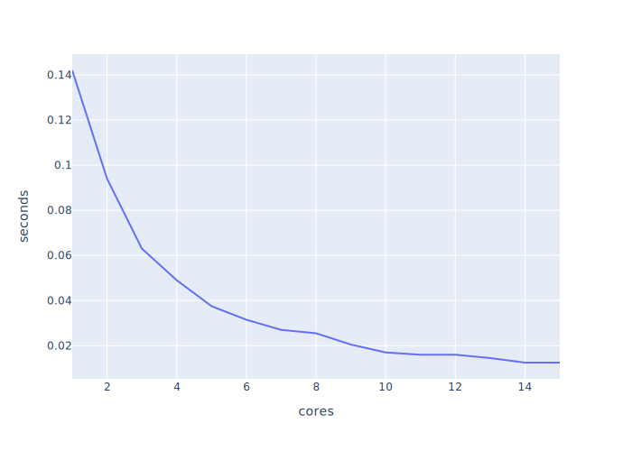
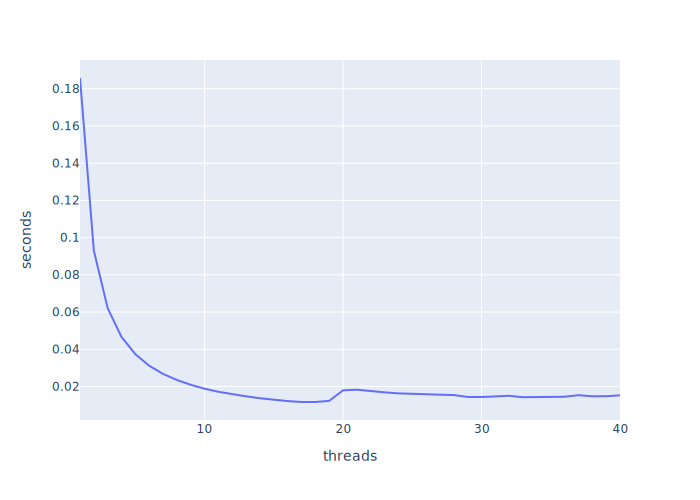

# Distributed systems

This is my documentation from the course 

# Week 1
# Week 2
# Week 3
# Week 4
# Week 5
- When is `MPI_REDUCE` useful:
- When is `MPI_Scatter` and `MPI_Gather` useful?
- What happens if all jobs send before receiving?
- Change communication.c to use non blocking operations
```c
#include "mpi.h"
#include <stdio.h>
#include <stdlib.h>
#define  MASTER		0

int main (int argc, char *argv[])
{
  int  numtasks, taskid, len, partner, message;
  char hostname[MPI_MAX_PROCESSOR_NAME];

  MPI_Status status;
  MPI_Request request;

  MPI_Init(&argc, &argv);
  MPI_Comm_rank(MPI_COMM_WORLD, &taskid);
  MPI_Comm_size(MPI_COMM_WORLD, &numtasks);

  /* need an even number of tasks  */
  if (numtasks % 2 != 0) {
   if (taskid == MASTER)
    printf("Quitting. Need an even number of tasks: numtasks=%d\n", numtasks);
  } else {
    if (taskid == MASTER)
      printf("MASTER: Number of MPI tasks is: %d\n",numtasks);

    MPI_Get_processor_name(hostname, &len);
    printf ("Hello from task %d on %s!\n", taskid, hostname);

    /* determine partner and then send/receive with partner */
    if (taskid < numtasks/2) {
      partner = numtasks/2 + taskid;
      MPI_Isend(&taskid, 1, MPI_INT, partner, 1, MPI_COMM_WORLD, &request);
      MPI_Irecv(&message, 1, MPI_INT, partner, 1, MPI_COMM_WORLD, &request);
    } else if (taskid >= numtasks/2) {
      partner = taskid - numtasks/2;
      MPI_Irecv(&message, 1, MPI_INT, partner, 1, MPI_COMM_WORLD, &request);
      MPI_Isend(&taskid, 1, MPI_INT, partner, 1, MPI_COMM_WORLD, &request);
    }

    MPI_Waitall(1, &request, &status);
    /* print partner info and exit*/
    printf("Task %d is partner with %d\n",taskid,message);
  }

  MPI_Finalize();
}
```
- Use MPI to implement a parallel version of PI
```c
#include "mpi.h"
#include "time.h"
#include <stdio.h>
#include <stdlib.h>
#define  MASTER		0
#define PI25DT 3.141592653589793238462643
#define INTERVALS 10000000


int main (int argc, char *argv[])
{
    double x, f, local_sum, pi;

    double dx = 1.0 / (double) INTERVALS;

    int  numtasks, taskid, len, partner, message;


    MPI_Status status;

    MPI_Init(&argc, &argv);
    MPI_Comm_rank(MPI_COMM_WORLD, &taskid);
    MPI_Comm_size(MPI_COMM_WORLD, &numtasks);

    long int intervals = INTERVALS/numtasks;
    long int start = intervals * (int) (taskid+1);
    long int stop = start - intervals;
    time_t time1;
    double time2;


    if (taskid == 0) { 
	time1 = clock();
    }

    local_sum = 0.0;
    for (int i = start; i > stop ; i--) {
	x = dx * ((double) (i - 0.5));
	local_sum = local_sum + 4.0 / (1.0 + x*x);
    }

    double global_sum;

    MPI_Reduce(&local_sum, &global_sum, 1, MPI_DOUBLE, MPI_SUM, 0, MPI_COMM_WORLD);


    if (taskid == 0) {
	time2 = (clock() - time1) / (double) CLOCKS_PER_SEC;
	pi = dx*global_sum;
	printf("%d, %.24f, %.24f, %.24f, %.24f\n", numtasks, pi, PI25DT, PI25DT-pi, time2);
    }

    MPI_Finalize();

    return 0;
}

```
- Make statistics on the output by changing factors
```sh
#!/bin/sh 
### General options 
### -- specify queue -- 
#BSUB -q hpc
### -- set the job Name -- 
#BSUB -J My_Application
### -- ask for number of cores (default: 1) -- 
#BSUB -n {cpucore}
### -- specify that the cores must be on the same host -- 
#BSUB -R "span[hosts=1]"
### -- specify that we need 2GB of memory per core/slot -- 
#BSUB -R "rusage[mem=2GB]"
### -- specify that we want the job to get killed if it exceeds 3 GB per core/slot -- 
#BSUB -M 3GB
### -- set walltime limit: hh:mm -- 
#BSUB -W 24:00 
### -- set the email address -- 
# please uncomment the following line and put in your e-mail address,
# if you want to receive e-mail notifications on a non-default address
##BSUB -u your_email_address
### -- send notification at start -- 
#BSUB -B 
### -- send notification at completion -- 
#BSUB -N 
### -- Specify the output and error file. %J is the job-id -- 
### -- -o and -e mean append, -oo and -eo mean overwrite -- 
#BSUB -o Output_%J.out 
#BSUB -e Error_%J.err 

module load mpi

mpirun ./main > log/main_{n}.log 
```


```python
from os import execvp 
data = open('run.txt').read()

for i in range(1,16):
    for j in range(20):
        open(f'run/run_{str(i).zfill(2)}_{j}.txt', 'w').write(data.format(cpucore=i, n=f'{str(i).zfill(2)}_{j}'))

```

```sh
bsub < run/run_01_0.txt
bsub < run/run_01_10.txt
bsub < run/run_01_11.txt
bsub < run/run_01_12.txt
bsub < run/run_01_13.txt
bsub < run/run_01_14.txt
bsub < run/run_01_15.txt
bsub < run/run_01_16.txt
bsub < run/run_01_17.txt
bsub < run/run_01_18.txt
bsub < run/run_01_19.txt
bsub < run/run_01_1.txt
bsub < run/run_01_2.txt
bsub < run/run_01_3.txt
bsub < run/run_01_4.txt
bsub < run/run_01_5.txt
bsub < run/run_01_6.txt
bsub < run/run_01_7.txt
bsub < run/run_01_8.txt
bsub < run/run_01_9.txt
bsub < run/run_02_0.txt
bsub < run/run_02_10.txt
bsub < run/run_02_11.txt
bsub < run/run_02_12.txt
bsub < run/run_02_13.txt
bsub < run/run_02_14.txt
bsub < run/run_02_15.txt
bsub < run/run_02_16.txt
bsub < run/run_02_17.txt
bsub < run/run_02_18.txt
bsub < run/run_02_19.txt
bsub < run/run_02_1.txt
bsub < run/run_02_2.txt
bsub < run/run_02_3.txt
bsub < run/run_02_4.txt
bsub < run/run_02_5.txt
bsub < run/run_02_6.txt
bsub < run/run_02_7.txt
bsub < run/run_02_8.txt
bsub < run/run_02_9.txt
bsub < run/run_03_0.txt
bsub < run/run_03_10.txt
bsub < run/run_03_11.txt
bsub < run/run_03_12.txt
bsub < run/run_03_13.txt
bsub < run/run_03_14.txt
bsub < run/run_03_15.txt
bsub < run/run_03_16.txt
bsub < run/run_03_17.txt
bsub < run/run_03_18.txt
bsub < run/run_03_19.txt
bsub < run/run_03_1.txt
bsub < run/run_03_2.txt
bsub < run/run_03_3.txt
bsub < run/run_03_4.txt
bsub < run/run_03_5.txt
bsub < run/run_03_6.txt
bsub < run/run_03_7.txt
bsub < run/run_03_8.txt
bsub < run/run_03_9.txt
bsub < run/run_04_0.txt
bsub < run/run_04_10.txt
bsub < run/run_04_11.txt
bsub < run/run_04_12.txt
bsub < run/run_04_13.txt
bsub < run/run_04_14.txt
bsub < run/run_04_15.txt
bsub < run/run_04_16.txt
bsub < run/run_04_17.txt
bsub < run/run_04_18.txt
bsub < run/run_04_19.txt
bsub < run/run_04_1.txt
bsub < run/run_04_2.txt
bsub < run/run_04_3.txt
bsub < run/run_04_4.txt
bsub < run/run_04_5.txt
bsub < run/run_04_6.txt
bsub < run/run_04_7.txt
bsub < run/run_04_8.txt
bsub < run/run_04_9.txt
bsub < run/run_05_0.txt
bsub < run/run_05_10.txt
bsub < run/run_05_11.txt
bsub < run/run_05_12.txt
bsub < run/run_05_13.txt
bsub < run/run_05_14.txt
bsub < run/run_05_15.txt
bsub < run/run_05_16.txt
bsub < run/run_05_17.txt
bsub < run/run_05_18.txt
bsub < run/run_05_19.txt
bsub < run/run_05_1.txt
bsub < run/run_05_2.txt
bsub < run/run_05_3.txt
bsub < run/run_05_4.txt
bsub < run/run_05_5.txt
bsub < run/run_05_6.txt
bsub < run/run_05_7.txt
bsub < run/run_05_8.txt
bsub < run/run_05_9.txt
bsub < run/run_06_0.txt
bsub < run/run_06_10.txt
bsub < run/run_06_11.txt
bsub < run/run_06_12.txt
bsub < run/run_06_13.txt
bsub < run/run_06_14.txt
bsub < run/run_06_15.txt
bsub < run/run_06_16.txt
bsub < run/run_06_17.txt
bsub < run/run_06_18.txt
bsub < run/run_06_19.txt
bsub < run/run_06_1.txt
bsub < run/run_06_2.txt
bsub < run/run_06_3.txt
bsub < run/run_06_4.txt
bsub < run/run_06_5.txt
bsub < run/run_06_6.txt
bsub < run/run_06_7.txt
bsub < run/run_06_8.txt
bsub < run/run_06_9.txt
bsub < run/run_07_0.txt
bsub < run/run_07_10.txt
bsub < run/run_07_11.txt
bsub < run/run_07_12.txt
bsub < run/run_07_13.txt
bsub < run/run_07_14.txt
bsub < run/run_07_15.txt
bsub < run/run_07_16.txt
bsub < run/run_07_17.txt
bsub < run/run_07_18.txt
bsub < run/run_07_19.txt
bsub < run/run_07_1.txt
bsub < run/run_07_2.txt
bsub < run/run_07_3.txt
bsub < run/run_07_4.txt
bsub < run/run_07_5.txt
bsub < run/run_07_6.txt
bsub < run/run_07_7.txt
bsub < run/run_07_8.txt
bsub < run/run_07_9.txt
bsub < run/run_08_0.txt
bsub < run/run_08_10.txt
bsub < run/run_08_11.txt
bsub < run/run_08_12.txt
bsub < run/run_08_13.txt
bsub < run/run_08_14.txt
bsub < run/run_08_15.txt
bsub < run/run_08_16.txt
bsub < run/run_08_17.txt
bsub < run/run_08_18.txt
bsub < run/run_08_19.txt
bsub < run/run_08_1.txt
bsub < run/run_08_2.txt
bsub < run/run_08_3.txt
bsub < run/run_08_4.txt
bsub < run/run_08_5.txt
bsub < run/run_08_6.txt
bsub < run/run_08_7.txt
bsub < run/run_08_8.txt
bsub < run/run_08_9.txt
bsub < run/run_09_0.txt
bsub < run/run_09_10.txt
bsub < run/run_09_11.txt
bsub < run/run_09_12.txt
bsub < run/run_09_13.txt
bsub < run/run_09_14.txt
bsub < run/run_09_15.txt
bsub < run/run_09_16.txt
bsub < run/run_09_17.txt
bsub < run/run_09_18.txt
bsub < run/run_09_19.txt
bsub < run/run_09_1.txt
bsub < run/run_09_2.txt
bsub < run/run_09_3.txt
bsub < run/run_09_4.txt
bsub < run/run_09_5.txt
bsub < run/run_09_6.txt
bsub < run/run_09_7.txt
bsub < run/run_09_8.txt
bsub < run/run_09_9.txt
bsub < run/run_10_0.txt
bsub < run/run_10_10.txt
bsub < run/run_10_11.txt
bsub < run/run_10_12.txt
bsub < run/run_10_13.txt
bsub < run/run_10_14.txt
bsub < run/run_10_15.txt
bsub < run/run_10_16.txt
bsub < run/run_10_17.txt
bsub < run/run_10_18.txt
bsub < run/run_10_19.txt
bsub < run/run_10_1.txt
bsub < run/run_10_2.txt
bsub < run/run_10_3.txt
bsub < run/run_10_4.txt
bsub < run/run_10_5.txt
bsub < run/run_10_6.txt
bsub < run/run_10_7.txt
bsub < run/run_10_8.txt
bsub < run/run_10_9.txt
bsub < run/run_11_0.txt
bsub < run/run_11_10.txt
bsub < run/run_11_11.txt
bsub < run/run_11_12.txt
bsub < run/run_11_13.txt
bsub < run/run_11_14.txt
bsub < run/run_11_15.txt
bsub < run/run_11_16.txt
bsub < run/run_11_17.txt
bsub < run/run_11_18.txt
bsub < run/run_11_19.txt
bsub < run/run_11_1.txt
bsub < run/run_11_2.txt
bsub < run/run_11_3.txt
bsub < run/run_11_4.txt
bsub < run/run_11_5.txt
bsub < run/run_11_6.txt
bsub < run/run_11_7.txt
bsub < run/run_11_8.txt
bsub < run/run_11_9.txt
bsub < run/run_12_0.txt
bsub < run/run_12_10.txt
bsub < run/run_12_11.txt
bsub < run/run_12_12.txt
bsub < run/run_12_13.txt
bsub < run/run_12_14.txt
bsub < run/run_12_15.txt
bsub < run/run_12_16.txt
bsub < run/run_12_17.txt
bsub < run/run_12_18.txt
bsub < run/run_12_19.txt
bsub < run/run_12_1.txt
bsub < run/run_12_2.txt
bsub < run/run_12_3.txt
bsub < run/run_12_4.txt
bsub < run/run_12_5.txt
bsub < run/run_12_6.txt
bsub < run/run_12_7.txt
bsub < run/run_12_8.txt
bsub < run/run_12_9.txt
bsub < run/run_13_0.txt
bsub < run/run_13_10.txt
bsub < run/run_13_11.txt
bsub < run/run_13_12.txt
bsub < run/run_13_13.txt
bsub < run/run_13_14.txt
bsub < run/run_13_15.txt
bsub < run/run_13_16.txt
bsub < run/run_13_17.txt
bsub < run/run_13_18.txt
bsub < run/run_13_19.txt
bsub < run/run_13_1.txt
bsub < run/run_13_2.txt
bsub < run/run_13_3.txt
bsub < run/run_13_4.txt
bsub < run/run_13_5.txt
bsub < run/run_13_6.txt
bsub < run/run_13_7.txt
bsub < run/run_13_8.txt
bsub < run/run_13_9.txt
bsub < run/run_14_0.txt
bsub < run/run_14_10.txt
bsub < run/run_14_11.txt
bsub < run/run_14_12.txt
bsub < run/run_14_13.txt
bsub < run/run_14_14.txt
bsub < run/run_14_15.txt
bsub < run/run_14_16.txt
bsub < run/run_14_17.txt
bsub < run/run_14_18.txt
bsub < run/run_14_19.txt
bsub < run/run_14_1.txt
bsub < run/run_14_2.txt
bsub < run/run_14_3.txt
bsub < run/run_14_4.txt
bsub < run/run_14_5.txt
bsub < run/run_14_6.txt
bsub < run/run_14_7.txt
bsub < run/run_14_8.txt
bsub < run/run_14_9.txt
bsub < run/run_15_0.txt
bsub < run/run_15_10.txt
bsub < run/run_15_11.txt
bsub < run/run_15_12.txt
bsub < run/run_15_13.txt
bsub < run/run_15_14.txt
bsub < run/run_15_15.txt
bsub < run/run_15_16.txt
bsub < run/run_15_17.txt
bsub < run/run_15_18.txt
bsub < run/run_15_19.txt
bsub < run/run_15_1.txt
bsub < run/run_15_2.txt
bsub < run/run_15_3.txt
bsub < run/run_15_4.txt
bsub < run/run_15_5.txt
bsub < run/run_15_6.txt
bsub < run/run_15_7.txt
bsub < run/run_15_8.txt
bsub < run/run_15_9.txt
```

When all the jobs are done, 

```ls
cd run
cat *.log >> out.log
```

out.log will have the following

```csv
1, 3.141592653589436068273244, 3.141592653589793115997963, 0.000000000000357047724719, 0.140000000000000013322676
1, 3.141592653589436068273244, 3.141592653589793115997963, 0.000000000000357047724719, 0.130000000000000004440892
1, 3.141592653589436068273244, 3.141592653589793115997963, 0.000000000000357047724719, 0.130000000000000004440892
1, 3.141592653589436068273244, 3.141592653589793115997963, 0.000000000000357047724719, 0.130000000000000004440892
1, 3.141592653589436068273244, 3.141592653589793115997963, 0.000000000000357047724719, 0.130000000000000004440892
1, 3.141592653589436068273244, 3.141592653589793115997963, 0.000000000000357047724719, 0.140000000000000013322676
1, 3.141592653589436068273244, 3.141592653589793115997963, 0.000000000000357047724719, 0.149999999999999994448885
1, 3.141592653589436068273244, 3.141592653589793115997963, 0.000000000000357047724719, 0.149999999999999994448885
1, 3.141592653589436068273244, 3.141592653589793115997963, 0.000000000000357047724719, 0.149999999999999994448885
1, 3.141592653589436068273244, 3.141592653589793115997963, 0.000000000000357047724719, 0.149999999999999994448885
1, 3.141592653589436068273244, 3.141592653589793115997963, 0.000000000000357047724719, 0.149999999999999994448885
1, 3.141592653589436068273244, 3.141592653589793115997963, 0.000000000000357047724719, 0.149999999999999994448885
1, 3.141592653589436068273244, 3.141592653589793115997963, 0.000000000000357047724719, 0.149999999999999994448885
1, 3.141592653589436068273244, 3.141592653589793115997963, 0.000000000000357047724719, 0.149999999999999994448885
1, 3.141592653589436068273244, 3.141592653589793115997963, 0.000000000000357047724719, 0.149999999999999994448885
1, 3.141592653589436068273244, 3.141592653589793115997963, 0.000000000000357047724719, 0.149999999999999994448885
1, 3.141592653589436068273244, 3.141592653589793115997963, 0.000000000000357047724719, 0.149999999999999994448885
1, 3.141592653589436068273244, 3.141592653589793115997963, 0.000000000000357047724719, 0.130000000000000004440892
1, 3.141592653589436068273244, 3.141592653589793115997963, 0.000000000000357047724719, 0.130000000000000004440892
1, 3.141592653589436068273244, 3.141592653589793115997963, 0.000000000000357047724719, 0.130000000000000004440892
2, 3.141592653589739825292781, 3.141592653589793115997963, 0.000000000000053290705182, 0.100000000000000005551115
2, 3.141592653589739825292781, 3.141592653589793115997963, 0.000000000000053290705182, 0.089999999999999996669331
2, 3.141592653589739825292781, 3.141592653589793115997963, 0.000000000000053290705182, 0.100000000000000005551115
2, 3.141592653589739825292781, 3.141592653589793115997963, 0.000000000000053290705182, 0.089999999999999996669331
2, 3.141592653589739825292781, 3.141592653589793115997963, 0.000000000000053290705182, 0.089999999999999996669331
2, 3.141592653589739825292781, 3.141592653589793115997963, 0.000000000000053290705182, 0.089999999999999996669331
2, 3.141592653589739825292781, 3.141592653589793115997963, 0.000000000000053290705182, 0.089999999999999996669331
2, 3.141592653589739825292781, 3.141592653589793115997963, 0.000000000000053290705182, 0.100000000000000005551115
2, 3.141592653589739825292781, 3.141592653589793115997963, 0.000000000000053290705182, 0.089999999999999996669331
2, 3.141592653589739825292781, 3.141592653589793115997963, 0.000000000000053290705182, 0.100000000000000005551115
2, 3.141592653589739825292781, 3.141592653589793115997963, 0.000000000000053290705182, 0.100000000000000005551115
2, 3.141592653589739825292781, 3.141592653589793115997963, 0.000000000000053290705182, 0.089999999999999996669331
2, 3.141592653589739825292781, 3.141592653589793115997963, 0.000000000000053290705182, 0.089999999999999996669331
2, 3.141592653589739825292781, 3.141592653589793115997963, 0.000000000000053290705182, 0.100000000000000005551115
2, 3.141592653589739825292781, 3.141592653589793115997963, 0.000000000000053290705182, 0.089999999999999996669331
2, 3.141592653589739825292781, 3.141592653589793115997963, 0.000000000000053290705182, 0.100000000000000005551115
2, 3.141592653589739825292781, 3.141592653589793115997963, 0.000000000000053290705182, 0.089999999999999996669331
2, 3.141592653589739825292781, 3.141592653589793115997963, 0.000000000000053290705182, 0.089999999999999996669331
2, 3.141592653589739825292781, 3.141592653589793115997963, 0.000000000000053290705182, 0.089999999999999996669331
2, 3.141592653589739825292781, 3.141592653589793115997963, 0.000000000000053290705182, 0.100000000000000005551115
3, 3.141592453589824529558427, 3.141592653589793115997963, 0.000000199999968586439536, 0.059999999999999997779554
3, 3.141592453589824529558427, 3.141592653589793115997963, 0.000000199999968586439536, 0.059999999999999997779554
3, 3.141592453589824529558427, 3.141592653589793115997963, 0.000000199999968586439536, 0.070000000000000006661338
3, 3.141592453589824529558427, 3.141592653589793115997963, 0.000000199999968586439536, 0.059999999999999997779554
3, 3.141592453589824529558427, 3.141592653589793115997963, 0.000000199999968586439536, 0.059999999999999997779554
3, 3.141592453589824529558427, 3.141592653589793115997963, 0.000000199999968586439536, 0.059999999999999997779554
3, 3.141592453589824529558427, 3.141592653589793115997963, 0.000000199999968586439536, 0.059999999999999997779554
3, 3.141592453589824529558427, 3.141592653589793115997963, 0.000000199999968586439536, 0.070000000000000006661338
3, 3.141592453589824529558427, 3.141592653589793115997963, 0.000000199999968586439536, 0.070000000000000006661338
3, 3.141592453589824529558427, 3.141592653589793115997963, 0.000000199999968586439536, 0.070000000000000006661338
3, 3.141592453589824529558427, 3.141592653589793115997963, 0.000000199999968586439536, 0.070000000000000006661338
3, 3.141592453589824529558427, 3.141592653589793115997963, 0.000000199999968586439536, 0.059999999999999997779554
3, 3.141592453589824529558427, 3.141592653589793115997963, 0.000000199999968586439536, 0.059999999999999997779554
3, 3.141592453589824529558427, 3.141592653589793115997963, 0.000000199999968586439536, 0.059999999999999997779554
3, 3.141592453589824529558427, 3.141592653589793115997963, 0.000000199999968586439536, 0.059999999999999997779554
3, 3.141592453589824529558427, 3.141592653589793115997963, 0.000000199999968586439536, 0.059999999999999997779554
3, 3.141592453589824529558427, 3.141592653589793115997963, 0.000000199999968586439536, 0.059999999999999997779554
3, 3.141592453589824529558427, 3.141592653589793115997963, 0.000000199999968586439536, 0.059999999999999997779554
3, 3.141592453589824529558427, 3.141592653589793115997963, 0.000000199999968586439536, 0.059999999999999997779554
3, 3.141592453589824529558427, 3.141592653589793115997963, 0.000000199999968586439536, 0.070000000000000006661338
4, 3.141592653589784234213766, 3.141592653589793115997963, 0.000000000000008881784197, 0.050000000000000002775558
4, 3.141592653589784234213766, 3.141592653589793115997963, 0.000000000000008881784197, 0.050000000000000002775558
4, 3.141592653589784234213766, 3.141592653589793115997963, 0.000000000000008881784197, 0.050000000000000002775558
4, 3.141592653589784234213766, 3.141592653589793115997963, 0.000000000000008881784197, 0.050000000000000002775558
4, 3.141592653589784234213766, 3.141592653589793115997963, 0.000000000000008881784197, 0.050000000000000002775558
4, 3.141592653589784234213766, 3.141592653589793115997963, 0.000000000000008881784197, 0.050000000000000002775558
4, 3.141592653589784234213766, 3.141592653589793115997963, 0.000000000000008881784197, 0.050000000000000002775558
4, 3.141592653589784234213766, 3.141592653589793115997963, 0.000000000000008881784197, 0.050000000000000002775558
4, 3.141592653589784234213766, 3.141592653589793115997963, 0.000000000000008881784197, 0.050000000000000002775558
4, 3.141592653589784234213766, 3.141592653589793115997963, 0.000000000000008881784197, 0.050000000000000002775558
4, 3.141592653589784234213766, 3.141592653589793115997963, 0.000000000000008881784197, 0.040000000000000000832667
4, 3.141592653589784234213766, 3.141592653589793115997963, 0.000000000000008881784197, 0.050000000000000002775558
4, 3.141592653589784234213766, 3.141592653589793115997963, 0.000000000000008881784197, 0.050000000000000002775558
4, 3.141592653589784234213766, 3.141592653589793115997963, 0.000000000000008881784197, 0.050000000000000002775558
4, 3.141592653589784234213766, 3.141592653589793115997963, 0.000000000000008881784197, 0.050000000000000002775558
4, 3.141592653589784234213766, 3.141592653589793115997963, 0.000000000000008881784197, 0.040000000000000000832667
4, 3.141592653589784234213766, 3.141592653589793115997963, 0.000000000000008881784197, 0.050000000000000002775558
4, 3.141592653589784234213766, 3.141592653589793115997963, 0.000000000000008881784197, 0.050000000000000002775558
4, 3.141592653589784234213766, 3.141592653589793115997963, 0.000000000000008881784197, 0.050000000000000002775558
4, 3.141592653589784234213766, 3.141592653589793115997963, 0.000000000000008881784197, 0.050000000000000002775558
5, 3.141592653589785566481396, 3.141592653589793115997963, 0.000000000000007549516567, 0.029999999999999998889777
5, 3.141592653589785566481396, 3.141592653589793115997963, 0.000000000000007549516567, 0.040000000000000000832667
5, 3.141592653589785566481396, 3.141592653589793115997963, 0.000000000000007549516567, 0.040000000000000000832667
5, 3.141592653589785566481396, 3.141592653589793115997963, 0.000000000000007549516567, 0.040000000000000000832667
5, 3.141592653589785566481396, 3.141592653589793115997963, 0.000000000000007549516567, 0.029999999999999998889777
5, 3.141592653589785566481396, 3.141592653589793115997963, 0.000000000000007549516567, 0.040000000000000000832667
5, 3.141592653589785566481396, 3.141592653589793115997963, 0.000000000000007549516567, 0.029999999999999998889777
5, 3.141592653589785566481396, 3.141592653589793115997963, 0.000000000000007549516567, 0.040000000000000000832667
5, 3.141592653589785566481396, 3.141592653589793115997963, 0.000000000000007549516567, 0.040000000000000000832667
5, 3.141592653589785566481396, 3.141592653589793115997963, 0.000000000000007549516567, 0.029999999999999998889777
5, 3.141592653589785566481396, 3.141592653589793115997963, 0.000000000000007549516567, 0.029999999999999998889777
5, 3.141592653589785566481396, 3.141592653589793115997963, 0.000000000000007549516567, 0.040000000000000000832667
5, 3.141592653589785566481396, 3.141592653589793115997963, 0.000000000000007549516567, 0.050000000000000002775558
5, 3.141592653589785566481396, 3.141592653589793115997963, 0.000000000000007549516567, 0.040000000000000000832667
5, 3.141592653589785566481396, 3.141592653589793115997963, 0.000000000000007549516567, 0.040000000000000000832667
5, 3.141592653589785566481396, 3.141592653589793115997963, 0.000000000000007549516567, 0.040000000000000000832667
5, 3.141592653589785566481396, 3.141592653589793115997963, 0.000000000000007549516567, 0.029999999999999998889777
5, 3.141592653589785566481396, 3.141592653589793115997963, 0.000000000000007549516567, 0.040000000000000000832667
5, 3.141592653589785566481396, 3.141592653589793115997963, 0.000000000000007549516567, 0.040000000000000000832667
5, 3.141592653589785566481396, 3.141592653589793115997963, 0.000000000000007549516567, 0.040000000000000000832667
6, 3.141591853589666527568625, 3.141592653589793115997963, 0.000000800000126588429339, 0.029999999999999998889777
6, 3.141591853589666527568625, 3.141592653589793115997963, 0.000000800000126588429339, 0.029999999999999998889777
6, 3.141591853589666527568625, 3.141592653589793115997963, 0.000000800000126588429339, 0.029999999999999998889777
6, 3.141591853589666527568625, 3.141592653589793115997963, 0.000000800000126588429339, 0.029999999999999998889777
6, 3.141591853589666527568625, 3.141592653589793115997963, 0.000000800000126588429339, 0.029999999999999998889777
6, 3.141591853589666527568625, 3.141592653589793115997963, 0.000000800000126588429339, 0.029999999999999998889777
6, 3.141591853589666527568625, 3.141592653589793115997963, 0.000000800000126588429339, 0.029999999999999998889777
6, 3.141591853589666527568625, 3.141592653589793115997963, 0.000000800000126588429339, 0.029999999999999998889777
6, 3.141591853589666527568625, 3.141592653589793115997963, 0.000000800000126588429339, 0.040000000000000000832667
6, 3.141591853589666527568625, 3.141592653589793115997963, 0.000000800000126588429339, 0.040000000000000000832667
6, 3.141591853589666527568625, 3.141592653589793115997963, 0.000000800000126588429339, 0.029999999999999998889777
6, 3.141591853589666527568625, 3.141592653589793115997963, 0.000000800000126588429339, 0.029999999999999998889777
6, 3.141591853589666527568625, 3.141592653589793115997963, 0.000000800000126588429339, 0.029999999999999998889777
6, 3.141591853589666527568625, 3.141592653589793115997963, 0.000000800000126588429339, 0.029999999999999998889777
6, 3.141591853589666527568625, 3.141592653589793115997963, 0.000000800000126588429339, 0.029999999999999998889777
6, 3.141591853589666527568625, 3.141592653589793115997963, 0.000000800000126588429339, 0.029999999999999998889777
6, 3.141591853589666527568625, 3.141592653589793115997963, 0.000000800000126588429339, 0.029999999999999998889777
6, 3.141591853589666527568625, 3.141592653589793115997963, 0.000000800000126588429339, 0.029999999999999998889777
6, 3.141591853589666527568625, 3.141592653589793115997963, 0.000000800000126588429339, 0.040000000000000000832667
6, 3.141591853589666527568625, 3.141592653589793115997963, 0.000000800000126588429339, 0.029999999999999998889777
7, 3.141592053589694621962281, 3.141592653589793115997963, 0.000000600000098494035683, 0.029999999999999998889777
7, 3.141592053589694621962281, 3.141592653589793115997963, 0.000000600000098494035683, 0.040000000000000000832667
7, 3.141592053589694621962281, 3.141592653589793115997963, 0.000000600000098494035683, 0.029999999999999998889777
7, 3.141592053589694621962281, 3.141592653589793115997963, 0.000000600000098494035683, 0.029999999999999998889777
7, 3.141592053589694621962281, 3.141592653589793115997963, 0.000000600000098494035683, 0.020000000000000000416334
7, 3.141592053589694621962281, 3.141592653589793115997963, 0.000000600000098494035683, 0.029999999999999998889777
7, 3.141592053589694621962281, 3.141592653589793115997963, 0.000000600000098494035683, 0.020000000000000000416334
7, 3.141592053589694621962281, 3.141592653589793115997963, 0.000000600000098494035683, 0.020000000000000000416334
7, 3.141592053589694621962281, 3.141592653589793115997963, 0.000000600000098494035683, 0.029999999999999998889777
7, 3.141592053589694621962281, 3.141592653589793115997963, 0.000000600000098494035683, 0.020000000000000000416334
7, 3.141592053589694621962281, 3.141592653589793115997963, 0.000000600000098494035683, 0.029999999999999998889777
7, 3.141592053589694621962281, 3.141592653589793115997963, 0.000000600000098494035683, 0.020000000000000000416334
7, 3.141592053589694621962281, 3.141592653589793115997963, 0.000000600000098494035683, 0.029999999999999998889777
7, 3.141592053589694621962281, 3.141592653589793115997963, 0.000000600000098494035683, 0.020000000000000000416334
7, 3.141592053589694621962281, 3.141592653589793115997963, 0.000000600000098494035683, 0.029999999999999998889777
7, 3.141592053589694621962281, 3.141592653589793115997963, 0.000000600000098494035683, 0.029999999999999998889777
7, 3.141592053589694621962281, 3.141592653589793115997963, 0.000000600000098494035683, 0.029999999999999998889777
7, 3.141592053589694621962281, 3.141592653589793115997963, 0.000000600000098494035683, 0.029999999999999998889777
7, 3.141592053589694621962281, 3.141592653589793115997963, 0.000000600000098494035683, 0.020000000000000000416334
7, 3.141592053589694621962281, 3.141592653589793115997963, 0.000000600000098494035683, 0.029999999999999998889777
8, 3.141592653589782901946137, 3.141592653589793115997963, 0.000000000000010214051827, 0.020000000000000000416334
8, 3.141592653589782901946137, 3.141592653589793115997963, 0.000000000000010214051827, 0.020000000000000000416334
8, 3.141592653589782901946137, 3.141592653589793115997963, 0.000000000000010214051827, 0.029999999999999998889777
8, 3.141592653589782901946137, 3.141592653589793115997963, 0.000000000000010214051827, 0.020000000000000000416334
8, 3.141592653589782901946137, 3.141592653589793115997963, 0.000000000000010214051827, 0.020000000000000000416334
8, 3.141592653589782901946137, 3.141592653589793115997963, 0.000000000000010214051827, 0.020000000000000000416334
8, 3.141592653589782901946137, 3.141592653589793115997963, 0.000000000000010214051827, 0.029999999999999998889777
8, 3.141592653589782901946137, 3.141592653589793115997963, 0.000000000000010214051827, 0.020000000000000000416334
8, 3.141592653589782901946137, 3.141592653589793115997963, 0.000000000000010214051827, 0.029999999999999998889777
8, 3.141592653589782901946137, 3.141592653589793115997963, 0.000000000000010214051827, 0.020000000000000000416334
8, 3.141592653589782901946137, 3.141592653589793115997963, 0.000000000000010214051827, 0.020000000000000000416334
8, 3.141592653589782901946137, 3.141592653589793115997963, 0.000000000000010214051827, 0.040000000000000000832667
8, 3.141592653589782901946137, 3.141592653589793115997963, 0.000000000000010214051827, 0.029999999999999998889777
8, 3.141592653589782901946137, 3.141592653589793115997963, 0.000000000000010214051827, 0.029999999999999998889777
8, 3.141592653589782901946137, 3.141592653589793115997963, 0.000000000000010214051827, 0.020000000000000000416334
8, 3.141592653589782901946137, 3.141592653589793115997963, 0.000000000000010214051827, 0.029999999999999998889777
8, 3.141592653589782901946137, 3.141592653589793115997963, 0.000000000000010214051827, 0.029999999999999998889777
8, 3.141592653589782901946137, 3.141592653589793115997963, 0.000000000000010214051827, 0.029999999999999998889777
8, 3.141592653589782901946137, 3.141592653589793115997963, 0.000000000000010214051827, 0.029999999999999998889777
8, 3.141592653589782901946137, 3.141592653589793115997963, 0.000000000000010214051827, 0.020000000000000000416334
9, 3.141592453589753475284851, 3.141592653589793115997963, 0.000000200000039640713112, 0.020000000000000000416334
9, 3.141592453589753475284851, 3.141592653589793115997963, 0.000000200000039640713112, 0.020000000000000000416334
9, 3.141592453589753475284851, 3.141592653589793115997963, 0.000000200000039640713112, 0.020000000000000000416334
9, 3.141592453589753475284851, 3.141592653589793115997963, 0.000000200000039640713112, 0.020000000000000000416334
9, 3.141592453589753475284851, 3.141592653589793115997963, 0.000000200000039640713112, 0.020000000000000000416334
9, 3.141592453589753475284851, 3.141592653589793115997963, 0.000000200000039640713112, 0.029999999999999998889777
9, 3.141592453589753475284851, 3.141592653589793115997963, 0.000000200000039640713112, 0.020000000000000000416334
9, 3.141592453589753475284851, 3.141592653589793115997963, 0.000000200000039640713112, 0.020000000000000000416334
9, 3.141592453589753475284851, 3.141592653589793115997963, 0.000000200000039640713112, 0.020000000000000000416334
9, 3.141592453589753475284851, 3.141592653589793115997963, 0.000000200000039640713112, 0.029999999999999998889777
9, 3.141592453589753475284851, 3.141592653589793115997963, 0.000000200000039640713112, 0.020000000000000000416334
9, 3.141592453589753475284851, 3.141592653589793115997963, 0.000000200000039640713112, 0.020000000000000000416334
9, 3.141592453589753475284851, 3.141592653589793115997963, 0.000000200000039640713112, 0.010000000000000000208167
9, 3.141592453589753475284851, 3.141592653589793115997963, 0.000000200000039640713112, 0.020000000000000000416334
9, 3.141592453589753475284851, 3.141592653589793115997963, 0.000000200000039640713112, 0.020000000000000000416334
9, 3.141592453589753475284851, 3.141592653589793115997963, 0.000000200000039640713112, 0.020000000000000000416334
9, 3.141592453589753475284851, 3.141592653589793115997963, 0.000000200000039640713112, 0.020000000000000000416334
9, 3.141592453589753475284851, 3.141592653589793115997963, 0.000000200000039640713112, 0.020000000000000000416334
9, 3.141592453589753475284851, 3.141592653589793115997963, 0.000000200000039640713112, 0.020000000000000000416334
9, 3.141592453589753475284851, 3.141592653589793115997963, 0.000000200000039640713112, 0.020000000000000000416334
10, 3.141592653589816652726086, 3.141592653589793115997963, -0.000000000000023536728122, 0.020000000000000000416334
10, 3.141592653589816652726086, 3.141592653589793115997963, -0.000000000000023536728122, 0.020000000000000000416334
10, 3.141592653589816652726086, 3.141592653589793115997963, -0.000000000000023536728122, 0.020000000000000000416334
10, 3.141592653589816652726086, 3.141592653589793115997963, -0.000000000000023536728122, 0.010000000000000000208167
10, 3.141592653589816652726086, 3.141592653589793115997963, -0.000000000000023536728122, 0.020000000000000000416334
10, 3.141592653589816652726086, 3.141592653589793115997963, -0.000000000000023536728122, 0.020000000000000000416334
10, 3.141592653589816652726086, 3.141592653589793115997963, -0.000000000000023536728122, 0.020000000000000000416334
10, 3.141592653589816652726086, 3.141592653589793115997963, -0.000000000000023536728122, 0.020000000000000000416334
10, 3.141592653589816652726086, 3.141592653589793115997963, -0.000000000000023536728122, 0.020000000000000000416334
10, 3.141592653589816652726086, 3.141592653589793115997963, -0.000000000000023536728122, 0.010000000000000000208167
10, 3.141592653589816652726086, 3.141592653589793115997963, -0.000000000000023536728122, 0.010000000000000000208167
10, 3.141592653589816652726086, 3.141592653589793115997963, -0.000000000000023536728122, 0.020000000000000000416334
10, 3.141592653589816652726086, 3.141592653589793115997963, -0.000000000000023536728122, 0.010000000000000000208167
10, 3.141592653589816652726086, 3.141592653589793115997963, -0.000000000000023536728122, 0.020000000000000000416334
10, 3.141592653589816652726086, 3.141592653589793115997963, -0.000000000000023536728122, 0.020000000000000000416334
10, 3.141592653589816652726086, 3.141592653589793115997963, -0.000000000000023536728122, 0.020000000000000000416334
10, 3.141592653589816652726086, 3.141592653589793115997963, -0.000000000000023536728122, 0.010000000000000000208167
10, 3.141592653589816652726086, 3.141592653589793115997963, -0.000000000000023536728122, 0.020000000000000000416334
10, 3.141592653589816652726086, 3.141592653589793115997963, -0.000000000000023536728122, 0.020000000000000000416334
10, 3.141592653589816652726086, 3.141592653589793115997963, -0.000000000000023536728122, 0.010000000000000000208167
11, 3.141590653588822945607717, 3.141592653589793115997963, 0.000002000000970170390246, 0.010000000000000000208167
11, 3.141590653588822945607717, 3.141592653589793115997963, 0.000002000000970170390246, 0.020000000000000000416334
11, 3.141590653588822945607717, 3.141592653589793115997963, 0.000002000000970170390246, 0.020000000000000000416334
11, 3.141590653588822945607717, 3.141592653589793115997963, 0.000002000000970170390246, 0.010000000000000000208167
11, 3.141590653588822945607717, 3.141592653589793115997963, 0.000002000000970170390246, 0.020000000000000000416334
11, 3.141590653588822945607717, 3.141592653589793115997963, 0.000002000000970170390246, 0.020000000000000000416334
11, 3.141590653588822945607717, 3.141592653589793115997963, 0.000002000000970170390246, 0.010000000000000000208167
11, 3.141590653588822945607717, 3.141592653589793115997963, 0.000002000000970170390246, 0.010000000000000000208167
11, 3.141590653588822945607717, 3.141592653589793115997963, 0.000002000000970170390246, 0.020000000000000000416334
11, 3.141590653588822945607717, 3.141592653589793115997963, 0.000002000000970170390246, 0.020000000000000000416334
11, 3.141590653588822945607717, 3.141592653589793115997963, 0.000002000000970170390246, 0.020000000000000000416334
11, 3.141590653588822945607717, 3.141592653589793115997963, 0.000002000000970170390246, 0.020000000000000000416334
11, 3.141590653588822945607717, 3.141592653589793115997963, 0.000002000000970170390246, 0.020000000000000000416334
11, 3.141590653588822945607717, 3.141592653589793115997963, 0.000002000000970170390246, 0.020000000000000000416334
11, 3.141590653588822945607717, 3.141592653589793115997963, 0.000002000000970170390246, 0.010000000000000000208167
11, 3.141590653588822945607717, 3.141592653589793115997963, 0.000002000000970170390246, 0.020000000000000000416334
11, 3.141590653588822945607717, 3.141592653589793115997963, 0.000002000000970170390246, 0.010000000000000000208167
11, 3.141590653588822945607717, 3.141592653589793115997963, 0.000002000000970170390246, 0.010000000000000000208167
11, 3.141590653588822945607717, 3.141592653589793115997963, 0.000002000000970170390246, 0.020000000000000000416334
11, 3.141590653588822945607717, 3.141592653589793115997963, 0.000002000000970170390246, 0.010000000000000000208167
12, 3.141591853589668303925464, 3.141592653589793115997963, 0.000000800000124812072499, 0.020000000000000000416334
12, 3.141591853589668303925464, 3.141592653589793115997963, 0.000000800000124812072499, 0.020000000000000000416334
12, 3.141591853589668303925464, 3.141592653589793115997963, 0.000000800000124812072499, 0.010000000000000000208167
12, 3.141591853589668303925464, 3.141592653589793115997963, 0.000000800000124812072499, 0.020000000000000000416334
12, 3.141591853589668303925464, 3.141592653589793115997963, 0.000000800000124812072499, 0.020000000000000000416334
12, 3.141591853589668303925464, 3.141592653589793115997963, 0.000000800000124812072499, 0.010000000000000000208167
12, 3.141591853589668303925464, 3.141592653589793115997963, 0.000000800000124812072499, 0.010000000000000000208167
12, 3.141591853589668303925464, 3.141592653589793115997963, 0.000000800000124812072499, 0.010000000000000000208167
12, 3.141591853589668303925464, 3.141592653589793115997963, 0.000000800000124812072499, 0.010000000000000000208167
12, 3.141591853589668303925464, 3.141592653589793115997963, 0.000000800000124812072499, 0.020000000000000000416334
12, 3.141591853589668303925464, 3.141592653589793115997963, 0.000000800000124812072499, 0.010000000000000000208167
12, 3.141591853589668303925464, 3.141592653589793115997963, 0.000000800000124812072499, 0.020000000000000000416334
12, 3.141591853589668303925464, 3.141592653589793115997963, 0.000000800000124812072499, 0.020000000000000000416334
12, 3.141591853589668303925464, 3.141592653589793115997963, 0.000000800000124812072499, 0.020000000000000000416334
12, 3.141591853589668303925464, 3.141592653589793115997963, 0.000000800000124812072499, 0.010000000000000000208167
12, 3.141591853589668303925464, 3.141592653589793115997963, 0.000000800000124812072499, 0.020000000000000000416334
12, 3.141591853589668303925464, 3.141592653589793115997963, 0.000000800000124812072499, 0.020000000000000000416334
12, 3.141591853589668303925464, 3.141592653589793115997963, 0.000000800000124812072499, 0.020000000000000000416334
12, 3.141591853589668303925464, 3.141592653589793115997963, 0.000000800000124812072499, 0.020000000000000000416334
12, 3.141591853589668303925464, 3.141592653589793115997963, 0.000000800000124812072499, 0.010000000000000000208167
13, 3.141590653588776316240683, 3.141592653589793115997963, 0.000002000001016799757281, 0.020000000000000000416334
13, 3.141590653588776316240683, 3.141592653589793115997963, 0.000002000001016799757281, 0.020000000000000000416334
13, 3.141590653588776316240683, 3.141592653589793115997963, 0.000002000001016799757281, 0.010000000000000000208167
13, 3.141590653588776316240683, 3.141592653589793115997963, 0.000002000001016799757281, 0.020000000000000000416334
13, 3.141590653588776316240683, 3.141592653589793115997963, 0.000002000001016799757281, 0.020000000000000000416334
13, 3.141590653588776316240683, 3.141592653589793115997963, 0.000002000001016799757281, 0.010000000000000000208167
13, 3.141590653588776316240683, 3.141592653589793115997963, 0.000002000001016799757281, 0.020000000000000000416334
13, 3.141590653588776316240683, 3.141592653589793115997963, 0.000002000001016799757281, 0.010000000000000000208167
13, 3.141590653588776316240683, 3.141592653589793115997963, 0.000002000001016799757281, 0.010000000000000000208167
13, 3.141590653588776316240683, 3.141592653589793115997963, 0.000002000001016799757281, 0.010000000000000000208167
13, 3.141590653588776316240683, 3.141592653589793115997963, 0.000002000001016799757281, 0.010000000000000000208167
13, 3.141590653588776316240683, 3.141592653589793115997963, 0.000002000001016799757281, 0.010000000000000000208167
13, 3.141590653588776316240683, 3.141592653589793115997963, 0.000002000001016799757281, 0.020000000000000000416334
13, 3.141590653588776316240683, 3.141592653589793115997963, 0.000002000001016799757281, 0.020000000000000000416334
13, 3.141590653588776316240683, 3.141592653589793115997963, 0.000002000001016799757281, 0.020000000000000000416334
13, 3.141590653588776316240683, 3.141592653589793115997963, 0.000002000001016799757281, 0.010000000000000000208167
13, 3.141590653588776316240683, 3.141592653589793115997963, 0.000002000001016799757281, 0.010000000000000000208167
13, 3.141590653588776316240683, 3.141592653589793115997963, 0.000002000001016799757281, 0.010000000000000000208167
13, 3.141590653588776316240683, 3.141592653589793115997963, 0.000002000001016799757281, 0.020000000000000000416334
13, 3.141590653588776316240683, 3.141592653589793115997963, 0.000002000001016799757281, 0.010000000000000000208167
14, 3.141590653588811843377471, 3.141592653589793115997963, 0.000002000000981272620493, 0.010000000000000000208167
14, 3.141590653588811843377471, 3.141592653589793115997963, 0.000002000000981272620493, 0.010000000000000000208167
14, 3.141590653588811843377471, 3.141592653589793115997963, 0.000002000000981272620493, 0.010000000000000000208167
14, 3.141590653588811843377471, 3.141592653589793115997963, 0.000002000000981272620493, 0.010000000000000000208167
14, 3.141590653588811843377471, 3.141592653589793115997963, 0.000002000000981272620493, 0.020000000000000000416334
14, 3.141590653588811843377471, 3.141592653589793115997963, 0.000002000000981272620493, 0.010000000000000000208167
14, 3.141590653588811843377471, 3.141592653589793115997963, 0.000002000000981272620493, 0.020000000000000000416334
14, 3.141590653588811843377471, 3.141592653589793115997963, 0.000002000000981272620493, 0.020000000000000000416334
14, 3.141590653588811843377471, 3.141592653589793115997963, 0.000002000000981272620493, 0.020000000000000000416334
14, 3.141590653588811843377471, 3.141592653589793115997963, 0.000002000000981272620493, 0.010000000000000000208167
14, 3.141590653588811843377471, 3.141592653589793115997963, 0.000002000000981272620493, 0.010000000000000000208167
14, 3.141590653588811843377471, 3.141592653589793115997963, 0.000002000000981272620493, 0.010000000000000000208167
14, 3.141590653588811843377471, 3.141592653589793115997963, 0.000002000000981272620493, 0.010000000000000000208167
14, 3.141590653588811843377471, 3.141592653589793115997963, 0.000002000000981272620493, 0.010000000000000000208167
14, 3.141590653588811843377471, 3.141592653589793115997963, 0.000002000000981272620493, 0.020000000000000000416334
14, 3.141590653588811843377471, 3.141592653589793115997963, 0.000002000000981272620493, 0.010000000000000000208167
14, 3.141590653588811843377471, 3.141592653589793115997963, 0.000002000000981272620493, 0.010000000000000000208167
14, 3.141590653588811843377471, 3.141592653589793115997963, 0.000002000000981272620493, 0.010000000000000000208167
14, 3.141590653588811843377471, 3.141592653589793115997963, 0.000002000000981272620493, 0.010000000000000000208167
14, 3.141590653588811843377471, 3.141592653589793115997963, 0.000002000000981272620493, 0.010000000000000000208167
15, 3.141590653588802073414854, 3.141592653589793115997963, 0.000002000000991042583109, 0.010000000000000000208167
15, 3.141590653588802073414854, 3.141592653589793115997963, 0.000002000000991042583109, 0.010000000000000000208167
15, 3.141590653588802073414854, 3.141592653589793115997963, 0.000002000000991042583109, 0.010000000000000000208167
15, 3.141590653588802073414854, 3.141592653589793115997963, 0.000002000000991042583109, 0.010000000000000000208167
15, 3.141590653588802073414854, 3.141592653589793115997963, 0.000002000000991042583109, 0.010000000000000000208167
15, 3.141590653588802073414854, 3.141592653589793115997963, 0.000002000000991042583109, 0.010000000000000000208167
15, 3.141590653588802073414854, 3.141592653589793115997963, 0.000002000000991042583109, 0.010000000000000000208167
15, 3.141590653588802073414854, 3.141592653589793115997963, 0.000002000000991042583109, 0.010000000000000000208167
15, 3.141590653588802073414854, 3.141592653589793115997963, 0.000002000000991042583109, 0.010000000000000000208167
15, 3.141590653588802073414854, 3.141592653589793115997963, 0.000002000000991042583109, 0.010000000000000000208167
15, 3.141590653588802073414854, 3.141592653589793115997963, 0.000002000000991042583109, 0.020000000000000000416334
15, 3.141590653588802073414854, 3.141592653589793115997963, 0.000002000000991042583109, 0.020000000000000000416334
15, 3.141590653588802073414854, 3.141592653589793115997963, 0.000002000000991042583109, 0.020000000000000000416334
15, 3.141590653588802073414854, 3.141592653589793115997963, 0.000002000000991042583109, 0.020000000000000000416334
15, 3.141590653588802073414854, 3.141592653589793115997963, 0.000002000000991042583109, 0.010000000000000000208167
15, 3.141590653588802073414854, 3.141592653589793115997963, 0.000002000000991042583109, 0.010000000000000000208167
15, 3.141590653588802073414854, 3.141592653589793115997963, 0.000002000000991042583109, 0.010000000000000000208167
15, 3.141590653588802073414854, 3.141592653589793115997963, 0.000002000000991042583109, 0.010000000000000000208167
15, 3.141590653588802073414854, 3.141592653589793115997963, 0.000002000000991042583109, 0.010000000000000000208167
15, 3.141590653588802073414854, 3.141592653589793115997963, 0.000002000000991042583109, 0.020000000000000000416334
```

Which we will use in this python script

```python
import pandas as pd
import plotly.express as px
from itertools import groupby

keys = ['cores', 'pi', 'error', 'seconds']

csv = [[float(y) 
    for y in x.split(',')] 
    for x in open('out.log').readlines()]

groups = [list(vs) for _, vs in groupby(csv, lambda x: x[0])]

aggregation = [[sum([x[i] 
    for x in vs])/len(vs) 
    for i in range(len(vs[0])) if i != 2] 
    for vs in groups]

df = pd.DataFrame([{k:v for k,v in zip(keys,x)} for x in aggregation])
fig = px.line(df, x='cores', y='seconds')
fig.write_image('fig1.svg')

print(df)
```

We get this graph



Which shows that the execution time becomes lower the more cores we assign.

# Week 6 
- Write an OpenMP version of PI
```c
#include <omp.h>
#include <time.h>
#include <stdio.h>
#include <stdlib.h>
#include <errno.h>
#include <limits.h>
#include <string.h> 
#define  MASTER 0
#define PI25DT 3.141592653589793238462643
#define INTERVALS 10000000

double PI();

int main (int argc, char *argv[])
{
	if (strlen(argv[1]) == 0) {return 1;}
	char* p;
	errno = 0;
	long arg = strtol(argv[1], &p, 10);
	if (*p != '\0' || errno != 0) {return 1;}
	if (arg < INT_MIN || arg > INT_MAX) {return 1;}
	int cpu = arg;
	double itime, ftime, exec_time;
	itime = omp_get_wtime();

	double global_sum, pi, dx;

	dx = 1.0 / (double) INTERVALS;

#	pragma omp parallel num_threads(cpu) reduction(+: global_sum)
	global_sum += PI(&global_sum);

	pi = dx*global_sum;

	ftime = omp_get_wtime();
	exec_time = ftime - itime;

	printf("%d, %.24f, %.24f, %.24f\n", cpu, pi, PI25DT-pi, exec_time);

	return 0;
}

double PI()
{
	double x;
	double dx = 1.0 / (double) INTERVALS;

	int numtasks = omp_get_num_threads();
	int taskid = omp_get_thread_num();
	int intervals = INTERVALS/numtasks;

	int start = intervals * (int) (taskid+1);
	int stop = start - intervals;

	double local_sum = 0.0;

	for (int i = start; i > stop ; i--) {
		x = dx * ((double) (i - 0.5));
		local_sum = local_sum + 4.0 / (1.0 + x*x);
	}

	return local_sum;
}
```
- Make some statistict

First we get the output.

```sh
# CLEAN
rm data.csv

# BUILD
gcc -g -Wall -std=c99 -fopenmp -o out main.c 

# RUN
for i in {1..40}; do for j in {1..20}; do ./out $i >> data.csv ; done ; done
```

The output looks like this csv.

```csv
1, 3.141592653589436068273244, 0.000000000000357047724719, 0.185889798915013670921326
1, 3.141592653589436068273244, 0.000000000000357047724719, 0.185788118047639727592468
1, 3.141592653589436068273244, 0.000000000000357047724719, 0.185803377069532871246338
1, 3.141592653589436068273244, 0.000000000000357047724719, 0.185807306086644530296326
1, 3.141592653589436068273244, 0.000000000000357047724719, 0.185783592984080314636230
1, 3.141592653589436068273244, 0.000000000000357047724719, 0.185745432041585445404053
1, 3.141592653589436068273244, 0.000000000000357047724719, 0.185798510909080505371094
1, 3.141592653589436068273244, 0.000000000000357047724719, 0.185732678975909948348999
1, 3.141592653589436068273244, 0.000000000000357047724719, 0.185828189132735133171082
1, 3.141592653589436068273244, 0.000000000000357047724719, 0.185811849078163504600525
1, 3.141592653589436068273244, 0.000000000000357047724719, 0.185801777057349681854248
1, 3.141592653589436068273244, 0.000000000000357047724719, 0.185794190037995576858521
1, 3.141592653589436068273244, 0.000000000000357047724719, 0.185774291865527629852295
1, 3.141592653589436068273244, 0.000000000000357047724719, 0.185811271890997886657715
1, 3.141592653589436068273244, 0.000000000000357047724719, 0.185798597987741231918335
1, 3.141592653589436068273244, 0.000000000000357047724719, 0.185791249852627515792847
1, 3.141592653589436068273244, 0.000000000000357047724719, 0.185743784066289663314819
1, 3.141592653589436068273244, 0.000000000000357047724719, 0.185782257933169603347778
1, 3.141592653589436068273244, 0.000000000000357047724719, 0.185750146163627505302429
1, 3.141592653589436068273244, 0.000000000000357047724719, 0.185790908988565206527710
2, 3.141592653589739825292781, 0.000000000000053290705182, 0.092970850178971886634827
2, 3.141592653589739825292781, 0.000000000000053290705182, 0.092967236880213022232056
2, 3.141592653589739825292781, 0.000000000000053290705182, 0.092953976010903716087341
2, 3.141592653589739825292781, 0.000000000000053290705182, 0.092942350078374147415161
2, 3.141592653589739825292781, 0.000000000000053290705182, 0.092950236052274703979492
2, 3.141592653589739825292781, 0.000000000000053290705182, 0.092933740001171827316284
2, 3.141592653589739825292781, 0.000000000000053290705182, 0.092947761993855237960815
2, 3.141592653589739825292781, 0.000000000000053290705182, 0.092937170062214136123657
2, 3.141592653589739825292781, 0.000000000000053290705182, 0.092975850915536284446716
2, 3.141592653589739825292781, 0.000000000000053290705182, 0.092960864072665572166443
2, 3.141592653589739825292781, 0.000000000000053290705182, 0.092948836041614413261414
2, 3.141592653589739825292781, 0.000000000000053290705182, 0.092951376223936676979065
2, 3.141592653589739825292781, 0.000000000000053290705182, 0.092955471947789192199707
2, 3.141592653589739825292781, 0.000000000000053290705182, 0.092941519105806946754456
2, 3.141592653589739825292781, 0.000000000000053290705182, 0.092931261984631419181824
2, 3.141592653589739825292781, 0.000000000000053290705182, 0.092953498009592294692993
2, 3.141592653589739825292781, 0.000000000000053290705182, 0.092964262003079056739807
2, 3.141592653589739825292781, 0.000000000000053290705182, 0.092968871816992759704590
2, 3.141592653589739825292781, 0.000000000000053290705182, 0.092978727072477340698242
2, 3.141592653589739825292781, 0.000000000000053290705182, 0.093035002006217837333679
3, 3.141592453589824529558427, 0.000000199999968586439536, 0.061995352851226925849915
3, 3.141592453589824529558427, 0.000000199999968586439536, 0.061988719971850514411926
3, 3.141592453589824529558427, 0.000000199999968586439536, 0.061995901167392730712891
3, 3.141592453589824529558427, 0.000000199999968586439536, 0.062009918969124555587769
3, 3.141592453589824529558427, 0.000000199999968586439536, 0.062019067117944359779358
3, 3.141592453589824529558427, 0.000000199999968586439536, 0.061990333022549748420715
3, 3.141592453589824529558427, 0.000000199999968586439536, 0.061987236142158508300781
3, 3.141592453589824529558427, 0.000000199999968586439536, 0.062010094057768583297729
3, 3.141592453589824529558427, 0.000000199999968586439536, 0.061988228000700473785400
3, 3.141592453589824529558427, 0.000000199999968586439536, 0.061987935099750757217407
3, 3.141592453589824529558427, 0.000000199999968586439536, 0.062019014963880181312561
3, 3.141592453589824529558427, 0.000000199999968586439536, 0.062007467960938811302185
3, 3.141592453589824529558427, 0.000000199999968586439536, 0.062010551104322075843811
3, 3.141592453589824529558427, 0.000000199999968586439536, 0.062010770197957754135132
3, 3.141592453589824529558427, 0.000000199999968586439536, 0.062037637922912836074829
3, 3.141592453589824529558427, 0.000000199999968586439536, 0.062046820996329188346863
3, 3.141592453589824529558427, 0.000000199999968586439536, 0.062023627804592251777649
3, 3.141592453589824529558427, 0.000000199999968586439536, 0.062027749139815568923950
3, 3.141592453589824529558427, 0.000000199999968586439536, 0.062035094015300273895264
3, 3.141592453589824529558427, 0.000000199999968586439536, 0.061978143174201250076294
4, 3.141592653589784234213766, 0.000000000000008881784197, 0.046568920137360692024231
4, 3.141592653589784234213766, 0.000000000000008881784197, 0.046560368034988641738892
4, 3.141592653589784234213766, 0.000000000000008881784197, 0.046569424914196133613586
4, 3.141592653589784234213766, 0.000000000000008881784197, 0.046570728998631238937378
4, 3.141592653589784234213766, 0.000000000000008881784197, 0.046582901850342750549316
4, 3.141592653589784234213766, 0.000000000000008881784197, 0.046588208992034196853638
4, 3.141592653589784234213766, 0.000000000000008881784197, 0.046563695883378386497498
4, 3.141592653589784234213766, 0.000000000000008881784197, 0.046563406009227037429810
4, 3.141592653589784234213766, 0.000000000000008881784197, 0.046532972948625683784485
4, 3.141592653589784234213766, 0.000000000000008881784197, 0.046549066901206970214844
4, 3.141592653589784234213766, 0.000000000000008881784197, 0.046571033075451850891113
4, 3.141592653589784234213766, 0.000000000000008881784197, 0.046589211095124483108521
4, 3.141592653589784234213766, 0.000000000000008881784197, 0.046607636846601963043213
4, 3.141592653589784234213766, 0.000000000000008881784197, 0.046564201824367046356201
4, 3.141592653589784234213766, 0.000000000000008881784197, 0.046562647214159369468689
4, 3.141592653589784234213766, 0.000000000000008881784197, 0.046564993914216756820679
4, 3.141592653589784234213766, 0.000000000000008881784197, 0.046577743953093886375427
4, 3.141592653589784234213766, 0.000000000000008881784197, 0.046568840974941849708557
4, 3.141592653589784234213766, 0.000000000000008881784197, 0.046537318034097552299500
4, 3.141592653589784234213766, 0.000000000000008881784197, 0.046581071102991700172424
5, 3.141592653589785566481396, 0.000000000000007549516567, 0.037308819824829697608948
5, 3.141592653589786010570606, 0.000000000000007105427358, 0.037307600956410169601440
5, 3.141592653589785566481396, 0.000000000000007549516567, 0.037281186087056994438171
5, 3.141592653589786010570606, 0.000000000000007105427358, 0.037289001978933811187744
5, 3.141592653589786010570606, 0.000000000000007105427358, 0.037267136853188276290894
5, 3.141592653589786010570606, 0.000000000000007105427358, 0.037298591108992695808411
5, 3.141592653589786010570606, 0.000000000000007105427358, 0.037286463193595409393311
5, 3.141592653589786010570606, 0.000000000000007105427358, 0.037294447189196944236755
5, 3.141592653589786010570606, 0.000000000000007105427358, 0.037297927075996994972229
5, 3.141592653589786010570606, 0.000000000000007105427358, 0.037286742124706506729126
5, 3.141592653589786010570606, 0.000000000000007105427358, 0.037300291005522012710571
5, 3.141592653589786010570606, 0.000000000000007105427358, 0.037304132943972945213318
5, 3.141592653589786010570606, 0.000000000000007105427358, 0.037291360087692737579346
5, 3.141592653589785566481396, 0.000000000000007549516567, 0.037309081992134451866150
5, 3.141592653589785566481396, 0.000000000000007549516567, 0.037297427887097001075745
5, 3.141592653589785566481396, 0.000000000000007549516567, 0.037287350976839661598206
5, 3.141592653589786010570606, 0.000000000000007105427358, 0.037305013043805956840515
5, 3.141592653589786010570606, 0.000000000000007105427358, 0.037288910942152142524719
5, 3.141592653589786454659816, 0.000000000000006661338148, 0.037292001070454716682434
5, 3.141592653589786010570606, 0.000000000000007105427358, 0.037297874921932816505432
6, 3.141591853589666971657834, 0.000000800000126144340129, 0.031115225981920957565308
6, 3.141591853589666527568625, 0.000000800000126588429339, 0.031111552147194743156433
6, 3.141591853589666527568625, 0.000000800000126588429339, 0.031174687901511788368225
6, 3.141591853589666527568625, 0.000000800000126588429339, 0.031178183853626251220703
6, 3.141591853589666527568625, 0.000000800000126588429339, 0.031100007006898522377014
6, 3.141591853589666527568625, 0.000000800000126588429339, 0.031119548948481678962708
6, 3.141591853589666527568625, 0.000000800000126588429339, 0.031093249097466468811035
6, 3.141591853589666527568625, 0.000000800000126588429339, 0.031158984871581196784973
6, 3.141591853589666527568625, 0.000000800000126588429339, 0.031122128013521432876587
6, 3.141591853589666527568625, 0.000000800000126588429339, 0.031075885985046625137329
6, 3.141591853589666527568625, 0.000000800000126588429339, 0.031136112054809927940369
6, 3.141591853589666527568625, 0.000000800000126588429339, 0.031140333972871303558350
6, 3.141591853589666083479415, 0.000000800000127032518549, 0.031118453014642000198364
6, 3.141591853589666527568625, 0.000000800000126588429339, 0.031179663958027958869934
6, 3.141591853589666527568625, 0.000000800000126588429339, 0.031140259001404047012329
6, 3.141591853589666971657834, 0.000000800000126144340129, 0.031097107101231813430786
6, 3.141591853589666527568625, 0.000000800000126588429339, 0.031104154884815216064453
6, 3.141591853589666083479415, 0.000000800000127032518549, 0.031098468927666544914246
6, 3.141591853589666527568625, 0.000000800000126588429339, 0.031117331003770232200623
6, 3.141591853589666527568625, 0.000000800000126588429339, 0.031197066884487867355347
7, 3.141592053589694621962281, 0.000000600000098494035683, 0.026701499940827488899231
7, 3.141592053589694621962281, 0.000000600000098494035683, 0.026676182169467210769653
7, 3.141592053589694621962281, 0.000000600000098494035683, 0.026682501891627907752991
7, 3.141592053589694621962281, 0.000000600000098494035683, 0.026717991102486848831177
7, 3.141592053589694621962281, 0.000000600000098494035683, 0.026689687976613640785217
7, 3.141592053589694621962281, 0.000000600000098494035683, 0.026712368009611964225769
7, 3.141592053589694621962281, 0.000000600000098494035683, 0.026759678032249212265015
7, 3.141592053589694621962281, 0.000000600000098494035683, 0.026713815983384847640991
7, 3.141592053589694621962281, 0.000000600000098494035683, 0.026716924970969557762146
7, 3.141592053589694621962281, 0.000000600000098494035683, 0.026702250121161341667175
7, 3.141592053589694621962281, 0.000000600000098494035683, 0.026672821957617998123169
7, 3.141592053589694621962281, 0.000000600000098494035683, 0.026707513956353068351746
7, 3.141592053589694621962281, 0.000000600000098494035683, 0.026709050172939896583557
7, 3.141592053589694621962281, 0.000000600000098494035683, 0.026683565927669405937195
7, 3.141592053589694621962281, 0.000000600000098494035683, 0.026681623188778758049011
7, 3.141592053589694621962281, 0.000000600000098494035683, 0.026703355135396122932434
7, 3.141592053589694621962281, 0.000000600000098494035683, 0.026753188110888004302979
7, 3.141592053589694621962281, 0.000000600000098494035683, 0.026700697839260101318359
7, 3.141592053589694621962281, 0.000000600000098494035683, 0.026694847969338297843933
7, 3.141592053589694621962281, 0.000000600000098494035683, 0.026698309928178787231445
8, 3.141592653589782901946137, 0.000000000000010214051827, 0.023436003131791949272156
8, 3.141592653589782457856927, 0.000000000000010658141036, 0.023392459843307733535767
8, 3.141592653589782901946137, 0.000000000000010214051827, 0.023386860964819788932800
8, 3.141592653589782901946137, 0.000000000000010214051827, 0.023432054091244935989380
8, 3.141592653589782901946137, 0.000000000000010214051827, 0.023390256799757480621338
8, 3.141592653589782901946137, 0.000000000000010214051827, 0.023441750090569257736206
8, 3.141592653589782901946137, 0.000000000000010214051827, 0.023397088050842285156250
8, 3.141592653589782457856927, 0.000000000000010658141036, 0.023403572151437401771545
8, 3.141592653589782457856927, 0.000000000000010658141036, 0.023398265941068530082703
8, 3.141592653589782901946137, 0.000000000000010214051827, 0.023380600148811936378479
8, 3.141592653589782457856927, 0.000000000000010658141036, 0.023497588001191616058350
8, 3.141592653589782901946137, 0.000000000000010214051827, 0.023411151021718978881836
8, 3.141592653589782901946137, 0.000000000000010214051827, 0.023384816013276576995850
8, 3.141592653589782457856927, 0.000000000000010658141036, 0.024286157917231321334839
8, 3.141592653589782901946137, 0.000000000000010214051827, 0.023407050874084234237671
8, 3.141592653589782901946137, 0.000000000000010214051827, 0.023390265181660652160645
8, 3.141592653589782901946137, 0.000000000000010214051827, 0.023390932939946651458740
8, 3.141592653589782901946137, 0.000000000000010214051827, 0.023418521974235773086548
8, 3.141592653589782901946137, 0.000000000000010214051827, 0.023390026995912194252014
8, 3.141592653589782457856927, 0.000000000000010658141036, 0.023397751152515411376953
9, 3.141592453589753475284851, 0.000000200000039640713112, 0.020840086974203586578369
9, 3.141592453589753475284851, 0.000000200000039640713112, 0.020831444999203085899353
9, 3.141592453589753475284851, 0.000000200000039640713112, 0.020861502969637513160706
9, 3.141592453589753475284851, 0.000000200000039640713112, 0.020855917129665613174438
9, 3.141592453589753475284851, 0.000000200000039640713112, 0.020829332061111927032471
9, 3.141592453589753475284851, 0.000000200000039640713112, 0.020862352102994918823242
9, 3.141592453589753475284851, 0.000000200000039640713112, 0.020815021824091672897339
9, 3.141592453589753475284851, 0.000000200000039640713112, 0.020891934167593717575073
9, 3.141592453589753475284851, 0.000000200000039640713112, 0.020825206069275736808777
9, 3.141592453589753475284851, 0.000000200000039640713112, 0.020822655875235795974731
9, 3.141592453589753475284851, 0.000000200000039640713112, 0.020820175064727663993835
9, 3.141592453589753475284851, 0.000000200000039640713112, 0.020833433140069246292114
9, 3.141592453589753475284851, 0.000000200000039640713112, 0.021438708994537591934204
9, 3.141592453589753475284851, 0.000000200000039640713112, 0.020860227057710289955139
9, 3.141592453589753475284851, 0.000000200000039640713112, 0.020846466068178415298462
9, 3.141592453589753475284851, 0.000000200000039640713112, 0.020831294124945998191833
9, 3.141592453589753475284851, 0.000000200000039640713112, 0.020844405051320791244507
9, 3.141592453589753475284851, 0.000000200000039640713112, 0.020829820074141025543213
9, 3.141592453589753475284851, 0.000000200000039640713112, 0.020827200962230563163757
9, 3.141592453589753475284851, 0.000000200000039640713112, 0.020845072111114859580994
10, 3.141592653589817096815295, -0.000000000000023980817332, 0.018810988171026110649109
10, 3.141592653589816652726086, -0.000000000000023536728122, 0.018764490028843283653259
10, 3.141592653589816652726086, -0.000000000000023536728122, 0.018779986072331666946411
10, 3.141592653589816652726086, -0.000000000000023536728122, 0.018767721019685268402100
10, 3.141592653589817096815295, -0.000000000000023980817332, 0.018839462194591760635376
10, 3.141592653589816652726086, -0.000000000000023536728122, 0.018767681904137134552002
10, 3.141592653589816652726086, -0.000000000000023536728122, 0.018785703927278518676758
10, 3.141592653589816652726086, -0.000000000000023536728122, 0.018766421126201748847961
10, 3.141592653589816208636876, -0.000000000000023092638912, 0.018775600008666515350342
10, 3.141592653589816652726086, -0.000000000000023536728122, 0.018782434985041618347168
10, 3.141592653589816652726086, -0.000000000000023536728122, 0.018771877046674489974976
10, 3.141592653589816652726086, -0.000000000000023536728122, 0.018789883004501461982727
10, 3.141592653589817096815295, -0.000000000000023980817332, 0.018777166958898305892944
10, 3.141592653589816652726086, -0.000000000000023536728122, 0.018785406835377216339111
10, 3.141592653589817096815295, -0.000000000000023980817332, 0.018764763837680220603943
10, 3.141592653589817096815295, -0.000000000000023980817332, 0.018765434855595231056213
10, 3.141592653589817096815295, -0.000000000000023980817332, 0.018760159844532608985901
10, 3.141592653589816652726086, -0.000000000000023536728122, 0.018775086151435971260071
10, 3.141592653589816652726086, -0.000000000000023536728122, 0.018775966018438339233398
10, 3.141592653589817096815295, -0.000000000000023980817332, 0.018776029115542769432068
11, 3.141590653588822945607717, 0.000002000000970170390246, 0.017095434945076704025269
11, 3.141590653588823389696927, 0.000002000000969726301037, 0.017118224175646901130676
11, 3.141590653588822945607717, 0.000002000000970170390246, 0.017106987070292234420776
11, 3.141590653588822945607717, 0.000002000000970170390246, 0.017112013883888721466064
11, 3.141590653588822945607717, 0.000002000000970170390246, 0.017101228004321455955505
11, 3.141590653588822945607717, 0.000002000000970170390246, 0.017116195056587457656860
11, 3.141590653588822945607717, 0.000002000000970170390246, 0.017111633904278278350830
11, 3.141590653588822945607717, 0.000002000000970170390246, 0.017107835970818996429443
11, 3.141590653588823389696927, 0.000002000000969726301037, 0.017150755971670150756836
11, 3.141590653588823389696927, 0.000002000000969726301037, 0.017113146837800741195679
11, 3.141590653588822945607717, 0.000002000000970170390246, 0.017110601067543029785156
11, 3.141590653588822945607717, 0.000002000000970170390246, 0.017146744066849350929260
11, 3.141590653588822945607717, 0.000002000000970170390246, 0.017107930965721607208252
11, 3.141590653588823389696927, 0.000002000000969726301037, 0.017097767908126115798950
11, 3.141590653588823389696927, 0.000002000000969726301037, 0.017118276096880435943604
11, 3.141590653588822945607717, 0.000002000000970170390246, 0.017097692936658859252930
11, 3.141590653588822945607717, 0.000002000000970170390246, 0.017095759976655244827271
11, 3.141590653588823389696927, 0.000002000000969726301037, 0.017101693898439407348633
11, 3.141590653588823389696927, 0.000002000000969726301037, 0.017122695920988917350769
11, 3.141590653588822945607717, 0.000002000000970170390246, 0.017116087023168802261353
12, 3.141591853589668748014674, 0.000000800000124367983290, 0.015730247134342789649963
12, 3.141591853589668748014674, 0.000000800000124367983290, 0.015738151036202907562256
12, 3.141591853589669192103884, 0.000000800000123923894080, 0.015724354889243841171265
12, 3.141591853589668748014674, 0.000000800000124367983290, 0.015825652983039617538452
12, 3.141591853589668748014674, 0.000000800000124367983290, 0.015726407989859580993652
12, 3.141591853589668748014674, 0.000000800000124367983290, 0.016675699967890977859497
12, 3.141591853589668303925464, 0.000000800000124812072499, 0.015743887983262538909912
12, 3.141591853589668303925464, 0.000000800000124812072499, 0.015736006898805499076843
12, 3.141591853589668303925464, 0.000000800000124812072499, 0.015742704039439558982849
12, 3.141591853589668748014674, 0.000000800000124367983290, 0.015820421045646071434021
12, 3.141591853589668748014674, 0.000000800000124367983290, 0.015723668970167636871338
12, 3.141591853589668303925464, 0.000000800000124812072499, 0.015714650973677635192871
12, 3.141591853589668303925464, 0.000000800000124812072499, 0.015758239896968007087708
12, 3.141591853589668748014674, 0.000000800000124367983290, 0.015733004081994295120239
12, 3.141591853589668303925464, 0.000000800000124812072499, 0.015721429139375686645508
12, 3.141591853589668748014674, 0.000000800000124367983290, 0.015773451887071132659912
12, 3.141591853589668748014674, 0.000000800000124367983290, 0.015718832146376371383667
12, 3.141591853589668748014674, 0.000000800000124367983290, 0.015735395951196551322937
12, 3.141591853589668303925464, 0.000000800000124812072499, 0.015706379897892475128174
12, 3.141591853589668303925464, 0.000000800000124812072499, 0.015720274066552519798279
13, 3.141590653588775872151473, 0.000002000001017243846491, 0.014615039108321070671082
13, 3.141590653588776316240683, 0.000002000001016799757281, 0.014689966104924678802490
13, 3.141590653588776316240683, 0.000002000001016799757281, 0.014604568015784025192261
13, 3.141590653588776316240683, 0.000002000001016799757281, 0.014600082067772746086121
13, 3.141590653588776316240683, 0.000002000001016799757281, 0.014572992222383618354797
13, 3.141590653588776316240683, 0.000002000001016799757281, 0.014572862070053815841675
13, 3.141590653588776316240683, 0.000002000001016799757281, 0.014569574967026710510254
13, 3.141590653588775872151473, 0.000002000001017243846491, 0.014546101214364171028137
13, 3.141590653588776316240683, 0.000002000001016799757281, 0.014547077007591724395752
13, 3.141590653588775428062263, 0.000002000001017687935700, 0.014522406039759516716003
13, 3.141590653588775872151473, 0.000002000001017243846491, 0.014603883028030395507812
13, 3.141590653588775872151473, 0.000002000001017243846491, 0.014649863820523023605347
13, 3.141590653588775872151473, 0.000002000001017243846491, 0.014555499888956546783447
13, 3.141590653588775872151473, 0.000002000001017243846491, 0.014573022024706006050110
13, 3.141590653588775872151473, 0.000002000001017243846491, 0.014617586974054574966431
13, 3.141590653588775872151473, 0.000002000001017243846491, 0.014578071888536214828491
13, 3.141590653588776316240683, 0.000002000001016799757281, 0.014657835941761732101440
13, 3.141590653588775428062263, 0.000002000001017687935700, 0.014740172075107693672180
13, 3.141590653588775872151473, 0.000002000001017243846491, 0.014669895172119140625000
13, 3.141590653588776316240683, 0.000002000001016799757281, 0.016020760871469974517822
14, 3.141590653588812287466681, 0.000002000000980828531283, 0.013618316035717725753784
14, 3.141590653588811843377471, 0.000002000000981272620493, 0.013629490975290536880493
14, 3.141590653588811843377471, 0.000002000000981272620493, 0.013619540957733988761902
14, 3.141590653588811843377471, 0.000002000000981272620493, 0.013592178001999855041504
14, 3.141590653588811843377471, 0.000002000000981272620493, 0.013660585042089223861694
14, 3.141590653588811843377471, 0.000002000000981272620493, 0.013773845974355936050415
14, 3.141590653588811843377471, 0.000002000000981272620493, 0.013636101968586444854736
14, 3.141590653588811399288261, 0.000002000000981716709703, 0.013610600028187036514282
14, 3.141590653588811843377471, 0.000002000000981272620493, 0.013648841064423322677612
14, 3.141590653588811399288261, 0.000002000000981716709703, 0.013830683194100856781006
14, 3.141590653588811843377471, 0.000002000000981272620493, 0.013589767972007393836975
14, 3.141590653588811843377471, 0.000002000000981272620493, 0.013615996111184358596802
14, 3.141590653588811843377471, 0.000002000000981272620493, 0.013641178840771317481995
14, 3.141590653588811843377471, 0.000002000000981272620493, 0.013680689036846160888672
14, 3.141590653588810955199051, 0.000002000000982160798912, 0.013633524999022483825684
14, 3.141590653588811843377471, 0.000002000000981272620493, 0.013620598940178751945496
14, 3.141590653588811843377471, 0.000002000000981272620493, 0.013593174982815980911255
14, 3.141590653588811843377471, 0.000002000000981272620493, 0.013590293005108833312988
14, 3.141590653588811399288261, 0.000002000000981716709703, 0.013607746921479701995850
14, 3.141590653588812287466681, 0.000002000000980828531283, 0.013569628121331334114075
15, 3.141590653588802073414854, 0.000002000000991042583109, 0.012721705948933959007263
15, 3.141590653588802073414854, 0.000002000000991042583109, 0.012745121028274297714233
15, 3.141590653588802073414854, 0.000002000000991042583109, 0.012721820035949349403381
15, 3.141590653588802073414854, 0.000002000000991042583109, 0.012708403868600726127625
15, 3.141590653588802073414854, 0.000002000000991042583109, 0.012680166866630315780640
15, 3.141590653588802517504064, 0.000002000000990598493900, 0.012682063039392232894897
15, 3.141590653588802517504064, 0.000002000000990598493900, 0.013065045932307839393616
15, 3.141590653588802073414854, 0.000002000000991042583109, 0.012714998098090291023254
15, 3.141590653588802073414854, 0.000002000000991042583109, 0.012725482927635312080383
15, 3.141590653588802073414854, 0.000002000000991042583109, 0.012697276892140507698059
15, 3.141590653588802073414854, 0.000002000000991042583109, 0.012677580118179321289062
15, 3.141590653588802073414854, 0.000002000000991042583109, 0.013618919067084789276123
15, 3.141590653588802517504064, 0.000002000000990598493900, 0.012737079057842493057251
15, 3.141590653588802073414854, 0.000002000000991042583109, 0.012822761898860335350037
15, 3.141590653588802073414854, 0.000002000000991042583109, 0.012769351946189999580383
15, 3.141590653588802073414854, 0.000002000000991042583109, 0.012695247074589133262634
15, 3.141590653588802073414854, 0.000002000000991042583109, 0.012687528040260076522827
15, 3.141590653588802073414854, 0.000002000000991042583109, 0.012750542024150490760803
15, 3.141590653588802961593274, 0.000002000000990154404690, 0.012785529019311070442200
15, 3.141590653588802073414854, 0.000002000000991042583109, 0.012704854132607579231262
16, 3.141592653589801553692951, -0.000000000000008437694987, 0.012040351051837205886841
16, 3.141592653589801109603741, -0.000000000000007993605777, 0.012012721039354801177979
16, 3.141592653589801553692951, -0.000000000000008437694987, 0.012674082070589065551758
16, 3.141592653589801553692951, -0.000000000000008437694987, 0.011983449803665280342102
16, 3.141592653589801553692951, -0.000000000000008437694987, 0.012087266892194747924805
16, 3.141592653589801553692951, -0.000000000000008437694987, 0.012026276905089616775513
16, 3.141592653589801553692951, -0.000000000000008437694987, 0.012103557819500565528870
16, 3.141592653589801109603741, -0.000000000000007993605777, 0.012058571912348270416260
16, 3.141592653589801553692951, -0.000000000000008437694987, 0.012118950951844453811646
16, 3.141592653589801553692951, -0.000000000000008437694987, 0.012042387155815958976746
16, 3.141592653589801553692951, -0.000000000000008437694987, 0.011953945038840174674988
16, 3.141592653589801553692951, -0.000000000000008437694987, 0.012084324844181537628174
16, 3.141592653589801553692951, -0.000000000000008437694987, 0.012087732087820768356323
16, 3.141592653589801553692951, -0.000000000000008437694987, 0.012098431121557950973511
16, 3.141592653589801553692951, -0.000000000000008437694987, 0.012242513941600918769836
16, 3.141592653589801553692951, -0.000000000000008437694987, 0.011951775988563895225525
16, 3.141592653589801553692951, -0.000000000000008437694987, 0.012143654981628060340881
16, 3.141592653589801109603741, -0.000000000000007993605777, 0.012263292912393808364868
16, 3.141592653589801553692951, -0.000000000000008437694987, 0.012098070932552218437195
16, 3.141592653589801553692951, -0.000000000000008437694987, 0.012447605142369866371155
17, 3.141591653589546062619320, 0.000001000000247053378644, 0.012552148196846246719360
17, 3.141591653589546062619320, 0.000001000000247053378644, 0.011517292819917201995850
17, 3.141591653589545618530110, 0.000001000000247497467853, 0.011341173900291323661804
17, 3.141591653589545618530110, 0.000001000000247497467853, 0.011439731111750006675720
17, 3.141591653589546062619320, 0.000001000000247053378644, 0.011476860148832201957703
17, 3.141591653589545618530110, 0.000001000000247497467853, 0.011315759969875216484070
17, 3.141591653589546062619320, 0.000001000000247053378644, 0.011579831130802631378174
17, 3.141591653589546062619320, 0.000001000000247053378644, 0.011933349072933197021484
17, 3.141591653589546062619320, 0.000001000000247053378644, 0.011463017202913761138916
17, 3.141591653589546062619320, 0.000001000000247053378644, 0.011748515069484710693359
17, 3.141591653589546506708530, 0.000001000000246609289434, 0.011499576037749648094177
17, 3.141591653589545618530110, 0.000001000000247497467853, 0.012169189983978867530823
17, 3.141591653589545618530110, 0.000001000000247497467853, 0.011744463816285133361816
17, 3.141591653589546062619320, 0.000001000000247053378644, 0.011623932048678398132324
17, 3.141591653589545618530110, 0.000001000000247497467853, 0.011527096154168248176575
17, 3.141591653589546062619320, 0.000001000000247053378644, 0.011498452164232730865479
17, 3.141591653589546062619320, 0.000001000000247053378644, 0.011719438945874571800232
17, 3.141591653589545618530110, 0.000001000000247497467853, 0.011646387865766882896423
17, 3.141591653589545618530110, 0.000001000000247497467853, 0.011451496044173836708069
17, 3.141591653589546062619320, 0.000001000000247053378644, 0.011408715974539518356323
18, 3.141590653588804293860903, 0.000002000000988822137060, 0.010868048062548041343689
18, 3.141590653588804293860903, 0.000002000000988822137060, 0.010808951919898390769958
18, 3.141590653588804293860903, 0.000002000000988822137060, 0.012397447135299444198608
18, 3.141590653588804293860903, 0.000002000000988822137060, 0.011681219097226858139038
18, 3.141590653588804293860903, 0.000002000000988822137060, 0.010927892988547682762146
18, 3.141590653588804293860903, 0.000002000000988822137060, 0.011078504845499992370605
18, 3.141590653588805182039323, 0.000002000000987933958640, 0.010931542841717600822449
18, 3.141590653588804293860903, 0.000002000000988822137060, 0.012092797085642814636230
18, 3.141590653588804293860903, 0.000002000000988822137060, 0.010903795948252081871033
18, 3.141590653588804293860903, 0.000002000000988822137060, 0.011808306910097599029541
18, 3.141590653588804293860903, 0.000002000000988822137060, 0.011104536009952425956726
18, 3.141590653588804293860903, 0.000002000000988822137060, 0.011188940145075321197510
18, 3.141590653588804293860903, 0.000002000000988822137060, 0.017980372998863458633423
18, 3.141590653588804293860903, 0.000002000000988822137060, 0.011185640003532171249390
18, 3.141590653588804293860903, 0.000002000000988822137060, 0.010779950069263577461243
18, 3.141590653588804293860903, 0.000002000000988822137060, 0.011650498025119304656982
18, 3.141590653588804293860903, 0.000002000000988822137060, 0.010847210884094238281250
18, 3.141590653588804293860903, 0.000002000000988822137060, 0.011250885901972651481628
18, 3.141590653588804737950113, 0.000002000000988378047850, 0.011409566970542073249817
18, 3.141590653588804293860903, 0.000002000000988822137060, 0.011770561803132295608521
19, 3.141589653587550934332739, 0.000003000002242181665224, 0.011539136990904808044434
19, 3.141589653587551378421949, 0.000003000002241737576014, 0.012069483054801821708679
19, 3.141589653587551378421949, 0.000003000002241737576014, 0.010663612047210335731506
19, 3.141589653587551822511159, 0.000003000002241293486804, 0.011255636112764477729797
19, 3.141589653587551378421949, 0.000003000002241737576014, 0.010822858195751905441284
19, 3.141589653587551378421949, 0.000003000002241737576014, 0.011412948835641145706177
19, 3.141589653587551378421949, 0.000003000002241737576014, 0.011403479147702455520630
19, 3.141589653587551378421949, 0.000003000002241737576014, 0.017417639028280973434448
19, 3.141589653587550934332739, 0.000003000002242181665224, 0.010730133857578039169312
19, 3.141589653587550934332739, 0.000003000002242181665224, 0.010828068014234304428101
19, 3.141589653587550934332739, 0.000003000002242181665224, 0.010672638891264796257019
19, 3.141589653587551378421949, 0.000003000002241737576014, 0.011184246046468615531921
19, 3.141589653587551378421949, 0.000003000002241737576014, 0.011409635189920663833618
19, 3.141589653587550934332739, 0.000003000002242181665224, 0.013333481037989258766174
19, 3.141589653587551378421949, 0.000003000002241737576014, 0.011765818111598491668701
19, 3.141589653587551378421949, 0.000003000002241737576014, 0.023026852868497371673584
19, 3.141589653587550934332739, 0.000003000002242181665224, 0.010694938013330101966858
19, 3.141589653587551378421949, 0.000003000002241737576014, 0.011845279019325971603394
19, 3.141589653587551378421949, 0.000003000002241737576014, 0.011079204967245459556580
19, 3.141589653587551378421949, 0.000003000002241737576014, 0.011921058176085352897644
20, 3.141592653589789563284285, 0.000000000000003552713679, 0.010558725101873278617859
20, 3.141592653589790007373495, 0.000000000000003108624469, 0.011213236954063177108765
20, 3.141592653589789563284285, 0.000000000000003552713679, 0.020574260968714952468872
20, 3.141592653589789563284285, 0.000000000000003552713679, 0.022081742994487285614014
20, 3.141592653589789563284285, 0.000000000000003552713679, 0.022102463059127330780029
20, 3.141592653589789119195075, 0.000000000000003996802889, 0.022049984894692897796631
20, 3.141592653589789563284285, 0.000000000000003552713679, 0.012086946051567792892456
20, 3.141592653589789563284285, 0.000000000000003552713679, 0.017409333027899265289307
20, 3.141592653589789563284285, 0.000000000000003552713679, 0.022074622102081775665283
20, 3.141592653589790007373495, 0.000000000000003108624469, 0.022082414943724870681763
20, 3.141592653589789563284285, 0.000000000000003552713679, 0.011739498004317283630371
20, 3.141592653589789563284285, 0.000000000000003552713679, 0.022031944012269377708435
20, 3.141592653589790007373495, 0.000000000000003108624469, 0.011956830974668264389038
20, 3.141592653589789563284285, 0.000000000000003552713679, 0.022050952073186635971069
20, 3.141592653589790007373495, 0.000000000000003108624469, 0.017193126957863569259644
20, 3.141592653589789563284285, 0.000000000000003552713679, 0.018497501965612173080444
20, 3.141592653589789563284285, 0.000000000000003552713679, 0.018338575959205627441406
20, 3.141592653589790007373495, 0.000000000000003108624469, 0.012406948022544384002686
20, 3.141592653589789563284285, 0.000000000000003552713679, 0.021884396905079483985901
20, 3.141592653589789563284285, 0.000000000000003552713679, 0.019807157106697559356689
21, 3.141590653588798964790385, 0.000002000000994151207578, 0.018112726043909788131714
21, 3.141590653588799408879595, 0.000002000000993707118369, 0.018207788001745939254761
21, 3.141590653588798964790385, 0.000002000000994151207578, 0.018123853020370006561279
21, 3.141590653588798520701175, 0.000002000000994595296788, 0.017527886899188160896301
21, 3.141590653588798964790385, 0.000002000000994151207578, 0.018116637133061885833740
21, 3.141590653588799408879595, 0.000002000000993707118369, 0.018176384037360548973083
21, 3.141590653588799408879595, 0.000002000000993707118369, 0.018135240068659186363220
21, 3.141590653588798964790385, 0.000002000000994151207578, 0.018117694882676005363464
21, 3.141590653588798964790385, 0.000002000000994151207578, 0.018477160949259996414185
21, 3.141590653588798964790385, 0.000002000000994151207578, 0.018126521026715636253357
21, 3.141590653588799408879595, 0.000002000000993707118369, 0.018130447017028927803040
21, 3.141590653588798964790385, 0.000002000000994151207578, 0.018136311089619994163513
21, 3.141590653588798964790385, 0.000002000000994151207578, 0.018144916975870728492737
21, 3.141590653588799408879595, 0.000002000000993707118369, 0.018103452166542410850525
21, 3.141590653588799408879595, 0.000002000000993707118369, 0.019444331992417573928833
21, 3.141590653588799408879595, 0.000002000000993707118369, 0.018118982901796698570251
21, 3.141590653588799408879595, 0.000002000000993707118369, 0.018536693882197141647339
21, 3.141590653588799408879595, 0.000002000000993707118369, 0.018126969924196600914001
21, 3.141590653588799408879595, 0.000002000000993707118369, 0.018139943946152925491333
21, 3.141590653588799408879595, 0.000002000000993707118369, 0.018850221065804362297058
22, 3.141590653588793191630657, 0.000002000000999924367306, 0.017374180024489760398865
22, 3.141590653588792747541447, 0.000002000001000368456516, 0.017346576089039444923401
22, 3.141590653588793635719867, 0.000002000000999480278097, 0.017329246969893574714661
22, 3.141590653588793635719867, 0.000002000000999480278097, 0.017308128997683525085449
22, 3.141590653588794079809077, 0.000002000000999036188887, 0.017360071884468197822571
22, 3.141590653588793191630657, 0.000002000000999924367306, 0.017339986981824040412903
22, 3.141590653588792747541447, 0.000002000001000368456516, 0.017334304051473736763000
22, 3.141590653588793635719867, 0.000002000000999480278097, 0.017333104973658919334412
22, 3.141590653588793191630657, 0.000002000000999924367306, 0.017325166845694184303284
22, 3.141590653588793635719867, 0.000002000000999480278097, 0.017297551967203617095947
22, 3.141590653588793635719867, 0.000002000000999480278097, 0.017318862956017255783081
22, 3.141590653588793191630657, 0.000002000000999924367306, 0.017926546977832913398743
22, 3.141590653588792747541447, 0.000002000001000368456516, 0.017327995039522647857666
22, 3.141590653588793191630657, 0.000002000000999924367306, 0.017332978080958127975464
22, 3.141590653588793191630657, 0.000002000000999924367306, 0.017373014008626341819763
22, 3.141590653588793191630657, 0.000002000000999924367306, 0.017440658994019031524658
22, 3.141590653588794079809077, 0.000002000000999036188887, 0.018301507923752069473267
22, 3.141590653588793635719867, 0.000002000000999480278097, 0.017303867964074015617371
22, 3.141590653588793191630657, 0.000002000000999924367306, 0.017357007833197712898254
22, 3.141590653588793191630657, 0.000002000000999924367306, 0.017337772995233535766602
23, 3.141589853587837932735738, 0.000002800001955183262226, 0.016587302088737487792969
23, 3.141589853587837932735738, 0.000002800001955183262226, 0.016682692104950547218323
23, 3.141589853587837932735738, 0.000002800001955183262226, 0.016633016057312488555908
23, 3.141589853587837932735738, 0.000002800001955183262226, 0.016690508928149938583374
23, 3.141589853587837488646528, 0.000002800001955627351435, 0.016625900985673069953918
23, 3.141589853587837932735738, 0.000002800001955183262226, 0.016657880041748285293579
23, 3.141589853587837488646528, 0.000002800001955627351435, 0.017355278134346008300781
23, 3.141589853587837932735738, 0.000002800001955183262226, 0.017838018015027046203613
23, 3.141589853587837488646528, 0.000002800001955627351435, 0.016627842094749212265015
23, 3.141589853587837488646528, 0.000002800001955627351435, 0.017369874054566025733948
23, 3.141589853587837932735738, 0.000002800001955183262226, 0.017604957800358533859253
23, 3.141589853587837932735738, 0.000002800001955183262226, 0.016625557094812393188477
23, 3.141589853587837488646528, 0.000002800001955627351435, 0.016656836029142141342163
23, 3.141589853587837932735738, 0.000002800001955183262226, 0.016768357018008828163147
23, 3.141589853587837488646528, 0.000002800001955627351435, 0.016619069036096334457397
23, 3.141589853587837488646528, 0.000002800001955627351435, 0.016625283053144812583923
23, 3.141589853587837488646528, 0.000002800001955627351435, 0.016609915997833013534546
23, 3.141589853587837488646528, 0.000002800001955627351435, 0.016645003110170364379883
23, 3.141589853587837932735738, 0.000002800001955183262226, 0.016647106036543846130371
23, 3.141589853587837932735738, 0.000002800001955183262226, 0.016656260006129741668701
24, 3.141589453587238178755570, 0.000003200002554937242394, 0.016004258068278431892395
24, 3.141589453587238178755570, 0.000003200002554937242394, 0.015963063109666109085083
24, 3.141589453587238178755570, 0.000003200002554937242394, 0.015965169994160532951355
24, 3.141589453587238178755570, 0.000003200002554937242394, 0.016976739047095179557800
24, 3.141589453587238178755570, 0.000003200002554937242394, 0.015952864894643425941467
24, 3.141589453587238178755570, 0.000003200002554937242394, 0.015980073017999529838562
24, 3.141589453587238178755570, 0.000003200002554937242394, 0.016460297862067818641663
24, 3.141589453587238178755570, 0.000003200002554937242394, 0.016056876163929700851440
24, 3.141589453587238178755570, 0.000003200002554937242394, 0.016927329124882817268372
24, 3.141589453587238178755570, 0.000003200002554937242394, 0.016635373933240771293640
24, 3.141589453587238178755570, 0.000003200002554937242394, 0.016036780085414648056030
24, 3.141589453587238178755570, 0.000003200002554937242394, 0.016603129915893077850342
24, 3.141589453587238178755570, 0.000003200002554937242394, 0.017103900900110602378845
24, 3.141589453587238178755570, 0.000003200002554937242394, 0.017124061938375234603882
24, 3.141589453587238178755570, 0.000003200002554937242394, 0.015955565031617879867554
24, 3.141589453587238178755570, 0.000003200002554937242394, 0.016008135862648487091064
24, 3.141589453587238178755570, 0.000003200002554937242394, 0.015975008020177483558655
24, 3.141589453587238178755570, 0.000003200002554937242394, 0.015971146989613771438599
24, 3.141589453587238178755570, 0.000003200002554937242394, 0.016007371013984084129333
24, 3.141589453587238178755570, 0.000003200002554937242394, 0.015967267099767923355103
25, 3.141592653589798445068482, -0.000000000000005329070518, 0.015370962908491492271423
25, 3.141592653589798445068482, -0.000000000000005329070518, 0.017007613787427544593811
25, 3.141592653589798889157692, -0.000000000000005773159728, 0.016075391089543700218201
25, 3.141592653589798889157692, -0.000000000000005773159728, 0.016438387101516127586365
25, 3.141592653589798889157692, -0.000000000000005773159728, 0.015401294920593500137329
25, 3.141592653589799333246901, -0.000000000000006217248938, 0.016169470967724919319153
25, 3.141592653589798889157692, -0.000000000000005773159728, 0.015831314027309417724609
25, 3.141592653589798889157692, -0.000000000000005773159728, 0.016357475193217396736145
25, 3.141592653589799333246901, -0.000000000000006217248938, 0.015333496034145355224609
25, 3.141592653589798889157692, -0.000000000000005773159728, 0.016117759048938751220703
25, 3.141592653589798889157692, -0.000000000000005773159728, 0.015380821889266371726990
25, 3.141592653589798889157692, -0.000000000000005773159728, 0.016200751997530460357666
25, 3.141592653589798889157692, -0.000000000000005773159728, 0.015491768019273877143860
25, 3.141592653589799333246901, -0.000000000000006217248938, 0.016039253911003470420837
25, 3.141592653589798445068482, -0.000000000000005329070518, 0.015981100965291261672974
25, 3.141592653589799333246901, -0.000000000000006217248938, 0.015362221049144864082336
25, 3.141592653589798889157692, -0.000000000000005773159728, 0.016979948850348591804504
25, 3.141592653589799333246901, -0.000000000000006217248938, 0.015376802999526262283325
25, 3.141592653589799333246901, -0.000000000000006217248938, 0.015377605101093649864197
25, 3.141592653589798889157692, -0.000000000000005773159728, 0.016426771879196166992188
26, 3.141590653588824277875347, 0.000002000000968838122617, 0.015304058091714978218079
26, 3.141590653588823389696927, 0.000002000000969726301037, 0.014862739946693181991577
26, 3.141590653588824277875347, 0.000002000000968838122617, 0.014814001042395830154419
26, 3.141590653588823833786137, 0.000002000000969282211827, 0.015179893001914024353027
26, 3.141590653588824277875347, 0.000002000000968838122617, 0.017803628928959369659424
26, 3.141590653588824277875347, 0.000002000000968838122617, 0.014836624963209033012390
26, 3.141590653588824277875347, 0.000002000000968838122617, 0.016085779061540961265564
26, 3.141590653588824277875347, 0.000002000000968838122617, 0.015180526999756693840027
26, 3.141590653588824721964556, 0.000002000000968394033407, 0.015610101167112588882446
26, 3.141590653588823833786137, 0.000002000000969282211827, 0.017429364146664738655090
26, 3.141590653588823833786137, 0.000002000000969282211827, 0.015592901036143302917480
26, 3.141590653588824277875347, 0.000002000000968838122617, 0.015697313006967306137085
26, 3.141590653588823833786137, 0.000002000000969282211827, 0.015730069018900394439697
26, 3.141590653588823833786137, 0.000002000000969282211827, 0.015723526943475008010864
26, 3.141590653588823833786137, 0.000002000000969282211827, 0.016063967021182179450989
26, 3.141590653588824277875347, 0.000002000000968838122617, 0.015703510027378797531128
26, 3.141590653588823833786137, 0.000002000000969282211827, 0.015322372084483504295349
26, 3.141590653588824277875347, 0.000002000000968838122617, 0.016130324918776750564575
26, 3.141590653588823833786137, 0.000002000000969282211827, 0.014869563048705458641052
26, 3.141590653588824277875347, 0.000002000000968838122617, 0.016155980993062257766724
27, 3.141590653588794967987496, 0.000002000000998148010467, 0.014351919991895556449890
27, 3.141590653588794967987496, 0.000002000000998148010467, 0.016044679796323180198669
27, 3.141590653588794967987496, 0.000002000000998148010467, 0.015465497039258480072021
27, 3.141590653588794967987496, 0.000002000000998148010467, 0.015330571914091706275940
27, 3.141590653588794967987496, 0.000002000000998148010467, 0.015394007787108421325684
27, 3.141590653588794967987496, 0.000002000000998148010467, 0.015046734828501939773560
27, 3.141590653588794967987496, 0.000002000000998148010467, 0.014580090064555406570435
27, 3.141590653588794967987496, 0.000002000000998148010467, 0.014476419193670153617859
27, 3.141590653588794967987496, 0.000002000000998148010467, 0.015254125930368900299072
27, 3.141590653588794967987496, 0.000002000000998148010467, 0.014884642092511057853699
27, 3.141590653588794967987496, 0.000002000000998148010467, 0.017374770948663353919983
27, 3.141590653588794967987496, 0.000002000000998148010467, 0.016991333104670047760010
27, 3.141590653588794967987496, 0.000002000000998148010467, 0.018104961141943931579590
27, 3.141590653588794967987496, 0.000002000000998148010467, 0.015655901981517672538757
27, 3.141590653588794967987496, 0.000002000000998148010467, 0.016151233110576868057251
27, 3.141590653588794967987496, 0.000002000000998148010467, 0.015287912916392087936401
27, 3.141590653588794967987496, 0.000002000000998148010467, 0.014315385837107896804810
27, 3.141590653588794967987496, 0.000002000000998148010467, 0.014653847087174654006958
27, 3.141590653588794967987496, 0.000002000000998148010467, 0.015819371910765767097473
27, 3.141590653588794967987496, 0.000002000000998148010467, 0.016320313094183802604675
28, 3.141587853584038469989537, 0.000004800005754646008427, 0.015633067116141319274902
28, 3.141587853584038914078747, 0.000004800005754201919217, 0.013842382002621889114380
28, 3.141587853584038025900327, 0.000004800005755090097637, 0.014792101923376321792603
28, 3.141587853584037581811117, 0.000004800005755534186846, 0.014512410853058099746704
28, 3.141587853584038469989537, 0.000004800005754646008427, 0.014398072147741913795471
28, 3.141587853584038025900327, 0.000004800005755090097637, 0.014773515984416007995605
28, 3.141587853584038025900327, 0.000004800005755090097637, 0.014906503027305006980896
28, 3.141587853584038025900327, 0.000004800005755090097637, 0.020762799074873328208923
28, 3.141587853584038025900327, 0.000004800005755090097637, 0.015314487041905522346497
28, 3.141587853584037581811117, 0.000004800005755534186846, 0.015929811866953969001770
28, 3.141587853584038469989537, 0.000004800005754646008427, 0.015221864217892289161682
28, 3.141587853584037581811117, 0.000004800005755534186846, 0.015459790127351880073547
28, 3.141587853584038025900327, 0.000004800005755090097637, 0.014802318997681140899658
28, 3.141587853584038025900327, 0.000004800005755090097637, 0.015619272831827402114868
28, 3.141587853584038469989537, 0.000004800005754646008427, 0.015032604103907942771912
28, 3.141587853584038025900327, 0.000004800005755090097637, 0.013859272003173828125000
28, 3.141587853584038025900327, 0.000004800005755090097637, 0.015352621907368302345276
28, 3.141587853584037581811117, 0.000004800005755534186846, 0.015347437933087348937988
28, 3.141587853584038469989537, 0.000004800005754646008427, 0.015246754977852106094360
28, 3.141587853584038025900327, 0.000004800005755090097637, 0.016449433984234929084778
29, 3.141589253586917429572622, 0.000003400002875686425341, 0.014450543094426393508911
29, 3.141589253586917429572622, 0.000003400002875686425341, 0.013568017166107892990112
29, 3.141589253586917429572622, 0.000003400002875686425341, 0.014069013996049761772156
29, 3.141589253586917429572622, 0.000003400002875686425341, 0.013810947071760892868042
29, 3.141589253586917429572622, 0.000003400002875686425341, 0.015534212114289402961731
29, 3.141589253586917429572622, 0.000003400002875686425341, 0.014521400909870862960815
29, 3.141589253586917429572622, 0.000003400002875686425341, 0.013433838961645960807800
29, 3.141589253586916985483413, 0.000003400002876130514551, 0.013477262109518051147461
29, 3.141589253586917429572622, 0.000003400002875686425341, 0.014571127016097307205200
29, 3.141589253586917429572622, 0.000003400002875686425341, 0.014658130938187241554260
29, 3.141589253586916985483413, 0.000003400002876130514551, 0.015427401056513190269470
29, 3.141589253586917429572622, 0.000003400002875686425341, 0.013451131060719490051270
29, 3.141589253586917429572622, 0.000003400002875686425341, 0.014581694034859538078308
29, 3.141589253586916985483413, 0.000003400002876130514551, 0.014636927051469683647156
29, 3.141589253586917873661832, 0.000003400002875242336131, 0.014386879978701472282410
29, 3.141589253586917429572622, 0.000003400002875686425341, 0.014308803016319870948792
29, 3.141589253586917429572622, 0.000003400002875686425341, 0.014427094021812081336975
29, 3.141589253586917429572622, 0.000003400002875686425341, 0.014556969981640577316284
29, 3.141589253586917429572622, 0.000003400002875686425341, 0.014570397092029452323914
29, 3.141589253586917429572622, 0.000003400002875686425341, 0.014385004993528127670288
30, 3.141590653588811399288261, 0.000002000000981716709703, 0.014560106210410594940186
30, 3.141590653588811843377471, 0.000002000000981272620493, 0.013841439969837665557861
30, 3.141590653588811843377471, 0.000002000000981272620493, 0.014601486967876553535461
30, 3.141590653588811843377471, 0.000002000000981272620493, 0.013918458018451929092407
30, 3.141590653588812287466681, 0.000002000000980828531283, 0.013398146023973822593689
30, 3.141590653588811843377471, 0.000002000000981272620493, 0.014048387994989752769470
30, 3.141590653588811843377471, 0.000002000000981272620493, 0.014036768814548850059509
30, 3.141590653588812287466681, 0.000002000000980828531283, 0.014232008019462227821350
30, 3.141590653588812287466681, 0.000002000000980828531283, 0.014455605996772646903992
30, 3.141590653588811399288261, 0.000002000000981716709703, 0.013977590948343276977539
30, 3.141590653588812287466681, 0.000002000000980828531283, 0.014269378967583179473877
30, 3.141590653588811843377471, 0.000002000000981272620493, 0.014125502202659845352173
30, 3.141590653588811399288261, 0.000002000000981716709703, 0.015283263986930251121521
30, 3.141590653588810955199051, 0.000002000000982160798912, 0.014229723950847983360291
30, 3.141590653588811399288261, 0.000002000000981716709703, 0.014091937104240059852600
30, 3.141590653588811843377471, 0.000002000000981272620493, 0.015192210907116532325745
30, 3.141590653588811843377471, 0.000002000000981272620493, 0.014168068068102002143860
30, 3.141590653588812287466681, 0.000002000000980828531283, 0.015273839002475142478943
30, 3.141590653588811843377471, 0.000002000000981272620493, 0.014173667877912521362305
30, 3.141590653588810955199051, 0.000002000000982160798912, 0.014451293041929602622986
31, 3.141588653585806412138481, 0.000004000003986703859482, 0.013903750805184245109558
31, 3.141588653585805523960062, 0.000004000003987592037902, 0.013735723914578557014465
31, 3.141588653585806412138481, 0.000004000003986703859482, 0.014330332167446613311768
31, 3.141588653585805523960062, 0.000004000003987592037902, 0.013996460940688848495483
31, 3.141588653585806412138481, 0.000004000003986703859482, 0.013470720034092664718628
31, 3.141588653585805968049272, 0.000004000003987147948692, 0.013970016967505216598511
31, 3.141588653585805523960062, 0.000004000003987592037902, 0.015117793111130595207214
31, 3.141588653585805523960062, 0.000004000003987592037902, 0.018576934002339839935303
31, 3.141588653585806412138481, 0.000004000003986703859482, 0.018027862999588251113892
31, 3.141588653585805968049272, 0.000004000003987147948692, 0.014574186876416206359863
31, 3.141588653585805968049272, 0.000004000003987147948692, 0.014208519132807850837708
31, 3.141588653585805968049272, 0.000004000003987147948692, 0.014489663997665047645569
31, 3.141588653585806412138481, 0.000004000003986703859482, 0.014420823194086551666260
31, 3.141588653585805968049272, 0.000004000003987147948692, 0.013998598093166947364807
31, 3.141588653585805523960062, 0.000004000003987592037902, 0.013831031974405050277710
31, 3.141588653585805523960062, 0.000004000003987592037902, 0.014041264075785875320435
31, 3.141588653585806412138481, 0.000004000003986703859482, 0.012677089078351855278015
31, 3.141588653585805968049272, 0.000004000003987147948692, 0.013400925090536475181580
31, 3.141588653585805968049272, 0.000004000003987147948692, 0.013755129883065819740295
31, 3.141588653585805968049272, 0.000004000003987147948692, 0.020314116962254047393799
32, 3.141592653589798445068482, -0.000000000000005329070518, 0.017050598049536347389221
32, 3.141592653589798445068482, -0.000000000000005329070518, 0.014136093901470303535461
32, 3.141592653589798889157692, -0.000000000000005773159728, 0.017946294974535703659058
32, 3.141592653589798445068482, -0.000000000000005329070518, 0.018057757057249546051025
32, 3.141592653589799333246901, -0.000000000000006217248938, 0.013577240984886884689331
32, 3.141592653589798445068482, -0.000000000000005329070518, 0.013899062061682343482971
32, 3.141592653589798000979272, -0.000000000000004884981308, 0.016285213874652981758118
32, 3.141592653589798445068482, -0.000000000000005329070518, 0.014560831943526864051819
32, 3.141592653589798445068482, -0.000000000000005329070518, 0.014821820193901658058167
32, 3.141592653589798445068482, -0.000000000000005329070518, 0.013412008993327617645264
32, 3.141592653589798445068482, -0.000000000000005329070518, 0.013911039102822542190552
32, 3.141592653589798889157692, -0.000000000000005773159728, 0.014028348028659820556641
32, 3.141592653589798445068482, -0.000000000000005329070518, 0.014490066096186637878418
32, 3.141592653589798889157692, -0.000000000000005773159728, 0.015459618065506219863892
32, 3.141592653589798889157692, -0.000000000000005773159728, 0.014376087114214897155762
32, 3.141592653589798445068482, -0.000000000000005329070518, 0.014009317150339484214783
32, 3.141592653589798889157692, -0.000000000000005773159728, 0.013537368038669228553772
32, 3.141592653589798445068482, -0.000000000000005329070518, 0.014360842993482947349548
32, 3.141592653589798445068482, -0.000000000000005329070518, 0.018012830987572669982910
32, 3.141592653589798445068482, -0.000000000000005329070518, 0.013394409790635108947754
33, 3.141590653588799408879595, 0.000002000000993707118369, 0.012660962995141744613647
33, 3.141590653588799852968805, 0.000002000000993263029159, 0.012945601949468255043030
33, 3.141590653588798964790385, 0.000002000000994151207578, 0.016533761052414774894714
33, 3.141590653588800297058015, 0.000002000000992818939949, 0.011947235791012644767761
33, 3.141590653588799408879595, 0.000002000000993707118369, 0.013043988961726427078247
33, 3.141590653588799408879595, 0.000002000000993707118369, 0.014698026003316044807434
33, 3.141590653588799408879595, 0.000002000000993707118369, 0.016321995994076132774353
33, 3.141590653588799408879595, 0.000002000000993707118369, 0.014474315801635384559631
33, 3.141590653588799408879595, 0.000002000000993707118369, 0.013907905900850892066956
33, 3.141590653588799408879595, 0.000002000000993707118369, 0.012979283928871154785156
33, 3.141590653588799408879595, 0.000002000000993707118369, 0.015841108048334717750549
33, 3.141590653588799408879595, 0.000002000000993707118369, 0.013567304005846381187439
33, 3.141590653588798964790385, 0.000002000000994151207578, 0.015094416914507746696472
33, 3.141590653588799408879595, 0.000002000000993707118369, 0.013633539201691746711731
33, 3.141590653588799408879595, 0.000002000000993707118369, 0.016861980082467198371887
33, 3.141590653588799408879595, 0.000002000000993707118369, 0.014177524019032716751099
33, 3.141590653588799408879595, 0.000002000000993707118369, 0.013828811934217810630798
33, 3.141590653588799852968805, 0.000002000000993263029159, 0.013454571831971406936646
33, 3.141590653588799408879595, 0.000002000000993707118369, 0.014255387941375374794006
33, 3.141590653588799408879595, 0.000002000000993707118369, 0.013734812149778008460999
34, 3.141588253584966849984994, 0.000004400004826266012969, 0.012862720992416143417358
34, 3.141588253584966849984994, 0.000004400004826266012969, 0.016870002960786223411560
34, 3.141588253584967294074204, 0.000004400004825821923760, 0.014217098010703921318054
34, 3.141588253584966849984994, 0.000004400004826266012969, 0.013261241139844059944153
34, 3.141588253584967294074204, 0.000004400004825821923760, 0.016124186106026172637939
34, 3.141588253584966849984994, 0.000004400004826266012969, 0.015844410983845591545105
34, 3.141588253584967294074204, 0.000004400004825821923760, 0.012659353204071521759033
34, 3.141588253584966849984994, 0.000004400004826266012969, 0.013617842923849821090698
34, 3.141588253584966849984994, 0.000004400004826266012969, 0.013916232157498598098755
34, 3.141588253584967294074204, 0.000004400004825821923760, 0.015761179151013493537903
34, 3.141588253584966849984994, 0.000004400004826266012969, 0.017052809940651059150696
34, 3.141588253584966849984994, 0.000004400004826266012969, 0.011731927981600165367126
34, 3.141588253584966849984994, 0.000004400004826266012969, 0.013623756123706698417664
34, 3.141588253584966849984994, 0.000004400004826266012969, 0.015853813150897622108459
34, 3.141588253584967294074204, 0.000004400004825821923760, 0.014163823099806904792786
34, 3.141588253584966849984994, 0.000004400004826266012969, 0.013228976866230368614197
34, 3.141588253584966849984994, 0.000004400004826266012969, 0.014002657029777765274048
34, 3.141588253584966849984994, 0.000004400004826266012969, 0.013875311007723212242126
34, 3.141588253584967294074204, 0.000004400004825821923760, 0.014647223986685276031494
34, 3.141588253584967294074204, 0.000004400004825821923760, 0.013557377969846129417419
35, 3.141590653588802073414854, 0.000002000000991042583109, 0.013165906071662902832031
35, 3.141590653588802073414854, 0.000002000000991042583109, 0.012221273966133594512939
35, 3.141590653588802961593274, 0.000002000000990154404690, 0.013604110106825828552246
35, 3.141590653588802073414854, 0.000002000000991042583109, 0.013504503993317484855652
35, 3.141590653588802073414854, 0.000002000000991042583109, 0.013419360155239701271057
35, 3.141590653588802073414854, 0.000002000000991042583109, 0.014218418160453438758850
35, 3.141590653588802517504064, 0.000002000000990598493900, 0.016558299073949456214905
35, 3.141590653588802073414854, 0.000002000000991042583109, 0.017876408994197845458984
35, 3.141590653588802517504064, 0.000002000000990598493900, 0.017743068980053067207336
35, 3.141590653588802073414854, 0.000002000000991042583109, 0.014527132967486977577209
35, 3.141590653588802073414854, 0.000002000000991042583109, 0.016609685029834508895874
35, 3.141590653588802517504064, 0.000002000000990598493900, 0.013308624969795346260071
35, 3.141590653588802073414854, 0.000002000000991042583109, 0.012482100864872336387634
35, 3.141590653588802517504064, 0.000002000000990598493900, 0.016032193088904023170471
35, 3.141590653588802073414854, 0.000002000000991042583109, 0.011892578098922967910767
35, 3.141590653588802073414854, 0.000002000000991042583109, 0.013197236927226185798645
35, 3.141590653588802073414854, 0.000002000000991042583109, 0.012904692906886339187622
35, 3.141590653588801629325644, 0.000002000000991486672319, 0.011342287063598632812500
35, 3.141590653588802517504064, 0.000002000000990598493900, 0.016540616983547806739807
35, 3.141590653588802073414854, 0.000002000000991042583109, 0.013490922981873154640198
36, 3.141587053581955668590808, 0.000005600007837447407155, 0.012094287900254130363464
36, 3.141587053581955668590808, 0.000005600007837447407155, 0.012527195969596505165100
36, 3.141587053581955668590808, 0.000005600007837447407155, 0.016127476003021001815796
36, 3.141587053581955668590808, 0.000005600007837447407155, 0.015743033960461616516113
36, 3.141587053581955668590808, 0.000005600007837447407155, 0.016134283039718866348267
36, 3.141587053581956112680018, 0.000005600007837003317945, 0.015636486932635307312012
36, 3.141587053581955668590808, 0.000005600007837447407155, 0.016245981911197304725647
36, 3.141587053581956112680018, 0.000005600007837003317945, 0.016155594959855079650879
36, 3.141587053581956112680018, 0.000005600007837003317945, 0.015187922166660428047180
36, 3.141587053581956112680018, 0.000005600007837003317945, 0.016188862966373562812805
36, 3.141587053581956112680018, 0.000005600007837003317945, 0.014527402818202972412109
36, 3.141587053581956112680018, 0.000005600007837003317945, 0.013949865009635686874390
36, 3.141587053581956112680018, 0.000005600007837003317945, 0.012637560954317450523376
36, 3.141587053581956112680018, 0.000005600007837003317945, 0.012781376019120216369629
36, 3.141587053581955668590808, 0.000005600007837447407155, 0.011981642805039882659912
36, 3.141587053581955668590808, 0.000005600007837447407155, 0.014296163106337189674377
36, 3.141587053581955668590808, 0.000005600007837447407155, 0.016143906163051724433899
36, 3.141587053581955668590808, 0.000005600007837447407155, 0.015197884989902377128601
36, 3.141587053581955668590808, 0.000005600007837447407155, 0.013120149960741400718689
36, 3.141587053581956556769228, 0.000005600007836559228735, 0.012548042926937341690063
37, 3.141590653588801629325644, 0.000002000000991486672319, 0.015801938017830252647400
37, 3.141590653588801185236434, 0.000002000000991930761529, 0.015803206013515591621399
37, 3.141590653588800741147224, 0.000002000000992374850739, 0.014077543048188090324402
37, 3.141590653588801185236434, 0.000002000000991930761529, 0.013085842132568359375000
37, 3.141590653588801629325644, 0.000002000000991486672319, 0.012248849961906671524048
37, 3.141590653588801185236434, 0.000002000000991930761529, 0.012997373007237911224365
37, 3.141590653588801185236434, 0.000002000000991930761529, 0.013124207966029644012451
37, 3.141590653588801185236434, 0.000002000000991930761529, 0.015008226037025451660156
37, 3.141590653588801185236434, 0.000002000000991930761529, 0.015734592918306589126587
37, 3.141590653588801185236434, 0.000002000000991930761529, 0.014436376979574561119080
37, 3.141590653588801629325644, 0.000002000000991486672319, 0.015802497044205665588379
37, 3.141590653588801185236434, 0.000002000000991930761529, 0.019204179989174008369446
37, 3.141590653588802073414854, 0.000002000000991042583109, 0.015003321925178170204163
37, 3.141590653588801629325644, 0.000002000000991486672319, 0.022994603961706161499023
37, 3.141590653588800741147224, 0.000002000000992374850739, 0.015759094152599573135376
37, 3.141590653588800741147224, 0.000002000000992374850739, 0.014682300155982375144958
37, 3.141590653588802073414854, 0.000002000000991042583109, 0.013204985996708273887634
37, 3.141590653588800741147224, 0.000002000000992374850739, 0.015387146966531872749329
37, 3.141590653588801185236434, 0.000002000000991930761529, 0.015767815988510847091675
37, 3.141590653588801185236434, 0.000002000000991930761529, 0.015809362987056374549866
38, 3.141585853578235276728492, 0.000006800011557839269472, 0.013668549014255404472351
38, 3.141585853578235276728492, 0.000006800011557839269472, 0.015362485079094767570496
38, 3.141585853578234388550072, 0.000006800011558727447891, 0.016268970910459756851196
38, 3.141585853578234388550072, 0.000006800011558727447891, 0.013729786965996026992798
38, 3.141585853578235276728492, 0.000006800011557839269472, 0.015833838144317269325256
38, 3.141585853578234388550072, 0.000006800011558727447891, 0.016479603946208953857422
38, 3.141585853578235276728492, 0.000006800011557839269472, 0.012534057954326272010803
38, 3.141585853578235276728492, 0.000006800011557839269472, 0.015362785896286368370056
38, 3.141585853578234832639282, 0.000006800011558283358681, 0.015662418911233544349670
38, 3.141585853578235276728492, 0.000006800011557839269472, 0.012742199003696441650391
38, 3.141585853578235276728492, 0.000006800011557839269472, 0.016231619985774159431458
38, 3.141585853578235276728492, 0.000006800011557839269472, 0.013727647950872778892517
38, 3.141585853578235276728492, 0.000006800011557839269472, 0.016483446117490530014038
38, 3.141585853578235276728492, 0.000006800011557839269472, 0.015606483910232782363892
38, 3.141585853578235276728492, 0.000006800011557839269472, 0.012857227819040417671204
38, 3.141585853578234832639282, 0.000006800011558283358681, 0.015363395912572741508484
38, 3.141585853578235276728492, 0.000006800011557839269472, 0.013720019022002816200256
38, 3.141585853578235276728492, 0.000006800011557839269472, 0.015221227891743183135986
38, 3.141585853578235276728492, 0.000006800011557839269472, 0.010721249040216207504272
38, 3.141585853578235276728492, 0.000006800011557839269472, 0.016684668837115168571472
39, 3.141590653588804737950113, 0.000002000000988378047850, 0.015030464157462120056152
39, 3.141590653588804737950113, 0.000002000000988378047850, 0.014982155989855527877808
39, 3.141590653588805182039323, 0.000002000000987933958640, 0.015039268881082534790039
39, 3.141590653588804293860903, 0.000002000000988822137060, 0.015061371028423309326172
39, 3.141590653588805182039323, 0.000002000000987933958640, 0.014014040818437933921814
39, 3.141590653588804737950113, 0.000002000000988378047850, 0.013559312094002962112427
39, 3.141590653588805182039323, 0.000002000000987933958640, 0.013544203946366906166077
39, 3.141590653588805182039323, 0.000002000000987933958640, 0.013883081963285803794861
39, 3.141590653588805182039323, 0.000002000000987933958640, 0.015146179823204874992371
39, 3.141590653588804293860903, 0.000002000000988822137060, 0.015050329035148024559021
39, 3.141590653588804737950113, 0.000002000000988378047850, 0.016035954933613538742065
39, 3.141590653588804293860903, 0.000002000000988822137060, 0.013428201200440526008606
39, 3.141590653588804737950113, 0.000002000000988378047850, 0.015035105170682072639465
39, 3.141590653588804737950113, 0.000002000000988378047850, 0.015054513001814484596252
39, 3.141590653588804293860903, 0.000002000000988822137060, 0.015027159126475453376770
39, 3.141590653588805182039323, 0.000002000000987933958640, 0.015024282038211822509766
39, 3.141590653588804737950113, 0.000002000000988378047850, 0.015003988053649663925171
39, 3.141590653588804293860903, 0.000002000000988822137060, 0.015064453007653355598450
39, 3.141590653588804737950113, 0.000002000000988378047850, 0.015066020889207720756531
39, 3.141590653588804737950113, 0.000002000000988378047850, 0.015106235165148973464966
40, 3.141592653589789119195075, 0.000000000000003996802889, 0.014747332083061337471008
40, 3.141592653589789119195075, 0.000000000000003996802889, 0.014304829994216561317444
40, 3.141592653589788675105865, 0.000000000000004440892099, 0.014718992169946432113647
40, 3.141592653589789119195075, 0.000000000000003996802889, 0.015306227141991257667542
40, 3.141592653589789563284285, 0.000000000000003552713679, 0.015027689049020409584045
40, 3.141592653589789563284285, 0.000000000000003552713679, 0.014697066973894834518433
40, 3.141592653589789119195075, 0.000000000000003996802889, 0.014766240958124399185181
40, 3.141592653589787786927445, 0.000000000000005329070518, 0.015385173959657549858093
40, 3.141592653589789563284285, 0.000000000000003552713679, 0.014667807845398783683777
40, 3.141592653589789563284285, 0.000000000000003552713679, 0.014213340124115347862244
40, 3.141592653589789119195075, 0.000000000000003996802889, 0.014697252074256539344788
40, 3.141592653589789119195075, 0.000000000000003996802889, 0.015312602976337075233459
40, 3.141592653589789563284285, 0.000000000000003552713679, 0.018164612120017409324646
40, 3.141592653589789563284285, 0.000000000000003552713679, 0.015775235136970877647400
40, 3.141592653589788675105865, 0.000000000000004440892099, 0.015808701049536466598511
40, 3.141592653589789119195075, 0.000000000000003996802889, 0.013541005086153745651245
40, 3.141592653589790007373495, 0.000000000000003108624469, 0.015976571012288331985474
40, 3.141592653589788675105865, 0.000000000000004440892099, 0.014714499004185199737549
40, 3.141592653589790007373495, 0.000000000000003108624469, 0.016476931981742382049561
40, 3.141592653589789563284285, 0.000000000000003552713679, 0.015783967915922403335571
```

and the script

```python
import pandas as pd
import plotly.express as px
from itertools import groupby

keys = ['threads', 'pi', 'error', 'seconds']

csv = [[float(y) 
    for y in x.split(',')] 
    for x in open('data.csv').readlines()]

groups = [list(vs) for _, vs in groupby(csv, lambda x: x[0])]

aggregation = [[sum([x[i] 
    for x in vs])/len(vs) 
    for i in range(len(vs[0]))] 
    for vs in groups]

df = pd.DataFrame([{k:v for k,v in zip(keys,x)} for x in aggregation])
fig = px.line(df, x='threads', y='seconds')
fig.write_image('fig1.png')

print(df)

```

gives us this graph


