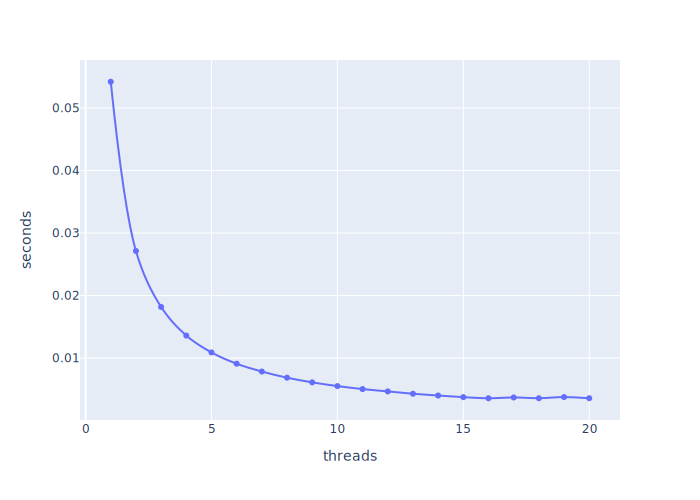
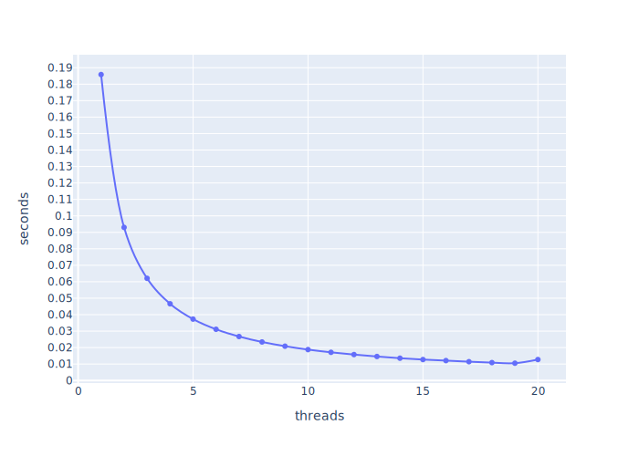

# Distributed systems

This is my documentation from the course 

# Week 1
# Week 2
# Week 3
- Conceptually write a parallel version of pi running on an arbitrary number of processors.
I made a version with mutex and waitgroups
```go
package main

import (
	"fmt"
	"runtime"
	"sync"
	"time"
)

const PI25DT float64 = 3.141592653589793238462643
const INTERVALS int = 10000000

func main() {
	cpus := runtime.NumCPU()
	for i := 1; i <= cpus; i++ {
		for j := 0; j <= 20; j++ {
			fmt.Println(run(i))
		}
	}
}

func run(cpus int) string {
	var (
		sum, pi, time2 float64
		wg             sync.WaitGroup
		mu             sync.Mutex
		intervals      = INTERVALS / cpus
		dx             = 1.0 / float64(INTERVALS)
		time1          = time.Now()
	)

	for i := cpus; i > 0; i-- {
		var (
			innerSum float64
			x        float64
			start    = intervals * i
			end      = start - intervals
		)
		wg.Add(1)
		go func(w *sync.WaitGroup) {
			defer w.Done()
			for j := start; j > end; j-- {
				x = dx * (float64(j) - 0.5)
				innerSum += 4.0 / (1.0 + x*x)
			}
			mu.Lock()
			sum += innerSum
			mu.Unlock()
		}(&wg)
	}

	wg.Wait()

	pi = dx * sum

	time2 = time.Since(time1).Seconds()

	return fmt.Sprintf("%d, %.24f, %.24f, %.24f", cpus, PI25DT, PI25DT-pi, time2)
}
```
which gave the following output with 20 threads
```csv
1.0, 3.141592653589793, 3.57047724719e-13, 0.05423645338095238
2.0, 3.141592653589793, 5.3290705182e-14, 0.03858928442857143
3.0, 3.141592653589793, 1.9999996858643954e-07, 0.03377063738095238
4.0, 3.141592653589793, 8.881784197e-15, 0.03148214357142857
5.0, 3.141592653589793, 7.211162883619048e-15, 0.027955456476190476
6.0, 3.141592653589793, 8.000001265672822e-07, 0.028463973142857143
7.0, 3.141592653589793, 6.000000984940357e-07, 0.03183754328571429
8.0, 3.141592653589793, 1.0298640247761905e-14, 0.028439853714285715
9.0, 3.141592653589793, 2.000000396407131e-07, 0.027101552476190477
10.0, 3.141592653589793, 2.3494433911523812e-14, 0.02337746119047619
11.0, 3.141592653589793, 2.0000009698320366e-06, 0.025170761
12.0, 3.141592653589793, 8.000001244314246e-07, 0.025845478285714287
13.0, 3.141592653589793, 2.000001016905493e-06, 0.024133992523809523
14.0, 3.141592653589793, 2.0000009813149145e-06, 0.02736389476190476
15.0, 3.141592653589793, 2.0000009909579946e-06, 0.023870838142857145
16.0, 3.141592653589793, 8.331959460809524e-15, 0.028217270238095237
17.0, 3.141592653589793, 1.0000002471591142e-06, 0.022219067619047617
18.0, 3.141592653589793, 2.0000009887586956e-06, 0.02301042480952381
19.0, 3.141592653589793, 3.000002241906753e-06, 0.02155738580952381
20.0, 3.141592653589793, 3.573860784238095e-15, 0.029006359952380954
```
with some statistics I got this graph


I made another version with channels
```go
package main

import (
	"fmt"
	"runtime"
	"time"
)

const PI25DT float64 = 3.141592653589793238462643
const INTERVALS int = 10000000

func main() {
	cpus := runtime.NumCPU()
	for i := 1; i <= cpus; i++ {
		for j := 0; j <= 20; j++ {
			fmt.Println(run(i))
		}
	}
}

func run(cpus int) string {
	var (
		sum, pi, time2 float64
		ch             = make(chan float64)
		intervals      = INTERVALS / cpus
		dx             = 1.0 / float64(INTERVALS)
		time1          = time.Now()
	)

	go func() {
		for i := cpus; i > 0; i-- {
			go func() {
				var (
					innerSum float64
					x        float64
					start    = intervals * i
					end      = start - intervals
				)
				for j := start; j > end; j-- {
					x = dx * (float64(j) - 0.5)
					innerSum += 4.0 / (1.0 + x*x)
				}
				ch <- innerSum
			}()
		}
	}()

	for i := cpus; i > 0; i-- {
		sum += <-ch
	}

	pi = dx * sum

	time2 = time.Since(time1).Seconds()

	return fmt.Sprintf("%d, %.24f, %.24f, %.24f", cpus, PI25DT, PI25DT-pi, time2)
}
```
which gave this output

```csv
1.0, 3.141592653589793, 6.2172489379e-14, 0.05420451619047619
2.0, 3.141592653589793, 0.5675882184168146, 0.027138082761904762
3.0, 3.141592653589793, 0.7194136391697775, 0.01810089104761905
4.0, 3.141592653589793, 0.7780659564399972, 0.013598904523809524
5.0, 3.141592653589793, 0.8063185434080369, 0.010892332714285715
6.0, 3.141592653589793, 0.8219740476045976, 0.009088278285714286
7.0, 3.141592653589793, 0.8294305772513837, 0.007840537142857143
8.0, 3.141592653589793, 0.8357551743061794, 0.006848026238095238
9.0, 3.141592653589793, 0.8393653055240177, 0.006093345619047619
10.0, 3.141592653589793, 0.8302434882806773, 0.005497660904761905
11.0, 3.141592653589793, 0.8424460590176509, 0.005014147
12.0, 3.141592653589793, 0.8479062981116386, 0.004624163428571429
13.0, 3.141592653589793, 0.8428308553746644, 0.004288464761904762
14.0, 3.141592653589793, 0.8493834556306964, 0.003996867285714286
15.0, 3.141592653589793, 0.839224797593155, 0.003748615619047619
16.0, 3.141592653589793, 0.8295492829901985, 0.0035349124761904762
17.0, 3.141592653589793, 0.8388947982286429, 0.003400369285714286
18.0, 3.141592653589793, 0.8398449785955684, 0.003267729857142857
19.0, 3.141592653589793, 0.8426705953212231, 0.003627997761904762
20.0, 3.141592653589793, 0.8334707698235071, 0.0031860890476190476
```


with some statistics I got this graph



# Week 4
# Week 5
- When is `MPI_REDUCE` useful:
- When is `MPI_Scatter` and `MPI_Gather` useful?
- What happens if all jobs send before receiving?
- Change communication.c to use non blocking operations
```c
#include "mpi.h"
#include <stdio.h>
#include <stdlib.h>
#define  MASTER		0

int main (int argc, char *argv[])
{
  int  numtasks, taskid, len, partner, message;
  char hostname[MPI_MAX_PROCESSOR_NAME];

  MPI_Status status;
  MPI_Request request;

  MPI_Init(&argc, &argv);
  MPI_Comm_rank(MPI_COMM_WORLD, &taskid);
  MPI_Comm_size(MPI_COMM_WORLD, &numtasks);

  /* need an even number of tasks  */
  if (numtasks % 2 != 0) {
   if (taskid == MASTER)
    printf("Quitting. Need an even number of tasks: numtasks=%d\n", numtasks);
  } else {
    if (taskid == MASTER)
      printf("MASTER: Number of MPI tasks is: %d\n",numtasks);

    MPI_Get_processor_name(hostname, &len);
    printf ("Hello from task %d on %s!\n", taskid, hostname);

    /* determine partner and then send/receive with partner */
    if (taskid < numtasks/2) {
      partner = numtasks/2 + taskid;
      MPI_Isend(&taskid, 1, MPI_INT, partner, 1, MPI_COMM_WORLD, &request);
      MPI_Irecv(&message, 1, MPI_INT, partner, 1, MPI_COMM_WORLD, &request);
    } else if (taskid >= numtasks/2) {
      partner = taskid - numtasks/2;
      MPI_Irecv(&message, 1, MPI_INT, partner, 1, MPI_COMM_WORLD, &request);
      MPI_Isend(&taskid, 1, MPI_INT, partner, 1, MPI_COMM_WORLD, &request);
    }

    MPI_Waitall(1, &request, &status);
    /* print partner info and exit*/
    printf("Task %d is partner with %d\n",taskid,message);
  }

  MPI_Finalize();
}
```
- Use MPI to implement a parallel version of PI
```c
#include "mpi.h"
#include "time.h"
#include <stdio.h>
#include <stdlib.h>
#define  MASTER		0
#define PI25DT 3.141592653589793238462643
#define INTERVALS 10000000


int main (int argc, char *argv[])
{
    double x, f, local_sum, pi;

    double dx = 1.0 / (double) INTERVALS;

    int  numtasks, taskid, len, partner, message;


    MPI_Status status;

    MPI_Init(&argc, &argv);
    MPI_Comm_rank(MPI_COMM_WORLD, &taskid);
    MPI_Comm_size(MPI_COMM_WORLD, &numtasks);

    long int intervals = INTERVALS/numtasks;
    long int start = intervals * (int) (taskid+1);
    long int stop = start - intervals;
    time_t time1;
    double time2;


    if (taskid == 0) { 
	time1 = clock();
    }

    local_sum = 0.0;
    for (int i = start; i > stop ; i--) {
	x = dx * ((double) (i - 0.5));
	local_sum = local_sum + 4.0 / (1.0 + x*x);
    }

    double global_sum;

    MPI_Reduce(&local_sum, &global_sum, 1, MPI_DOUBLE, MPI_SUM, 0, MPI_COMM_WORLD);


    if (taskid == 0) {
	time2 = (clock() - time1) / (double) CLOCKS_PER_SEC;
	pi = dx*global_sum;
	printf("%d, %.24f, %.24f, %.24f, %.24f\n", numtasks, pi, PI25DT, PI25DT-pi, time2);
    }

    MPI_Finalize();

    return 0;
}

```
- Make statistics on the output by changing factors
```sh
#!/bin/sh 
### General options 
### -- specify queue -- 
#BSUB -q hpc
### -- set the job Name -- 
#BSUB -J My_Application
### -- ask for number of cores (default: 1) -- 
#BSUB -n {cpucore}
### -- specify that the cores must be on the same host -- 
#BSUB -R "span[hosts=1]"
### -- specify that we need 2GB of memory per core/slot -- 
#BSUB -R "rusage[mem=2GB]"
### -- specify that we want the job to get killed if it exceeds 3 GB per core/slot -- 
#BSUB -M 3GB
### -- set walltime limit: hh:mm -- 
#BSUB -W 24:00 
### -- set the email address -- 
# please uncomment the following line and put in your e-mail address,
# if you want to receive e-mail notifications on a non-default address
##BSUB -u your_email_address
### -- send notification at start -- 
#BSUB -B 
### -- send notification at completion -- 
#BSUB -N 
### -- Specify the output and error file. %J is the job-id -- 
### -- -o and -e mean append, -oo and -eo mean overwrite -- 
#BSUB -o Output_%J.out 
#BSUB -e Error_%J.err 

module load mpi

mpirun ./main > log/main_{n}.log 
```


```python
from os import execvp 
data = open('run.txt').read()

for i in range(1,16):
    for j in range(20):
        open(f'run/run_{str(i).zfill(2)}_{j}.txt', 'w').write(data.format(cpucore=i, n=f'{str(i).zfill(2)}_{j}'))

```

```sh
cd run
bsub < run/*.txt
cat *.log >> out.log
```

out.log will have the following

```csv
1.0, 3.141592653589793, 6.2172489379e-14, 0.05420451619047619
2.0, 3.141592653589793, 0.5675882184168146, 0.027138082761904762
3.0, 3.141592653589793, 0.7194136391697775, 0.01810089104761905
4.0, 3.141592653589793, 0.7780659564399972, 0.013598904523809524
5.0, 3.141592653589793, 0.8063185434080369, 0.010892332714285715
6.0, 3.141592653589793, 0.8219740476045976, 0.009088278285714286
7.0, 3.141592653589793, 0.8294305772513837, 0.007840537142857143
8.0, 3.141592653589793, 0.8357551743061794, 0.006848026238095238
9.0, 3.141592653589793, 0.8393653055240177, 0.006093345619047619
10.0, 3.141592653589793, 0.8302434882806773, 0.005497660904761905
11.0, 3.141592653589793, 0.8424460590176509, 0.005014147
12.0, 3.141592653589793, 0.8479062981116386, 0.004624163428571429
13.0, 3.141592653589793, 0.8428308553746644, 0.004288464761904762
14.0, 3.141592653589793, 0.8493834556306964, 0.003996867285714286
15.0, 3.141592653589793, 0.839224797593155, 0.003748615619047619
16.0, 3.141592653589793, 0.8295492829901985, 0.0035349124761904762
17.0, 3.141592653589793, 0.8388947982286429, 0.003400369285714286
18.0, 3.141592653589793, 0.8398449785955684, 0.003267729857142857
19.0, 3.141592653589793, 0.8426705953212231, 0.003627997761904762
20.0, 3.141592653589793, 0.8334707698235071, 0.0031860890476190476
```

We get this graph


Which shows that the execution time becomes lower the more cores we assign.

# Week 6 
- Write an OpenMP version of PI
```c
#include <omp.h>
#include <time.h>
#include <stdio.h>
#include <stdlib.h>
#include <errno.h>
#include <limits.h>
#include <string.h> 
#define  MASTER 0
#define PI25DT 3.141592653589793238462643
#define INTERVALS 10000000

double PI();

int main (int argc, char *argv[])
{
	if (strlen(argv[1]) == 0) {return 1;}
	char* p;
	errno = 0;
	long arg = strtol(argv[1], &p, 10);
	if (*p != '\0' || errno != 0) {return 1;}
	if (arg < INT_MIN || arg > INT_MAX) {return 1;}
	int cpu = arg;
	double itime, ftime, exec_time;
	itime = omp_get_wtime();

	double global_sum, pi, dx;

	dx = 1.0 / (double) INTERVALS;

#	pragma omp parallel num_threads(cpu) reduction(+: global_sum)
	global_sum += PI(&global_sum);

	pi = dx*global_sum;

	ftime = omp_get_wtime();
	exec_time = ftime - itime;

	printf("%d, %.24f, %.24f, %.24f\n", cpu, pi, PI25DT-pi, exec_time);

	return 0;
}

double PI()
{
	double x;
	double dx = 1.0 / (double) INTERVALS;

	int numtasks = omp_get_num_threads();
	int taskid = omp_get_thread_num();
	int intervals = INTERVALS/numtasks;

	int start = intervals * (int) (taskid+1);
	int stop = start - intervals;

	double local_sum = 0.0;

	for (int i = start; i > stop ; i--) {
		x = dx * ((double) (i - 0.5));
		local_sum = local_sum + 4.0 / (1.0 + x*x);
	}

	return local_sum;
}
```
- Make some statistict

First we get the output.

```sh
# CLEAN
rm data.csv

# BUILD
gcc -g -Wall -std=c99 -fopenmp -o out main.c 

# RUN
for i in {1..20}; do for j in {1..20}; do ./out $i >> data.csv ; done ; done
```

The output looks like this csv.

```csv
1.0, 3.141592653589436, 3.57047724719e-13, 0.18584446752211078
2.0, 3.14159265358974, 5.3290705182e-14, 0.09299461473710835
3.0, 3.1415924535898245, 1.9999996858643954e-07, 0.062060013704467565
4.0, 3.1415926535897842, 8.881784197e-15, 0.046603204170241955
5.0, 3.141592653589786, 7.19424519975e-15, 0.03728697014739737
6.0, 3.1415918535896665, 8.000001265440205e-07, 0.0311086957459338
7.0, 3.1415920535896946, 6.000000984940357e-07, 0.026703226927202194
8.0, 3.141592653589783, 1.039168751065e-14, 0.023409910709597172
9.0, 3.1415924535897535, 2.0000003970732648e-07, 0.02083822079002857
10.0, 3.1415926535898167, 2.3625545964e-14, 0.018772891559638082
11.0, 3.1415906535888234, 2.0000009699039366e-06, 0.017115934554021807
12.0, 3.1415918535896687, 8.000001245678235e-07, 0.01575561014469713
13.0, 3.141590653588776, 2.0000010170440064e-06, 0.014585135015659034
14.0, 3.141590653588812, 2.000000981294825e-06, 0.01354914647527039
15.0, 3.141590653588802, 2.000000990842743e-06, 0.012722483789548277
16.0, 3.1415926535898016, 8.282263763499999e-15, 0.012088755960576236
17.0, 3.141591653589546, 1.0000002470977875e-06, 0.011427389946766198
18.0, 3.1415906535888043, 2.000000988822137e-06, 0.010863741033244879
19.0, 3.1415896535875514, 3.0000022418041892e-06, 0.010505183890927583
20.0, 3.1415926535897896, 3.3972824555e-15, 0.012721628556028009
```

this graph



which shows us that the code becomes faster with more threads, but flattens out
